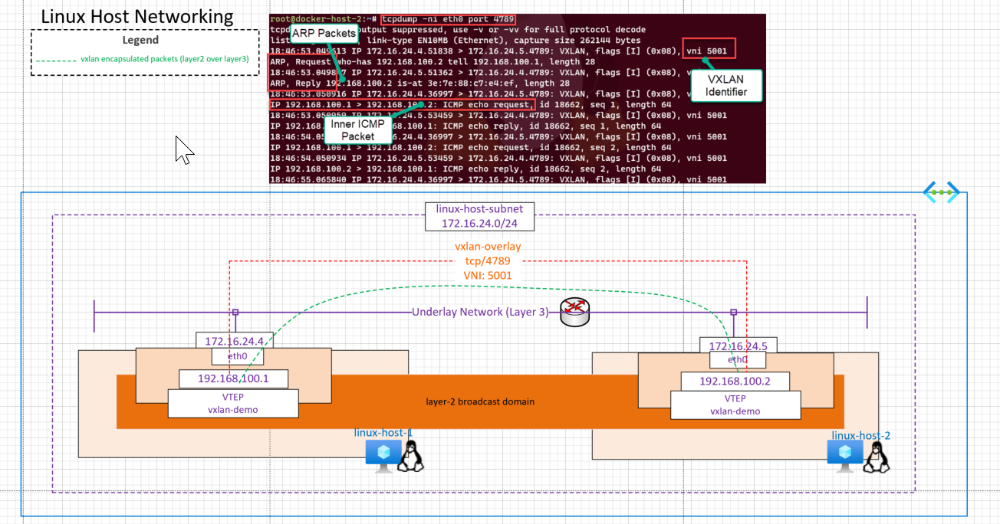

# VXLAN overlay with two linux hosts

This architecture demonstrates VXLAN network overlay between two linux host in it's simplest form. This is the fundamental principal behind cluster networking.

The quickstart deployment will provision two linux Azure VMs, each has an out-the-box installation. Azure bastion is also deployed and enabled for the VMs and you can connect to the linux VMs using this method immediately. For direct SSH connection, please see quickstart guide below.

# Reference Architecture



[](https://portal.azure.com/#create/Microsoft.Template/uri/https%3A%2F%2Fraw.githubusercontent.com%2Fnehalineogi%2Fazure-cross-solution-network-architectures%2Fmain%2Fadvanced-linux-networking%2Fjson%2Flinuxhost.json)

# Quickstart deployment

The username for the deployed VMs is `localadmin`

The passwords are stored in a keyvault deployed to the same resource group.


### Task 1: Start Deployment

1. Click Deploy to Azure button above and supply the signed-in user ID from step 2.

2. Open Cloud Shell and retrieve your signed-in user ID below (this is used to apply access to Keyvault).

```
az ad signed-in-user show --query id -o tsv
```

3. Using Azure Bastion, log in to the VMs using the username `localadmin` and passwords from keyvault.

4. log in as root with command ```sudo su```

### Task 2 (optional): SSH to the linux VMs.

1. Locate the Network Security Group (NSG) called "Allow-tunnel-traffic" and amend rule "allow-ssh-inbound" - change 127.0.0.1 to your current public IP address and change rule from Deny to Allow

2. Retrieve the public IP address (or DNS label) for each VM

3. Retrieve the VM passwords from the keyvault.

4. SSH to your VMs

5. log in as root with command ```sudo su```

```
ssh localadmin@[VM Public IP or DNS]
```
# Design Components

1. Two Ubuntu linux VMs in a subnet with eth0 interface (deployed via "Deploy to Azure" button)
2. VXLAN-demo interface acting as the VTEP and creating the overlay (layer2 over layer3)
3. Packet captures showing VXLAN encapsulated ICMP packets

# VXLAN between two linux hosts (As good as it gets!)

## Linux host 1

Before: Notice no vxlan interface

```
root@linux-host-1:~# ip add sh
1: lo: <LOOPBACK,UP,LOWER_UP> mtu 65536 qdisc noqueue state UNKNOWN group default qlen 1000
    link/loopback 00:00:00:00:00:00 brd 00:00:00:00:00:00
    inet 127.0.0.1/8 scope host lo
       valid_lft forever preferred_lft forever
    inet6 ::1/128 scope host
       valid_lft forever preferred_lft forever
2: eth0: <BROADCAST,MULTICAST,UP,LOWER_UP> mtu 1500 qdisc mq state UP group default qlen 1000
    link/ether 00:22:48:1e:1a:09 brd ff:ff:ff:ff:ff:ff
    inet 172.16.24.4/24 brd 172.16.24.255 scope global eth0
       valid_lft forever preferred_lft forever
    inet6 fe80::222:48ff:fe1e:1a09/64 scope link
       valid_lft forever preferred_lft forever

```

Configure VXLAN. Using VXLAN Port of 4789. Per RFC link [here](https://datatracker.ietf.org/doc/html/rfc7348)

```
    -  Destination Port: IANA has assigned the value 4789 for the
         VXLAN UDP port, and this value SHOULD be used by default as the
         destination UDP port.  Some early implementations of VXLAN have
         used other values for the destination port.  To enable
         interoperability with these implementations, the destination
         port SHOULD be configurable.

```

```
root@linux-host-1:~# ip link add vxlan-demo type vxlan id 5001 remote 172.16.24.5 local 172.16.24.4 de
v eth0 dstport 4789
root@linux-host-1:~# ip addr add 192.168.100.1/24 dev vxlan-demo
root@linux-host-1:~# ip link set up dev vxlan-demo

root@linux-host-1:~# ip add
1: lo: <LOOPBACK,UP,LOWER_UP> mtu 65536 qdisc noqueue state UNKNOWN group default qlen 1000
    link/loopback 00:00:00:00:00:00 brd 00:00:00:00:00:00
    inet 127.0.0.1/8 scope host lo
       valid_lft forever preferred_lft forever
    inet6 ::1/128 scope host
       valid_lft forever preferred_lft forever
2: eth0: <BROADCAST,MULTICAST,UP,LOWER_UP> mtu 1500 qdisc mq state UP group default qlen 1000
    link/ether 00:22:48:1e:1a:09 brd ff:ff:ff:ff:ff:ff
    inet 172.16.24.4/24 brd 172.16.24.255 scope global eth0
       valid_lft forever preferred_lft forever
    inet6 fe80::222:48ff:fe1e:1a09/64 scope link
       valid_lft forever preferred_lft forever
3: vxlan-demo: <BROADCAST,MULTICAST,UP,LOWER_UP> mtu 1450 qdisc noqueue state UNKNOWN group default qlen 1000
    link/ether 7a:1e:dd:83:9f:2f brd ff:ff:ff:ff:ff:ff
    inet 192.168.100.1/24 scope global vxlan-demo
       valid_lft forever preferred_lft forever
    inet6 fe80::781e:ddff:fe83:9f2f/64 scope link
       valid_lft forever preferred_lft forever

```

## Linux host 2

```
root@linux-host-2:~# ip link add vxlan-demo type vxlan id 5001 remote 172.16.24.4 local 172.16.24.5 de
v eth0 dstport 4789

root@linux-host-2:~# ip addr add 192.168.100.2/24 dev vxlan-demo
root@linux-host-2:~# ip link set up dev vxlan-demo

root@linux-host-2:~# ip add
1: lo: <LOOPBACK,UP,LOWER_UP> mtu 65536 qdisc noqueue state UNKNOWN group default qlen 1000
    link/loopback 00:00:00:00:00:00 brd 00:00:00:00:00:00
    inet 127.0.0.1/8 scope host lo
       valid_lft forever preferred_lft forever
    inet6 ::1/128 scope host
       valid_lft forever preferred_lft forever
2: eth0: <BROADCAST,MULTICAST,UP,LOWER_UP> mtu 1500 qdisc mq state UP group default qlen 1000
    link/ether 00:0d:3a:8b:a6:59 brd ff:ff:ff:ff:ff:ff
    inet 172.16.24.5/24 brd 172.16.24.255 scope global eth0
       valid_lft forever preferred_lft forever
    inet6 fe80::20d:3aff:fe8b:a659/64 scope link
       valid_lft forever preferred_lft forever
3: vxlan-demo: <BROADCAST,MULTICAST,UP,LOWER_UP> mtu 1450 qdisc noqueue state UNKNOWN group default qlen 1000
    link/ether 3e:7e:88:c7:e4:ef brd ff:ff:ff:ff:ff:ff
    inet 192.168.100.2/24 scope global vxlan-demo
       valid_lft forever preferred_lft forever
    inet6 fe80::3c7e:88ff:fec7:e4ef/64 scope link
       valid_lft forever preferred_lft forever
root@linux-host-2:~#

```

# Validations

## On host 1: Initiate the ping

```

root@linux-host-1:~# ping 192.168.100.2
PING 192.168.100.2 (192.168.100.2) 56(84) bytes of data.
64 bytes from 192.168.100.2: icmp_seq=1 ttl=64 time=1.40 ms
64 bytes from 192.168.100.2: icmp_seq=2 ttl=64 time=0.613 ms

```

## On host 2: (Capture VXLAN encapsulated packets)

###### Note: First the ARP packet, VNI ID of 5001 and then VXLAN encapsulated inside ICMP packet

```
root@linux-host-2:~# tcpdump -ni eth0 port 4789
tcpdump: verbose output suppressed, use -v or -vv for full protocol decode
listening on eth0, link-type EN10MB (Ethernet), capture size 262144 bytes
18:46:53.049613 IP 172.16.24.4.51838 > 172.16.24.5.4789: VXLAN, flags [I] (0x08), vni 5001
ARP, Request who-has 192.168.100.2 tell 192.168.100.1, length 28
18:46:53.049847 IP 172.16.24.5.51362 > 172.16.24.4.4789: VXLAN, flags [I] (0x08), vni 5001
ARP, Reply 192.168.100.2 is-at 3e:7e:88:c7:e4:ef, length 28
18:46:53.050916 IP 172.16.24.4.36997 > 172.16.24.5.4789: VXLAN, flags [I] (0x08), vni 5001
IP 192.168.100.1 > 192.168.100.2: ICMP echo request, id 18662, seq 1, length 64
18:46:53.050959 IP 172.16.24.5.53459 > 172.16.24.4.4789: VXLAN, flags [I] (0x08), vni 5001
IP 192.168.100.2 > 192.168.100.1: ICMP echo reply, id 18662, seq 1, length 64
18:46:54.050780 IP 172.16.24.4.36997 > 172.16.24.5.4789: VXLAN, flags [I] (0x08), vni 5001
IP 192.168.100.1 > 192.168.100.2: ICMP echo request, id 18662, seq 2, length 64
18:46:54.050934 IP 172.16.24.5.53459 > 172.16.24.4.4789: VXLAN, flags [I] (0x08), vni 5001
IP 192.168.100.2 > 192.168.100.1: ICMP echo reply, id 18662, seq 2, length 64
18:46:55.065840 IP 172.16.24.4.36997 > 172.16.24.5.4789: VXLAN, flags [I] (0x08), vni 5001
IP 192.168.100.1 > 192.168.100.2: ICMP echo request, id 18662, seq 3, length 64
18:46:55.065933 IP 172.16.24.5.53459 > 172.16.24.4.4789: VXLAN, flags [I] (0x08), vni 5001
IP 192.168.100.2 > 192.168.100.1: ICMP echo reply, id 18662, seq 3, length 64
18:46:56.089847 IP 172.16.24.4.36997 > 172.16.24.5.4789: VXLAN, flags [I] (0x08), vni 5001
IP 192.168.100.1 > 192.168.100.2: ICMP echo request, id 18662, seq 4, length 64
18:46:56.089940 IP 172.16.24.5.53459 > 172.16.24.4.4789: VXLAN, flags [I] (0x08), vni 5001
IP 192.168.100.2 > 192.168.100.1: ICMP echo reply, id 18662, seq 4, length 64
18:46:57.090192 IP 172.16.24.4.36997 > 172.16.24.5.4789: VXLAN, flags [I] (0x08), vni 5001
IP 192.168.100.1 > 192.168.100.2: ICMP echo request, id 18662, seq 5, length 64
```

# FAQ/Troubleshooting

## I am unable to SSH to hosts, what do I need to do?

The automated deployment deploys Azure Bastion so you can connect to the VMs via the portal using Bastion. Alternatively the subnet hosting the VMs has a Network Security Group (NSG) attached called "Allow-tunnel-traffic" with a rule called 'allow-ssh-inbound' which is set to Deny by default. If you wish to allow SSH direct to the hosts, you can edit this rule and change the Source from 127.0.0.1 to your current public IP address. Afterwards, Remember to set the rule from Deny to Allow.

## I have followed the steps suggested above, but I still cannot log in over SSH? 

Ensure that you have correctly edited the Network Security Group (NSG) to allow access for port 22. The rule will need your current public IP address and the rule needs to be amended to <b>'allow' rather than 'deny' </b> traffic. 

If you are using a Virtual Private Network (VPN) for outbound internet access, the public IP address you are assigned may differ from the public IP address that is used to connect on the internet, VPN services sometimes use public to public IP address NAT for outbound internet access for efficient use of their public IP addresses. This can be tricky to determine, and will mean that entering your public IP addresss on the NSG will not work. You may wish to open the rule to a 'range' of public IP addresses provided by the VPN service (for instance a.a.a.a/24). You should consider that this does mean that your service will become network reachable to any other VPN customers who are currently assigned an IP address in that range. 

Alternatively, you can check on the destination side (host in Azure) exactly what public IP address is connecting by running this iptables command and then viewing /var/log/syslog. You can use bastion to connect to the host.

``` iptables -I INPUT -p tcp -m tcp --dport 22 -m state --state NEW  -j LOG --log-level 1 --log-prefix "SSH Log" ```

## What are the logins for the VMs?

The credentials for the VMs are stored in an Azure keyvault.

## Are the passwords used cyptographically secure?

No. The passwords are generated deterministically and therefore should be changed on the VMs post deployment, to maximise security. They are auto generated in this way for convenience and are intended to support this environment as a 'Proof of Concept' or learning experience only and are not intended for production use.

## I cannot run the deployment - what is the ADuserID?

In order for the deployment to provision your signed-in user account access to the keyvault, you will need to provide your Azure Active Directory (AAD) signed-in user ObjectID. In order to retrieve this there are serveral methods. The Azure CLI and Azure Powershell methods are provided below. You can use the cloud shell to run the Azure CLI method, but for powershell you must run this from your own device using Azure Powershell module.

Note that older versions of az cli you may need to run the command with ```--query Objectid``` instead of ```--query id```

Azure CLI or Cloud Shell

```
az ad signed-in-user show --query id -o tsv
```

Azure Powershell

```
(Get-AzContext).Account.ExtendedProperties.HomeAccountId.Split('.')[0]
```
## Are there any commands I can use to get the host's DNS, passwords and to change the Network Security Group (NSG) rule, instead of using the portal? 

Yes, below are commands that can be used to more quickly retieve this information. 

<b> Obtain password from keyvault (example for linux-host-1 host in default resource group) </b>

If you wish to retieve passwords for a different hostname, simply change the name property to match.

``` az keyvault secret show --name "linux-host-1-admin-password" --vault-name $(az keyvault list -g linuxhost --query "[].name" -o tsv) --query "value" -o tsv ```

If you receive an error on this command relating to a timeout and you are using Windows Subsystem for Linux and referencing the Windows based az, you should reference this github issue - https://github.com/Azure/azure-cli/issues/13573. Use powershell or cloud shell instead to mitigate this known bug.

<b> Obtain DNS label for public IP of host (example for linux-host-1 in default resource group) </b>

``` az network public-ip show -g linuxhost -n linux-host-1nic-pip --query "dnsSettings.fqdn" -o tsv ```

<b> Change Network Security Rule (NSG) to allow SSH inbound from a specific public IP address </b>

You should change a.a.a.a to match your public IP address

``` az network nsg rule update -g linuxhost --nsg-name Allow-tunnel-traffic -n allow-ssh-inbound  --access allow --source-address-prefix "a.a.a.a" ```

# TODO:

1. Attach the vxlan-demo interface to custom docker bridge and create a manual cluster!

```

```
