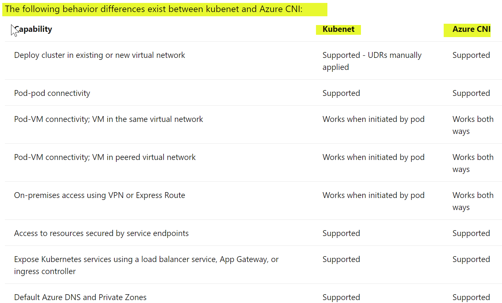
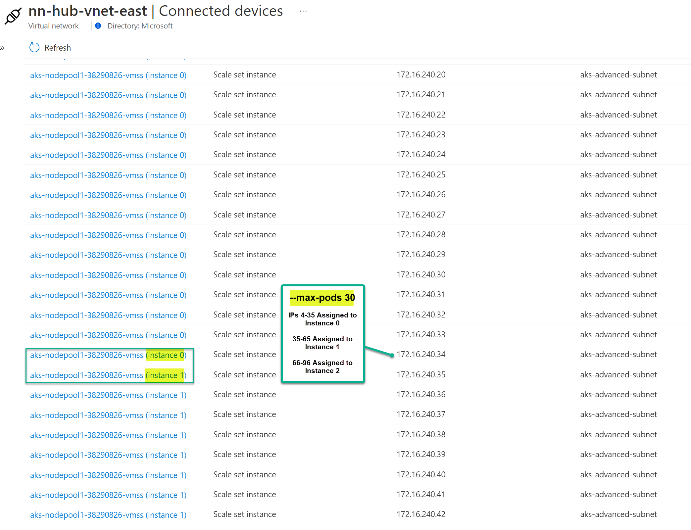

## Azure AKS Advanced/CNI Networking

This architecture uses the for AKS Advanced/CNI Network Model. Observe that the AKS Nodes **and** Pods receive IP address from Azure subnet (NODE CIDR). Note the traffic flows for inbound connectivity to AKS via Internal and External Load balancers.This architecture also demonstrates connectivity and flows to and from on-premises. On-premises network can directly reach both node and pod networks. Outbound flows from AKS pods to internet traverse the Azure load balancer. There are other design options to egress via Azure firewall/NVA or Azure NAT Gateway.

## Reference Architecture

### Advanced/Azure CNI Networking


Download [Multi-tab Visio](aks-all-reference-architectures-visio.vsdx) and [PDF](aks-all-reference-architectures-PDF.pdf)

[](https://portal.azure.com/#create/Microsoft.Template/uri/https%3A%2F%2Fraw.githubusercontent.com%2Fnehalineogi%2Fazure-cross-solution-network-architectures%2Faks%2Fjson%2Fcni.json)

# Quickstart deployment
### Task 1: Start Deployment

1. Click Deploy to Azure button above and supply the signed-in user ID from step 2.

2. Open Cloud Shell and retrieve your signed-in user ID below (this is used to apply access to Keyvault).

```
az ad signed-in-user show --query objectId -o tsv
```

3. You can log in to the supporting VMs using the username `localadmin` and passwords from the deployed keyvault.

4. You can log into the AKS cluster by using kubectl from cloud shell. Follow the challenges below. 

### Task 2 (optional): SSH to the supporting VMs.

1. Locate the Network Security Group (NSG) called "Allow-tunnel-traffic" and amend rule "allow-ssh-inbound" - change 127.0.0.1 to your current public IP address and change rule from Deny to Allow

2. Retrieve the public IP address (or DNS label) for each VM

3. Retrieve the VM passwords from the keyvault.

4. SSH to your VMs

```
ssh localadmin@[VM Public IP or DNS]
```

## Azure Documentation links

1. [Choose a Network Model](https://docs.microsoft.com/en-us/azure/aks/configure-kubenet#choose-a-network-model-to-use)
2. [IP Address Planning](https://docs.microsoft.com/en-us/azure/aks/configure-kubenet#ip-address-availability-and-exhaustion)
3. [Configure AKS Advanced Networking](https://docs.microsoft.com/en-us/azure/aks/configure-azure-cni)
4. [AKS CNI Networking](https://docs.microsoft.com/en-us/azure/aks/configure-azure-cni)
5. [External Load Balancer](https://docs.microsoft.com/en-us/azure/aks/load-balancer-standard)

## Design Components

0. Network Model Comparison [From Azure Documentation](https://docs.microsoft.com/en-us/azure/aks/concepts-network#compare-network-models)



1. [Key Design considerations](https://docs.microsoft.com/en-us/azure/aks/concepts-network#azure-cni-advanced-networking)

The CNI networking option is used during AKS cluster creation. 

Components with blue dotted lines in the diagram above are automatically deployed and a three node AKS cluster is deployed in CNI mode by default. 

The Node CIDR is 172.16.240.0/24 (aks-node-subnet) and PODs will use IPs from the same subnet.

- Nodes and PODs get IPs from the same subnet - this could lead to IP exhaustion issue and need for a large IP space to be available.
- Pods get full virtual network connectivity and can be directly reached via their private IP address from connected networks
- Needs a large available IP address space. Common consideration is the assigned IP address range is too small to then add additional nodes when you scale or upgrade a cluster.
- The network team may also not be able to issue a large enough IP address range to support your expected application demands.
- There is no user defined routes for pod connectivity.
- Azure Network Policy support

2. [IP Address Calculations](https://docs.microsoft.com/en-us/azure/aks/configure-kubenet#ip-address-availability-and-exhaustion)
   With Azure CNI network model, that same /24 subnet (251 usable IPs) range could only support a maximum of 8 nodes in the cluster
   This node count could only support up to 240 (8x30) pods (with a default maximum of 30 pods per node with Azure CNI).

   If you have 8 nodes and 30 pods, you'll use up 8x30=240 IP addresses.

   Note: Maximum nodes per cluster with Virtual Machine Scale Sets and Standard Load Balancer SKU. Limits link [here](https://docs.microsoft.com/en-us/azure/azure-resource-manager/management/azure-subscription-service-limits#azure-kubernetes-service-limits))

3. [External Load Balancer](https://docs.microsoft.com/en-us/azure/aks/load-balancer-standard)

AKS uses [services](https://docs.microsoft.com/en-us/azure/aks/concepts-network#services) to provide inbound connectivity to pods insides the AKS cluster. The three service types are (Cluster IP, NodePort and LoadBalancer). In the archictecture above, the service type is LoadBalancer. AKS Creates an Azure load balancer resource, configures an external IP address, and connects the requested pods to the load balancer backend pool. To allow customers' traffic to reach the application, load balancing rules are created on the desired ports. Internal load balancer and external load balancer can be used at the same time. All egress traffic from the NODEs and PODs use the loadbalancer IP for outbound traffic.

Diagram showing Load Balancer traffic flow in an AKS cluster


4. [Internal Load Balancer](https://docs.microsoft.com/en-us/azure/aks/internal-lb)
   Internal load balancer can be used to expose the services. This exposed IP will reside on the AKS-subnet. If you'd like to specify a specific IP address following instructions in [link here](https://docs.microsoft.com/en-us/azure/aks/internal-lb#specify-an-ip-address).

## Deployment Validations

These steps will deploy a single test pod and delete it.

1. Obtain the cluster credentials to log in to kubectl (if you did not use the default, replace resource-group with your specified resource group name). 

```az aks get-credentials --resource-group aks --name myAKSCluster```

2. Open Cloud Shell and clone the reposity

```git clone https://github.com/nehalineogi/azure-cross-solution-network-architectures```

3. Navigate to the dnsutils directory 

```cd azure-cross-solution-network-architectures/aks/yaml/dns```

4. Deploy a simple pod

```kubectl apply -f dnsutils.yaml```

5. Check pod is running successfully 

```kubectl get pods -o wide```

6. Delete pod (cleanup)

```kubectl delete pod dnsutils```

#### IP Address Assignment

Pre-assigned IP addresses for PODs based on --max-pods=30 setting setting
Screen capture of the Azure VNET and AKS subnet:



Note that AKS nodes and pods get IPs from the same AKS subnet

```
kubectlget nodes,pods,service -o wide -n colors-ns
NAME                                     STATUS   ROLES   AGE   VERSION    INTERNAL-IP     EXTERNAL-IP   OS-IMAGE             KERNEL-VERSION     CONTAINER-RUNTIME
node/aks-nodepool1-38290826-vmss000000   Ready    agent   10h   v1.19.11   172.16.240.4    <none>        Ubuntu 18.04.5 LTS   5.4.0-1049-azure   containerd://1.4.4+azure
node/aks-nodepool1-38290826-vmss000001   Ready    agent   10h   v1.19.11   172.16.240.35   <none>        Ubuntu 18.04.5 LTS   5.4.0-1049-azure   containerd://1.4.4+azure
node/aks-nodepool1-38290826-vmss000002   Ready    agent   10h   v1.19.11   172.16.240.66   <none>        Ubuntu 18.04.5 LTS   5.4.0-1049-azure   containerd://1.4.4+azure

NAME                                  READY   STATUS    RESTARTS   AGE   IP              NODE                                NOMINATED NODE   READINESS GATES
pod/red-deployment-5f589f64c6-7fbc2   1/1     Running   0          9h    172.16.240.50   aks-nodepool1-38290826-vmss000001   <none>           <none>
pod/red-deployment-5f589f64c6-s8cqm   1/1     Running   0          9h    172.16.240.11   aks-nodepool1-38290826-vmss000000   <none>           <none>
pod/red-deployment-5f589f64c6-sz2lq   1/1     Running   0          9h    172.16.240.76   aks-nodepool1-38290826-vmss000002   <none>           <none>

NAME                           TYPE           CLUSTER-IP       EXTERNAL-IP     PORT(S)          AGE   SELECTOR
service/red-service            LoadBalancer   10.101.214.144   20.72.170.184   8080:31838/TCP   42m   app=red
service/red-service-internal   LoadBalancer   10.101.54.70     172.16.240.97   8080:32732/TCP   42m   app=red

```

#### Node view

Note that node inherits the DNS from the Azure VNET DNS setting. The outbound IP for the node is the External Load balancer outbound SNAT.

```
kubectl get nodes,pods -o wide
NAME                                     STATUS   ROLES   AGE   VERSION    INTERNAL-IP     EXTERNAL-IP   OS-IMAGE             KERNEL-VERSION     CONTAINER-RUNTIME
node/aks-nodepool1-38290826-vmss000000   Ready    agent   11m   v1.19.11   172.16.240.4    <none>        Ubuntu 18.04.5 LTS   5.4.0-1049-azure   containerd://1.4.4+azure
node/aks-nodepool1-38290826-vmss000001   Ready    agent   11m   v1.19.11   172.16.240.35   <none>        Ubuntu 18.04.5 LTS   5.4.0-1049-azure   containerd://1.4.4+azure
node/aks-nodepool1-38290826-vmss000002   Ready    agent   11m   v1.19.11   172.16.240.66   <none>        Ubuntu 18.04.5 LTS   5.4.0-1049-azure   containerd://1.4.4+azure

 ../kubectl-node_shell aks-nodepool1-38290826-vmss000002
spawning "nsenter-dh091t" on "aks-nodepool1-38290826-vmss000002"
If you don't see a command prompt, try pressing enter.
root@aks-nodepool1-38290826-vmss000002:/# ip add
1: lo: <LOOPBACK,UP,LOWER_UP> mtu 65536 qdisc noqueue state UNKNOWN group default qlen 1000
    link/loopback 00:00:00:00:00:00 brd 00:00:00:00:00:00
    inet 127.0.0.1/8 scope host lo
       valid_lft forever preferred_lft forever
    inet6 ::1/128 scope host
       valid_lft forever preferred_lft forever
2: eth0: <BROADCAST,MULTICAST,UP,LOWER_UP> mtu 1500 qdisc mq state UP group default qlen 1000
    link/ether 00:0d:3a:1b:38:5d brd ff:ff:ff:ff:ff:ff
    inet 172.16.240.66/24 brd 172.16.240.255 scope global eth0
       valid_lft forever preferred_lft forever
    inet6 fe80::20d:3aff:fe1b:385d/64 scope link
       valid_lft forever preferred_lft forever
3: enP20757s1: <BROADCAST,MULTICAST,SLAVE,UP,LOWER_UP> mtu 1500 qdisc mq master eth0 state UP group default qlen 1000
    link/ether 00:0d:3a:1b:38:5d brd ff:ff:ff:ff:ff:ff
5: azv9b700506950@if4: <BROADCAST,MULTICAST,UP,LOWER_UP> mtu 1500 qdisc noqueue state UP group default qlen 1000
    link/ether 32:ce:cd:84:25:7a brd ff:ff:ff:ff:ff:ff link-netnsid 0
    inet6 fe80::30ce:cdff:fe84:257a/64 scope link
       valid_lft forever preferred_lft forever
7: azv2f011236414@if6: <BROADCAST,MULTICAST,UP,LOWER_UP> mtu 1500 qdisc noqueue state UP group default qlen 1000
    link/ether 02:33:6a:2d:9b:69 brd ff:ff:ff:ff:ff:ff link-netnsid 1
    inet6 fe80::33:6aff:fe2d:9b69/64 scope link
       valid_lft forever preferred_lft forever
11: azvb3c61c3cba9@if10: <BROADCAST,MULTICAST,UP,LOWER_UP> mtu 1500 qdisc noqueue state UP group default qlen 1000
    link/ether ae:c0:cf:25:98:1f brd ff:ff:ff:ff:ff:ff link-netnsid 3
    inet6 fe80::acc0:cfff:fe25:981f/64 scope link
       valid_lft forever preferred_lft forever
13: azv3c30acfc1be@if12: <BROADCAST,MULTICAST,UP,LOWER_UP> mtu 1500 qdisc noqueue state UP group default qlen 1000
    link/ether 96:79:ae:18:fd:e4 brd ff:ff:ff:ff:ff:ff link-netnsid 4
    inet6 fe80::9479:aeff:fe18:fde4/64 scope link
       valid_lft forever preferred_lft forever
root@aks-nodepool1-38290826-vmss000002:/# route -n
Kernel IP routing table
Destination     Gateway         Genmask         Flags Metric Ref    Use Iface
0.0.0.0         172.16.240.1    0.0.0.0         UG    100    0        0 eth0
168.63.129.16   172.16.240.1    255.255.255.255 UGH   100    0        0 eth0
169.254.169.254 172.16.240.1    255.255.255.255 UGH   100    0        0 eth0
172.16.240.0    0.0.0.0         255.255.255.0   U     0      0        0 eth0
172.16.240.67   0.0.0.0         255.255.255.255 UH    0      0        0 azvb3c61c3cba9
172.16.240.69   0.0.0.0         255.255.255.255 UH    0      0        0 azv9b700506950
172.16.240.76   0.0.0.0         255.255.255.255 UH    0      0        0 azv3c30acfc1be
172.16.240.80   0.0.0.0         255.255.255.255 UH    0      0        0 azv2f011236414
root@aks-nodepool1-38290826-vmss000002:/# cat /etc/resolv.conf
# This file is managed by man:systemd-resolved(8). Do not edit.
#
# This is a dynamic resolv.conf file for connecting local clients directly to
# all known uplink DNS servers. This file lists all configured search domains.
#
# Third party programs must not access this file directly, but only through the
# symlink at /etc/resolv.conf. To manage man:resolv.conf(5) in a different way,
# replace this symlink by a static file or a different symlink.
#
# See man:systemd-resolved.service(8) for details about the supported modes of
# operation for /etc/resolv.conf.

nameserver 168.63.129.16
search 1grit5g0qs5exa0hhgg2i425ng.bx.internal.cloudapp.net
root@aks-nodepool1-38290826-vmss000002:/# curl ifconfig.io
20.84.17.89

```

#### POD View

Note that the outbound IP of the POD is the External Load balancer SNAT.

```
kubectl exec -it dnsutils -- sh
/ # ip add
1: lo: <LOOPBACK,UP,LOWER_UP> mtu 65536 qdisc noqueue state UNKNOWN qlen 1000
    link/loopback 00:00:00:00:00:00 brd 00:00:00:00:00:00
    inet 127.0.0.1/8 scope host lo
       valid_lft forever preferred_lft forever
    inet6 ::1/128 scope host
       valid_lft forever preferred_lft forever
10: eth0@if11: <BROADCAST,UP,LOWER_UP,M-DOWN> mtu 1500 qdisc noqueue state UP qlen 1000
    link/ether c2:76:6a:85:ee:09 brd ff:ff:ff:ff:ff:ff
    inet 172.16.240.67/24 scope global eth0
       valid_lft forever preferred_lft forever
    inet6 fe80::c076:6aff:fe85:ee09/64 scope link
       valid_lft forever preferred_lft forever
/ # route -n
Kernel IP routing table
Destination     Gateway         Genmask         Flags Metric Ref    Use Iface
0.0.0.0         169.254.1.1     0.0.0.0         UG    0      0        0 eth0
169.254.1.1     0.0.0.0         255.255.255.255 UH    0      0        0 eth0
/ # cat /etc/resolv.conf
search default.svc.cluster.local svc.cluster.local cluster.local 1grit5g0qs5exa0hhgg2i425ng.bx.internal.cloudapp.net
nameserver 10.101.0.10
options ndots:5

/ # wget -qO- ifconfig.me
20.84.17.89

```

#### Traffic flows to and from On-premises

**From AKS to On-premises**
Note: On-Premises server sees the Node IP.

```
k exec -it dnsutils -- sh
/ # ip add
1: lo: <LOOPBACK,UP,LOWER_UP> mtu 65536 qdisc noqueue state UNKNOWN qlen 1000
    link/loopbackubectl 00:00:00:00:00:00 brd 00:00:00:00:00:00
    inet 127.0.0.1/8 scope host lo
       valid_lft forever preferred_lft forever
    inet6 ::1/128 scope host
       valid_lft forever preferred_lft forever
10: eth0@if11: <BROADCAST,UP,LOWER_UP,M-DOWN> mtu 1500 qdisc noqueue state UP qlen 1000
    link/ether c2:76:6a:85:ee:09 brd ff:ff:ff:ff:ff:ff
    inet 172.16.240.67/24 scope global eth0
       valid_lft forever preferred_lft forever
    inet6 fe80::c076:6aff:fe85:ee09/64 scope link
       valid_lft forever preferred_lft forever
/ # wget 192.168.199.130:8000
Connecting to 192.168.199.130:8000 (192.168.199.130:8000)
index.html           100% |******************************************************************************************************************|   854   0:00:00 ETA
/ #

On Prem server:
nehali@nehali-laptop:~$ ifconfig eth5
eth5: flags=4163<UP,BROADCAST,RUNNING,MULTICAST>  mtu 1500
        inet 192.168.199.130  netmask 255.255.255.128  broadcast 192.168.199.255
        inet6 fe80::d9b2:eb5a:4d72:3918  prefixlen 64  scopeid 0xfd<compat,link,site,host>
        ether 00:ff:96:aa:71:26  (Ethernet)
        RX packets 0  bytes 0 (0.0 B)
        RX errors 0  dropped 0  overruns 0  frame 0
        TX packets 0  bytes 0 (0.0 B)
        TX errors 0  dropped 0 overruns 0  carrier 0  collisions 0
nehali@nehali-laptop:/mnt/c/Users/neneogi$ python3 -m http.server
Serving HTTP on 0.0.0.0 port 8000 (http://0.0.0.0:8000/) ...
172.16.240.66 - - [17/Jul/2021 11:00:47] "GET / HTTP/1.1" 200 -


```

**From On-Premises to AKS:**
Note that the AKS pods are directly reachable

```
nehali@nehali-laptop:~$ ifconfig eth5
eth5: flags=4163<UP,BROADCAST,RUNNING,MULTICAST>  mtu 1500
        inet 192.168.199.2  netmask 255.255.255.128  broadcast 192.168.199.127
        inet6 fe80::d9b2:eb5a:4d72:3918  prefixlen 64  scopeid 0xfd<compat,link,site,host>
        ether 00:ff:96:aa:71:26  (Ethernet)
        RX packets 0  bytes 0 (0.0 B)
        RX errors 0  dropped 0  overruns 0  frame 0
        TX packets 0  bytes 0 (0.0 B)
        TX errors 0  dropped 0 overruns 0  carrier 0  collisions 0

nehali@nehali-laptop:~$ curl  http://172.16.240.97:8080
red
nehali@nehali-laptop:~$ curl  172.16.240.50:8080
red

```

#### Azure VM View

Note: Azure VM on the same VNET sees the actual POD IP.

```
POD:
kubectl exec -it dnsutils -- sh
/ # ip add
1: lo: <LOOPBACK,UP,LOWER_UP> mtu 65536 qdisc noqueue state UNKNOWN qlen 1000
link/loopback 00:00:00:00:00:00 brd 00:00:00:00:00:00
inet 127.0.0.1/8 scope host lo
valid_lft forever preferred_lft forever
inet6 ::1/128 scope host
valid_lft forever preferred_lft forever
10: eth0@if11: <BROADCAST,UP,LOWER_UP,M-DOWN> mtu 1500 qdisc noqueue state UP qlen 1000
link/ether c2:76:6a:85:ee:09 brd ff:ff:ff:ff:ff:ff
inet 172.16.240.67/24 scope global eth0
valid_lft forever preferred_lft forever
inet6 fe80::c076:6aff:fe85:ee09/64 scope link
valid_lft forever preferred_lft forever
/ # wget 172.16.1.5:8000
Connecting to 172.16.1.5:8000 (172.16.1.5:8000)
wget: can't open 'index.html': File exists
/ # rm index.html
/ # wget 172.16.1.5:8000
Connecting to 172.16.1.5:8000 (172.16.1.5:8000)
index.html 100% |\***\*\*\*\*\*\*\***\*\*\***\*\*\*\*\*\*\***\*\*\*\*\***\*\*\*\*\*\*\***\*\*\***\*\*\*\*\*\*\***\*\*\***\*\*\*\*\*\*\***\*\*\***\*\*\*\*\*\*\***\*\*\*\*\***\*\*\*\*\*\*\***\*\*\***\*\*\*\*\*\*\***| 77 0:00:00 ETA
/ # exit

**VM in Azure (Same VNET as AKS-subnet)**

nehali@nn-linux-dev:~$ ifconfig eth0
eth0: flags=4163<UP,BROADCAST,RUNNING,MULTICAST> mtu 1500
inet 172.16.1.5 netmask 255.255.255.0 broadcast 172.16.1.255
inet6 fe80::20d:3aff:fe1c:8876 prefixlen 64 scopeid 0x20<link>
ether 00:0d:3a:1c:88:76 txqueuelen 1000 (Ethernet)
RX packets 79611619 bytes 21567157846 (21.5 GB)
RX errors 0 dropped 0 overruns 0 frame 0
TX packets 80391879 bytes 13317890087 (13.3 GB)
TX errors 0 dropped 0 overruns 0 carrier 0 collisions 0

nehali@nn-linux-dev:~$ python3 -m http.server
Serving HTTP on 0.0.0.0 port 8000 (http://0.0.0.0:8000/) ...
172.16.240.67 - - [17/Jul/2021 15:05:43] "GET / HTTP/1.1" 200 -
172.16.240.67 - - [17/Jul/2021 15:05:48] "GET / HTTP/1.1" 200 -

```

### External Service

Note the Endpoints are up. Node the Type:LoadBalancer and exposed IP is public

```
kubectl describe service red-service -n colors-ns
Name:                     red-service
Namespace:                colors-ns
Labels:                   <none>
Annotations:              <none>
Selector:                 app=red
Type:                     LoadBalancer
IP Families:              <none>
IP:                       10.101.214.144
IPs:                      <none>
LoadBalancer Ingress:     20.72.170.184
Port:                     <unset>  8080/TCP
TargetPort:               8080/TCP
NodePort:                 <unset>  31838/TCP
Endpoints:                172.16.240.11:8080,172.16.240.50:8080,172.16.240.76:8080
Session Affinity:         None
External Traffic Policy:  Cluster
Events:
  Type    Reason                Age   From                Message
  ----    ------                ----  ----                -------
  Normal  EnsuringLoadBalancer  21m   service-controller  Ensuring load balancer
  Normal  EnsuredLoadBalancer   21m   service-controller  Ensured load balancer

```

### Internal Service

Note the type: Load balancer and the exposed IP is private

```
 kubectl describe service red-service-internal -n colors-ns
Name:                     red-service-internal
Namespace:                colors-ns
Labels:                   <none>
Annotations:              service.beta.kubernetes.io/azure-load-balancer-internal: true
Selector:                 app=red
Type:                     LoadBalancer
IP Families:              <none>
IP:                       10.101.54.70
IPs:                      <none>
LoadBalancer Ingress:     172.16.240.97
Port:                     <unset>  8080/TCP
TargetPort:               8080/TCP
NodePort:                 <unset>  32732/TCP
Endpoints:                172.16.240.11:8080,172.16.240.50:8080,172.16.240.76:8080
Session Affinity:         None
External Traffic Policy:  Cluster
Events:
  Type    Reason                Age                From                Message
  ----    ------                ----               ----                -------
  Normal  EnsuringLoadBalancer  47s (x2 over 21m)  service-controller  Ensuring load balancer
  Normal  EnsuredLoadBalancer   46s (x2 over 19m)  service-controller  Ensured load balancer

```

## TODO

1. Azure Network Policy Validations
