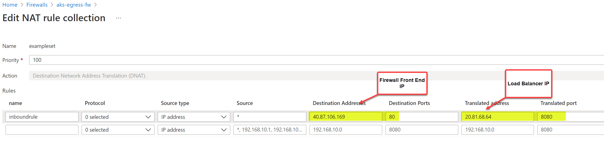

## AKS Egress via Azure Firewall/NVA

This architecture demonstrates how to secure oubound traffic from AKS via Azure firewall/NVA. The complextity comes with the asymmetric routing issue with Azure standard load balancer and Kube API server access from AKS nodes. By default, AKS clusters have unrestricted outbound (egress) internet access. To restrict egress traffic, a limited number of ports and addresses must be accessible to maintain healthy cluster maintenance tasks. Azure firewall has AzureKubernetesService FQDN tag to simply firewall policies. For NVAs the rules would have to be created manually.

## Reference Architecture

### AKS Egress traffic flows via Azure firewall


Download Visio link here.

## Azure Documentation links

1. [AKS Egress](https://docs.microsoft.com/en-us/azure/aks/limit-egress-traffic)
2. [AKS Egress via Azure firewall](https://docs.microsoft.com/en-us/azure/aks/limit-egress-traffic#restrict-egress-traffic-using-azure-firewall)

## Design Components and traffic flows

1. Ingress to Public facing services forced via Azure firewall. DNAT rule to translate firewall public IP to LB Frontend IP.UDR to preserve the flow symmetry for the return traffic.

2. Outbound from the Node and POD via Azure firewall using the UDR and Azure firewall policies.

3. AKS Control plane protected via API Server Authorized IP which includes the firewall public IP and On-premises IP for developer access.

## Considerations

1. [Assymetric Routing Issue with Standard Load Balancer Design](https://docs.microsoft.com/en-us/azure/firewall/integrate-lb#asymmetric-routing)

When firewall or NVA is deployed in conjuction with the Azure Load balancer assymetric routing issue occurs when a AKS subnet has a default route going to the firewall's private IP address. In this case, the incoming traffic is received via load balancer public IP address, but the return path goes through the firewall's private IP address. Since the firewall is stateful, it drops the returning packet because the firewall isn't aware of such an established session. The way to fix the assymetric routing issue is to create a NAT rule on the firewall pointing to the Load balancer IP for Ingress traffic and create a UDR for the firewall public IP to bypass the firewall for the return traffic.


4. [OutboundType](https://docs.microsoft.com/en-us/azure/aks/limit-egress-traffic#deploy-aks-with-outbound-type-of-udr-to-the-existing-network)
   To steer the AKS outbound traffic via the Azure firewall, create and setup the inbound and oubound rules on the firewall and then deploy the AKS cluster using the \*\* **outbound type of UserDefinedRouting\*\***.

   **--outbound-type userDefinedRouting \*\***

5. [NVA/Firewall Design](https://docs.microsoft.com/en-us/azure/aks/limit-egress-traffic#restrict-egress-traffic-using-azure-firewall)

When you want to restrict the egress traffic via firewall/NVA use the AKS FQDN tag to allow AKS specific traffic via Azure firewall.

3. [Outbound UDR] (https://docs.microsoft.com/en-us/azure/aks/limit-egress-traffic#create-and-set-up-an-azure-firewall-with-a-udr)

Create a UDR with the next hop to the firewall and associate it with the AKS subnet

5. [Firewall Policies](https://docs.microsoft.com/en-us/azure/aks/limit-egress-traffic#adding-firewall-rules)
   Create firewall policies (network and application rules) to allow egress traffic from the Nodes and pods. Example traffic to the docker registry or outbound traffic to ifconfig.io in the example architecture

6. [API Server Access](https://docs.microsoft.com/en-us/azure/aks/limit-egress-traffic#enable-developer-access-to-the-api-server)
   If you used authorized IP ranges for the cluster you must add your developer tooling IP addresses to the AKS cluster list of approved IP ranges in order to access the API server from there.

## Cluster Deployment

Very well documented here:
https://docs.microsoft.com/en-us/azure/aks/limit-egress-traffic#restrict-egress-traffic-using-azure-firewall

```
#
#https://docs.microsoft.com/en-us/azure/aks/limit-egress-traffic#restrict-egress-traffic-using-azure-firewall
#
PREFIX="aks-egress"
RG="${PREFIX}-rg"
LOC="eastus"
PLUGIN=azure
AKSNAME="${PREFIX}"
VNET_NAME="${PREFIX}-vnet"
AKSSUBNET_NAME="aks-subnet"
# DO NOT CHANGE FWSUBNET_NAME - This is currently a requirement for Azure Firewall.
FWSUBNET_NAME="AzureFirewallSubnet"
FWNAME="${PREFIX}-fw"
FWPUBLICIP_NAME="${PREFIX}-fwpublicip"
FWIPCONFIG_NAME="${PREFIX}-fwconfig"
FWROUTE_TABLE_NAME="${PREFIX}-fwrt"
FWROUTE_NAME="${PREFIX}-fwrn"
FWROUTE_NAME_INTERNET="${PREFIX}-fwinternet"

# Create Resource Group

az group create --name $RG --location $LOC

# Dedicated virtual network with AKS subnet

az network vnet create \
    --resource-group $RG \
    --name $VNET_NAME \
    --location $LOC \
    --address-prefixes 10.42.0.0/16 \
    --subnet-name $AKSSUBNET_NAME \
    --subnet-prefix 10.42.1.0/24

# Dedicated subnet for Azure Firewall (Firewall name cannot be changed)

az network vnet subnet create \
    --resource-group $RG \
    --vnet-name $VNET_NAME \
    --name $FWSUBNET_NAME \
    --address-prefix 10.42.2.0/24

az network public-ip create -g $RG -n $FWPUBLICIP_NAME -l $LOC --sku "Standard"


# Install Azure Firewall preview CLI extension

az extension add --name azure-firewall

# Deploy Azure Firewall

az network firewall create -g $RG -n $FWNAME -l $LOC --enable-dns-proxy true


# Configure Firewall IP Config

az network firewall ip-config create -g $RG -f $FWNAME -n $FWIPCONFIG_NAME --public-ip-address $FWPUBLICIP_NAME --vnet-name $VNET_NAME


# Capture Firewall IP Address for Later Use

FWPUBLIC_IP=$(az network public-ip show -g $RG -n $FWPUBLICIP_NAME --query "ipAddress" -o tsv)
FWPRIVATE_IP=$(az network firewall show -g $RG -n $FWNAME --query "ipConfigurations[0].privateIpAddress" -o tsv)


# Create UDR and add a route for Azure Firewall

az network route-table create -g $RG -l $LOC --name $FWROUTE_TABLE_NAME
az network route-table route create -g $RG --name $FWROUTE_NAME --route-table-name $FWROUTE_TABLE_NAME --address-prefix 0.0.0.0/0 --next-hop-type VirtualAppliance --next-hop-ip-address $FWPRIVATE_IP
az network route-table route create -g $RG --name $FWROUTE_NAME_INTERNET --route-table-name $FWROUTE_TABLE_NAME --address-prefix $FWPUBLIC_IP/32 --next-hop-type Internet
#
#
#

# Add FW Network Rules

az network firewall network-rule create -g $RG -f $FWNAME --collection-name 'aksfwnr' -n 'apiudp' --protocols 'UDP' --source-addresses '*' --destination-addresses "AzureCloud.$LOC" --destination-ports 1194 --action allow --priority 100
az network firewall network-rule create -g $RG -f $FWNAME --collection-name 'aksfwnr' -n 'apitcp' --protocols 'TCP' --source-addresses '*' --destination-addresses "AzureCloud.$LOC" --destination-ports 9000
az network firewall network-rule create -g $RG -f $FWNAME --collection-name 'aksfwnr' -n 'time' --protocols 'UDP' --source-addresses '*' --destination-fqdns 'ntp.ubuntu.com' --destination-ports 123

# Add FW Application Rules

az network firewall application-rule create -g $RG -f $FWNAME --collection-name 'aksfwar' -n 'fqdn' --source-addresses '*' --protocols 'http=80' 'https=443' --fqdn-tags "AzureKubernetesService" --action allow --priority 100

# Associate route table with next hop to Firewall to the AKS subnet

az network vnet subnet update -g $RG --vnet-name $VNET_NAME --name $AKSSUBNET_NAME --route-table $FWROUTE_TABLE_NAME

#
#
#

SUBNETID=$(az network vnet subnet show -g $RG --vnet-name $VNET_NAME --name $AKSSUBNET_NAME --query id -o tsv)
#
#
#
az aks create -g $RG -n $AKSNAME -l $LOC \
  --node-count 3 --generate-ssh-keys \
  --network-plugin $PLUGIN \
  --outbound-type userDefinedRouting \
  --service-cidr 10.41.0.0/16 \
  --dns-service-ip 10.41.0.10 \
  --docker-bridge-address 172.17.0.1/16 \
  --vnet-subnet-id $SUBNETID \
  --enable-managed-identity \
  --api-server-authorized-ip-ranges $FWPUBLIC_IP
  --verbose

 az aks create -g $RG -n $AKSNAME -l $LOC \
>   --node-count 3 --generate-ssh-keys \
>   --network-plugin $PLUGIN \
>   --outbound-type userDefinedRouting \
>   --service-cidr 10.41.0.0/16 \
>   --dns-service-ip 10.41.0.10 \
>   --docker-bridge-address 172.17.0.1/16 \
>   --vnet-subnet-id $SUBNETID \
>   --enable-managed-identity \
>   --api-server-authorized-ip-ranges $FWPUBLIC_IP
It is highly recommended to use USER assigned identity (option --assign-identity) when you want to bring your ownsubnet, which will have no latency for the role assignment to take effect. When using SYSTEM assigned identity, azure-cli will grant Network Contributor role to the system assigned identity after the cluster is created, and the role assignment will take some time to take effect, see https://docs.microsoft.com/en-us/azure/aks/use-managed-identity, proceed to create cluster with system assigned identity? (y/N): y
It is highly recommended to use USER assigned identity (option --assign-identity) when you want to bring your ownsubnet, which will have no latency for the role assignment to take effect. When using SYSTEM assigned identity, azure-cli will grant Network Contributor role to the system assigned identity after the cluster is created, and the role assignment will take some time to take effect, see https://docs.microsoft.com/en-us/azure/aks/use-managed-identity, proceed to create cluster with system assigned identity?


# Retrieve your IP address
CURRENT_IP=$(dig @resolver1.opendns.com ANY myip.opendns.com +short)

# Add to AKS approved list
az aks update -g $RG -n $AKSNAME --api-server-authorized-ip-ranges $CURRENT_IP/32

#
# sample deployment
#
k create ns demo-ns
k apply -f deployment.yaml
k apply -f service-external-lb.yaml
k get nodes,pods,service -o wide -n demo-ns
k get events ns demo-ns

#
# DNAT rule
#
kubectl get services -n demo-ns
SERVICE_IP=$(kubectl get svc nginx-service -n demo-ns -o jsonpath='{.status.loadBalancer.ingress[*].ip}')
echo $SERVICE_IP
az network firewall nat-rule create --collection-name exampleset --destination-addresses $FWPUBLIC_IP --destination-ports 80 --firewall-name $FWNAME --name inboundrule --protocols Any --resource-group $RG --source-addresses '*' --translated-port 80 --action Dnat --priority 100 --translated-address $SERVICE_IP

#
# Cleanup
#

az group delete -g $RG

```

## Validations

#### External Service : Type: LoadBalancer

Note the Endpoints are up. Node the Type:LoadBalancer and exposed IP is public

```
kubectl get services -n demo-ns
NAME            TYPE           CLUSTER-IP      EXTERNAL-IP   PORT(S)          AGE
nginx-service   LoadBalancer   10.41.195.139   20.81.68.64   8080:32459/TCP   43m

```

#### Traffic flows from Internet to AKS (via Azure firewall)

Test to firewall Public IP
40.87.106.169:80 ---NAT---> 20.81.68.64:8080
Return traffic bypasses the firewall

```
 curl -I 40.87.106.169
HTTP/1.1 200 OK
Server: nginx/1.21.1
Date: Sat, 31 Jul 2021 23:50:05 GMT
Content-Type: text/html
Connection: keep-alive
Expires: Sat, 31 Jul 2021 23:50:04 GMT
Cache-Control: no-cache


```

Note the /32 for the firewall IP
**firewall route table**


**firewall NAT**


#### Traffic flow from POD to Internet (via Firewall)

```

nehali@nehali-laptop:~$ k exec -it nginx-deployment-6c46465cc6-4kgh8 -n demo-ns -- sh
/ # curl ifconfig.me
HTTP  request from 10.42.1.35:44378 to ifconfig.me:80. Url: ifconfig.me. Action: Deny. No rule matched. Proceeding with default action/ #
/ #
/ # curl ifconfig.io
/ # curl ifconfig.io
40.87.106.169
/ # ip add
1: lo: <LOOPBACK,UP,LOWER_UP> mtu 65536 qdisc noqueue state UNKNOWN qlen 1000
    link/loopback 00:00:00:00:00:00 brd 00:00:00:00:00:00
    inet 127.0.0.1/8 scope host lo
       valid_lft forever preferred_lft forever
    inet6 ::1/128 scope host
       valid_lft forever preferred_lft forever
16: eth0@if17: <BROADCAST,UP,LOWER_UP,M-DOWN> mtu 1500 qdisc noqueue state UP qlen 1000
    link/ether ee:91:ef:2a:c1:51 brd ff:ff:ff:ff:ff:ff
    inet 10.42.1.62/24 scope global eth0
       valid_lft forever preferred_lft forever
    inet6 fe80::ec91:efff:fe2a:c151/64 scope link
       valid_lft forever preferred_lft forever

After adding the firewall rule below
/ # wget -qO- ifconfig.me
40.87.106.169

```

#### Firewall Rules

**Network Rules (Oubound Traffic)**


**Application Rules (Outbound Traffic)**


## TODO

1. Open case for bug - authorized ranges
2. Sentinel on firewall logging
3. Check docker.io rule
