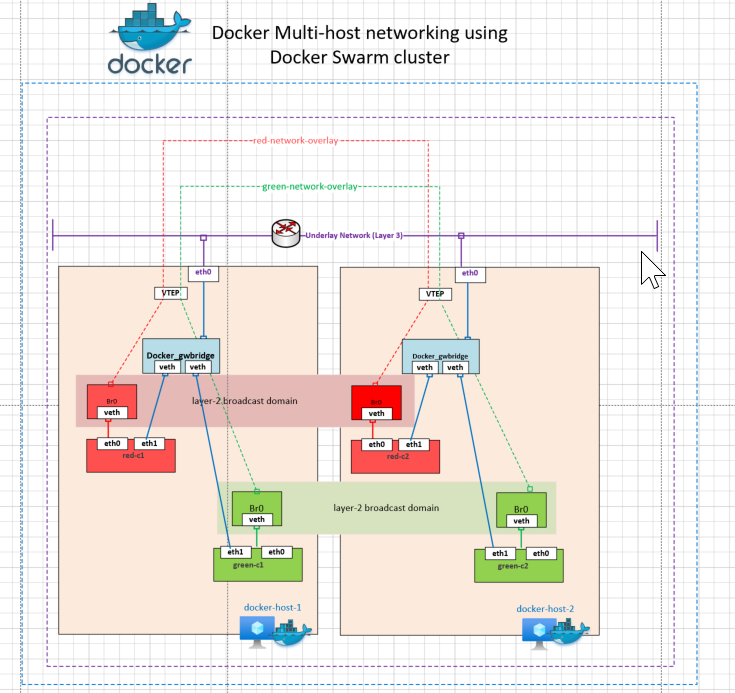
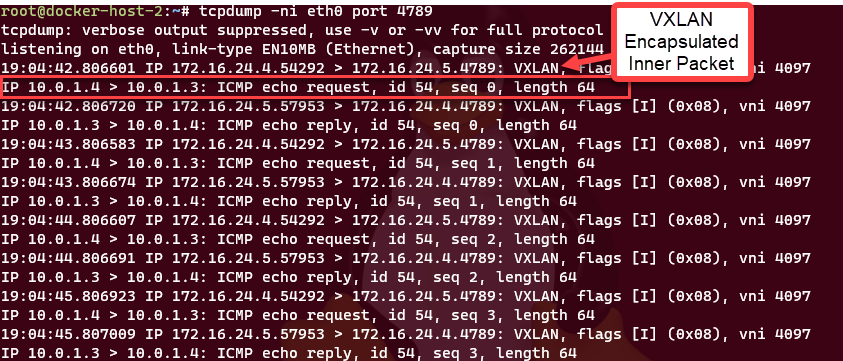

## Docker Multi host Networking

This architecture demonstrates VXLAN network overlay with multi-host docker swarm cluster. Overlay networks span multiple nodes. Overlay networks extend the layer-2 broadcast domain to multiple nodes

## Reference Architecture

#### Multi-Host (Docker Swarm Cluster)



Download Visio link here.

## Documentation links

1. [Install Docker on Ubuntu](https://docs.docker.com/engine/install/ubuntu/)
2. [Docker Swarm Mode](https://docs.docker.com/engine/swarm/swarm-mode/)
3. [VXLAN Overlay Networks](https://docs.docker.com/network/overlay/)
4. [Encrypt traffic on an overlay network](https://docs.docker.com/network/overlay/#encrypt-traffic-on-an-overlay-network)

## Design Components

- Two Ubuntu Linux VM acting as docker hosts. In this design VM reside on the same azure subnet but it can be deployed in enviornments where they have layer3 connectivity.
- Enable Swarm Mode to create a multihost cluster
- Custom Overlay Networks (red-overlay and green-overlay)
- docker_gwbridge is the default bridge for swarm cluster
- Overlay networks span multiple nodes
- Overlay networks extend the layer-2 broadcast domain to multiple nodes
- 
- Encryption can be enabled on overlay networks

## Docker Installation

Create Ubuntu linux VMs (docker-host-1 and docker-host-2) in Azure subnet and install docker.

```
sudo apt-get update
sudo apt-get install docker-ce docker-ce-cli containerd.io
apt install bridge-utils
```

## Create a Docker Swarm Cluster

List the default networks and initialize docker swarm cluster

### Initialize the cluster on the Manager Node

```
root@docker-host-1:~# docker network ls
NETWORK ID NAME DRIVER SCOPE
617215cfa2bf bridge bridge local
e40cd249ca0f host host local
bbc4a629e148 none null local

root@docker-host-1:~# docker swarm init --advertise-addr=172.16.24.4
Swarm initialized: current node (im1clp7aw6n6qqv8lcs3u3hxe) is now a manager.

To add a worker to this swarm, run the following command:

    docker swarm join --token SWMTKN-1-5y4llc1jq1eowsq42pkxrmjl01z50299uszrqaajvh79r33bkq-27wum03xpatfo65av02ufiexd 172.16.24.4:2377

To add a manager to this swarm, run 'docker swarm join-token manager' and follow the instructions.

```

### Join the Worker Node to the swarm cluster

```
root@docker-host-2:~# docker rm $(docker ps -aq) -f
e6dc0d3bc421
root@docker-host-2:~# docker swarm join --token SWMTKN-1-5y4llc1jq1eowsq42pkxrmjl01z50299uszrqaajvh79r33bkq-27wum03xpatfo65av02ufiexd 172.16.24.4:2377
This node joined a swarm as a worker.

Bridge Network: Layer2 broadcast domain. All containers connected to the bridge can talk to each other.

```

### Run validations Manager Node

```

root@docker-host-1:~# docker node ls
ID                            HOSTNAME        STATUS    AVAILABILITY   MANAGER STATUS   ENGINE VERSION
im1clp7aw6n6qqv8lcs3u3hxe *   docker-host-1   Ready     Active         Leader           20.10.7
66lur8tr9pz53r1bdrd1ee6bj     docker-host-2   Ready     Active                          20.10.7
root@docker-host-1:~#

Notice two new network the docker_gwbridge network scoped as "local" and overlay network called "ingress" scoped as swarm
root@docker-host-1:~# docker network ls
NETWORK ID     NAME              DRIVER    SCOPE
617215cfa2bf   bridge            bridge    local
31854151fca2   docker_gwbridge   bridge    local
e40cd249ca0f   host              host      local
cbggz8x7u06z   ingress           overlay   swarm
bbc4a629e148   none              null      local
root@docker-host-1:~#

Observe the IPs on the Default bridge:

root@docker-host-1:~# docker network inspect docker_gwbridge
[
    {
        "Name": "docker_gwbridge",
        "Id": "31854151fca2b9a3c23492b5cec8b4f1a98d878cae1cbfffe07f0bfb8e24ec73",
        "Created": "2021-07-28T17:30:03.934967791Z",
        "Scope": "local",
        "Driver": "bridge",
        "EnableIPv6": false,
        "IPAM": {
            "Driver": "default",
            "Options": null,
            "Config": [
                {
                    "Subnet": "172.22.0.0/16",
                    "Gateway": "172.22.0.1"
                }
            ]
        },
        "Internal": false,
        "Attachable": false,
        "Ingress": false,
        "ConfigFrom": {
            "Network": ""
        },
        "ConfigOnly": false,
        "Containers": {
            "930c47519b4cc4b1b9a3e57fa41cbe2553efd87e41ed68414a5909f539470daf": {
                "Name": "gateway_6544aa12aef6",
                "EndpointID": "131e17b98e242286d0e86817f7850b461ed7f801bfc20a285ba0b884777734cd",
                "MacAddress": "02:42:ac:16:00:03",
                "IPv4Address": "172.22.0.3/16",
                "IPv6Address": ""
            },
            "ingress-sbox": {
                "Name": "gateway_ingress-sbox",
                "EndpointID": "b21f423d1daf361ac1c2edeb3dc23eb90fdf32c3e28983c018fa1c8761dd1c7c",
                "MacAddress": "02:42:ac:16:00:02",
                "IPv4Address": "172.22.0.2/16",
                "IPv6Address": ""
            }
        },
        "Options": {
            "com.docker.network.bridge.enable_icc": "false",
            "com.docker.network.bridge.enable_ip_masquerade": "true",
            "com.docker.network.bridge.name": "docker_gwbridge"
        },
        "Labels": {}
    }
]
root@docker-host-1:~#


root@docker-host-2:~# docker network inspect docker_gwbridge
[
    {
        "Name": "docker_gwbridge",
        "Id": "03633bcf16523df6bc2e1ad4c61c0c1fa48aff8707220a2487511675aeeca8b0",
        "Created": "2021-07-28T17:30:47.940924793Z",
        "Scope": "local",
        "Driver": "bridge",
        "EnableIPv6": false,
        "IPAM": {
            "Driver": "default",
            "Options": null,
            "Config": [
                {
                    "Subnet": "172.20.0.0/16",
                    "Gateway": "172.20.0.1"
                }
            ]
        },
        "Internal": false,
        "Attachable": false,
        "Ingress": false,
        "ConfigFrom": {
            "Network": ""
        },
        "ConfigOnly": false,
        "Containers": {
            "17ca00bbc9e0513f8168d84357b83f59f204d3224737c4a9be6b76165d594a5e": {
                "Name": "gateway_d63087c3850c",
                "EndpointID": "8818139ba7b641ad75eee8117d6c34760320daead77d86e77918022254bd7a41",
                "MacAddress": "02:42:ac:14:00:03",
                "IPv4Address": "172.20.0.3/16",
                "IPv6Address": ""
            },
            "ingress-sbox": {
                "Name": "gateway_ingress-sbox",
                "EndpointID": "4986fc32aeefe212a5ba3aecbd75a6d90257273c435c578f717826c269f52c12",
                "MacAddress": "02:42:ac:14:00:02",
                "IPv4Address": "172.20.0.2/16",
                "IPv6Address": ""
            }
        },
        "Options": {
            "com.docker.network.bridge.enable_icc": "false",
            "com.docker.network.bridge.enable_ip_masquerade": "true",
            "com.docker.network.bridge.name": "docker_gwbridge"
        },
        "Labels": {}
    }
]

```

### Create new custom overlay networks

```
root@docker-host-1:~# docker network create -d overlay red-overlay
e2wklxwawqznawtlwyieynell
root@docker-host-1:~# docker network create -d overlay green-overlay --opt encyrpted
yq9448zt082zrr6wmva6zygld
root@docker-host-1:~# docker network inspect red-overlay
[
    {
        "Name": "red-overlay",
        "Id": "e2wklxwawqznawtlwyieynell",
        "Created": "2021-07-28T17:39:51.625319947Z",
        "Scope": "swarm",
        "Driver": "overlay",
        "EnableIPv6": false,
        "IPAM": {
            "Driver": "default",
            "Options": null,
            "Config": [
                {
                    "Subnet": "10.0.1.0/24",
                    "Gateway": "10.0.1.1"
                }
            ]
        },
        "Internal": false,
        "Attachable": false,
        "Ingress": false,
        "ConfigFrom": {
            "Network": ""
        },
        "ConfigOnly": false,
        "Containers": null,
        "Options": {
            "com.docker.network.driver.overlay.vxlanid_list": "4097"
        },
        "Labels": null
    }
]
root@docker-host-1:~# docker network inspect green-overlay
[
    {
        "Name": "green-overlay",
        "Id": "yq9448zt082zrr6wmva6zygld",
        "Created": "2021-07-28T17:40:05.825047112Z",
        "Scope": "swarm",
        "Driver": "overlay",
        "EnableIPv6": false,
        "IPAM": {
            "Driver": "default",
            "Options": null,
            "Config": [
                {
                    "Subnet": "10.0.2.0/24",
                    "Gateway": "10.0.2.1"
                }
            ]
        },
        "Internal": false,
        "Attachable": false,
        "Ingress": false,
        "ConfigFrom": {
            "Network": ""
        },
        "ConfigOnly": false,
        "Containers": null,
        "Options": {
            "com.docker.network.driver.overlay.vxlanid_list": "4098",
            "encyrpted": ""
        },
        "Labels": null
    }

]

root@docker-host-1:~# docker network ls
NETWORK ID     NAME              DRIVER    SCOPE
617215cfa2bf   bridge            bridge    local
31854151fca2   docker_gwbridge   bridge    local
yq9448zt082z   green-overlay     overlay   swarm
e40cd249ca0f   host              host      local
cbggz8x7u06z   ingress           overlay   swarm
bbc4a629e148   none              null      local
e2wklxwawqzn   red-overlay       overlay   swarm
```

### Create docker service with 2 replicas on the red-overlay network

```

root@docker-host-1:~# docker service create --name web-service --replicas=2 --network red-overlay nginxdemos/hello
dimkgkean8tk4cy7pg0ro96og
overall progress: 2 out of 2 tasks
1/2: running
2/2: running
verify: Service converged
root@docker-host-1:~# docker ps
CONTAINER ID   IMAGE                     COMMAND                  CREATED          STATUS          PORTS     NAMES
930c47519b4c   nginxdemos/hello:latest   "/docker-entrypoint.…"   22 seconds ago   Up 21 seconds   80/tcp    web-service.2.4nvjeoc4irny8vq5mbr2vxhkz
root@docker-host-1:~# docker service ls
ID             NAME          MODE         REPLICAS   IMAGE                     PORTS
dimkgkean8tk   web-service   replicated   2/2        nginxdemos/hello:latest
root@docker-host-1:~# docker service ps
"docker service ps" requires at least 1 argument.
See 'docker service ps --help'.

Usage:  docker service ps [OPTIONS] SERVICE [SERVICE...]

List the tasks of one or more services
root@docker-host-1:~# docker service ps web-service
ID             NAME            IMAGE                     NODE            DESIRED STATE   CURRENT STATE            ERROR     PORTS
4j5g6tq92nlq   web-service.1   nginxdemos/hello:latest   docker-host-2   Running         Running 39 seconds ago
4nvjeoc4irny   web-service.2   nginxdemos/hello:latest   docker-host-1   Running         Running 41 seconds ago
root@docker-host-1:~#


root@docker-host-2:~# docker ps
CONTAINER ID   IMAGE                     COMMAND                  CREATED          STATUS          PORTS     NAMES
17ca00bbc9e0   nginxdemos/hello:latest   "/docker-entrypoint.…"   24 seconds ago   Up 23 seconds   80/tcp    web-service.1.4j5g6tq92nlqwja2aovsghnpm

```

# Inspect the containers

```
root@docker-host-1:~# docker exec -it web-service.2.4nvjeoc4irny8vq5mbr2vxhkz sh
/ # ip add
1: lo: <LOOPBACK,UP,LOWER_UP> mtu 65536 qdisc noqueue state UNKNOWN qlen 1000
    link/loopback 00:00:00:00:00:00 brd 00:00:00:00:00:00
    inet 127.0.0.1/8 scope host lo
       valid_lft forever preferred_lft forever
75: eth0@if76: <BROADCAST,MULTICAST,UP,LOWER_UP,M-DOWN> mtu 1450 qdisc noqueue state UP
    link/ether 02:42:0a:00:01:04 brd ff:ff:ff:ff:ff:ff
    inet 10.0.1.4/24 brd 10.0.1.255 scope global eth0
       valid_lft forever preferred_lft forever
77: eth1@if78: <BROADCAST,MULTICAST,UP,LOWER_UP,M-DOWN> mtu 1500 qdisc noqueue state UP
    link/ether 02:42:ac:16:00:03 brd ff:ff:ff:ff:ff:ff
    inet 172.22.0.3/16 brd 172.22.255.255 scope global eth1
       valid_lft forever preferred_lft forever
/ # route -n
Kernel IP routing table
Destination     Gateway         Genmask         Flags Metric Ref    Use Iface
0.0.0.0         172.22.0.1      0.0.0.0         UG    0      0        0 eth1
10.0.1.0        0.0.0.0         255.255.255.0   U     0      0        0 eth0
172.22.0.0      0.0.0.0         255.255.0.0     U     0      0        0 eth1
/ #
/ # ping web-service.1.4j5g6tq92nlqwja2aovsghnpm
PING web-service.1.4j5g6tq92nlqwja2aovsghnpm (10.0.1.3): 56 data bytes
64 bytes from 10.0.1.3: seq=0 ttl=64 time=1.423 ms
64 bytes from 10.0.1.3: seq=1 ttl=64 time=0.811 ms
^C
--- web-service.1.4j5g6tq92nlqwja2aovsghnpm ping statistics ---
2 packets transmitted, 2 packets received, 0% packet loss
round-trip min/avg/max = 0.811/1.117/1.423 ms
/ #


Container on docker-host-2
root@docker-host-2:~# docker exec -it web-service.1.4j5g6tq92nlqwja2aovsghnpm sh
/ # ip add
1: lo: <LOOPBACK,UP,LOWER_UP> mtu 65536 qdisc noqueue state UNKNOWN qlen 1000
    link/loopback 00:00:00:00:00:00 brd 00:00:00:00:00:00
    inet 127.0.0.1/8 scope host lo
       valid_lft forever preferred_lft forever
43: eth0@if44: <BROADCAST,MULTICAST,UP,LOWER_UP,M-DOWN> mtu 1450 qdisc noqueue state UP
    link/ether 02:42:0a:00:01:03 brd ff:ff:ff:ff:ff:ff
    inet 10.0.1.3/24 brd 10.0.1.255 scope global eth0
       valid_lft forever preferred_lft forever
45: eth1@if46: <BROADCAST,MULTICAST,UP,LOWER_UP,M-DOWN> mtu 1500 qdisc noqueue state UP
    link/ether 02:42:ac:14:00:03 brd ff:ff:ff:ff:ff:ff
    inet 172.20.0.3/16 brd 172.20.255.255 scope global eth1
       valid_lft forever preferred_lft forever
/ # route -n
Kernel IP routing table
Destination     Gateway         Genmask         Flags Metric Ref    Use Iface
0.0.0.0         172.20.0.1      0.0.0.0         UG    0      0        0 eth1
10.0.1.0        0.0.0.0         255.255.255.0   U     0      0        0 eth0
172.20.0.0      0.0.0.0         255.255.0.0     U     0      0        0 eth1

```

### VXLAN Overlay Packet capture

####Initiate ping from container on docker-host-1 to container on docker-host-2

```
root@docker-host-1:~# docker service ps web-service
ID             NAME            IMAGE                     NODE            DESIRED STATE   CURRENT STATE               ERROR     PORTS
4j5g6tq92nlq   web-service.1   nginxdemos/hello:latest   docker-host-2   Running         Running about an hour ago
4nvjeoc4irny   web-service.2   nginxdemos/hello:latest   docker-host-1   Running         Running about an hour ago
root@docker-host-1:~# docker exec -it web-service.2.4nvjeoc4irny8vq5mbr2vxhkz sh
/ # ping  web-service.1
ping: bad address 'web-service.1'
/ # ip add
1: lo: <LOOPBACK,UP,LOWER_UP> mtu 65536 qdisc noqueue state UNKNOWN qlen 1000
    link/loopback 00:00:00:00:00:00 brd 00:00:00:00:00:00
    inet 127.0.0.1/8 scope host lo
       valid_lft forever preferred_lft forever
75: eth0@if76: <BROADCAST,MULTICAST,UP,LOWER_UP,M-DOWN> mtu 1450 qdisc noqueue state UP
    link/ether 02:42:0a:00:01:04 brd ff:ff:ff:ff:ff:ff
    inet 10.0.1.4/24 brd 10.0.1.255 scope global eth0
       valid_lft forever preferred_lft forever
77: eth1@if78: <BROADCAST,MULTICAST,UP,LOWER_UP,M-DOWN> mtu 1500 qdisc noqueue state UP
    link/ether 02:42:ac:16:00:03 brd ff:ff:ff:ff:ff:ff
    inet 172.22.0.3/16 brd 172.22.255.255 scope global eth1
       valid_lft forever preferred_lft forever
/ # ping 10.0.1.3
PING 10.0.1.3 (10.0.1.3): 56 data bytes
64 bytes from 10.0.1.3: seq=0 ttl=64 time=1.268 ms
64 bytes from 10.0.1.3: seq=1 ttl=64 time=1.060 ms
64 bytes from 10.0.1.3: seq=2 ttl=64 time=0.837 ms
64 bytes from 10.0.1.3: seq=3 ttl=64 time=1.331 ms
^C
--- 10.0.1.3 ping statistics ---
4 packets transmitted, 4 packets received, 0% packet loss
round-trip min/avg/max = 0.837/1.124/1.331 ms
/ #

```

####Run tcpdump on docker-host-2 eth0 interface

Observe vxlan encapsulated packets (inner icmp packets)

```

root@docker-host-2:~# tcpdump -ni eth0 port 4789
tcpdump: verbose output suppressed, use -v or -vv for full protocol decode
listening on eth0, link-type EN10MB (Ethernet), capture size 262144 bytes
19:04:42.806601 IP 172.16.24.4.54292 > 172.16.24.5.4789: VXLAN, flags [I] (0x08), vni 4097
IP 10.0.1.4 > 10.0.1.3: ICMP echo request, id 54, seq 0, length 64
19:04:42.806720 IP 172.16.24.5.57953 > 172.16.24.4.4789: VXLAN, flags [I] (0x08), vni 4097
IP 10.0.1.3 > 10.0.1.4: ICMP echo reply, id 54, seq 0, length 64
19:04:43.806583 IP 172.16.24.4.54292 > 172.16.24.5.4789: VXLAN, flags [I] (0x08), vni 4097
IP 10.0.1.4 > 10.0.1.3: ICMP echo request, id 54, seq 1, length 64
19:04:43.806674 IP 172.16.24.5.57953 > 172.16.24.4.4789: VXLAN, flags [I] (0x08), vni 4097
IP 10.0.1.3 > 10.0.1.4: ICMP echo reply, id 54, seq 1, length 64
19:04:44.806607 IP 172.16.24.4.54292 > 172.16.24.5.4789: VXLAN, flags [I] (0x08), vni 4097
IP 10.0.1.4 > 10.0.1.3: ICMP echo request, id 54, seq 2, length 64
19:04:44.806691 IP 172.16.24.5.57953 > 172.16.24.4.4789: VXLAN, flags [I] (0x08), vni 4097
IP 10.0.1.3 > 10.0.1.4: ICMP echo reply, id 54, seq 2, length 64
19:04:45.806923 IP 172.16.24.4.54292 > 172.16.24.5.4789: VXLAN, flags [I] (0x08), vni 4097
IP 10.0.1.4 > 10.0.1.3: ICMP echo request, id 54, seq 3, length 64
19:04:45.807009 IP 172.16.24.5.57953 > 172.16.24.4.4789: VXLAN, flags [I] (0x08), vni 4097
IP 10.0.1.3 > 10.0.1.4: ICMP echo reply, id 54, seq 3, length 64
```

#### Cleanup services, swarm cluster

```

root@docker-host-1:~# docker service ls
ID             NAME          MODE         REPLICAS   IMAGE                     PORTS
dimkgkean8tk   web-service   replicated   3/2        nginxdemos/hello:latest
root@docker-host-1:~# docker service rm  web-service
web-service


root@docker-host-2:~# docker swarm leave
Node left the swarm.


root@docker-host-1:~# docker swarm leave
Error response from daemon: You are attempting to leave the swarm on a node that is participating as a manager. Removing the last manager erases all current state of the swarm. Use `--force` to ignore this message.
root@docker-host-1:~# docker swarm leave --force
Node left the swarm.

root@docker-host-1:~# docker network rm docker_gwbridge
docker_gwbridge

root@docker-host-2:~# docker network rm docker_gwbridge
docker_gwbridge
root@docker-host-2:~#

```

### TODO

1. Enable encryption on overlay and capture packets
2. Use Bicep automation to deploy docker hosts and create a docker swarm cluster
