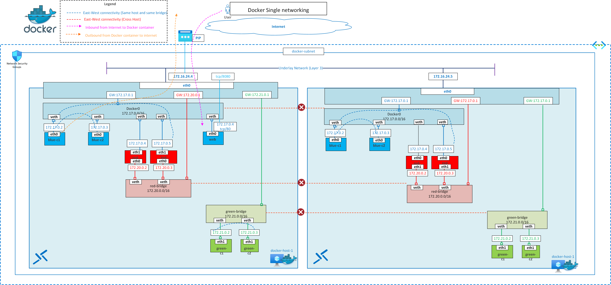

# Docker Single Host Networking

This architecture demonstrates _single_ docker host and networking within the docker host, custom bridge networks and dual homing containers. Containers connected to the bridge network on one docker host cannot talk to the container on the other host. **Bridge networks are scoped locally and don't span multiple hosts**.

The quickstart deployment will provision two Azure VMs acting as docker hosts, each has an out-the-box installation of docker. Azure bastion is also deployed and enabled for the VMs and you can connect to the docker VMs using this method immediately. For direct SSH connection, please see quickstart guide below.

# Reference Architecture

#### Single Host Docker networking



Download [Multi-tab Visio](aks-all-reference-architectures-visio.vsdx) and [PDF](aks-all-reference-architectures-PDF.pdf)

[](https://portal.azure.com/#create/Microsoft.Template/uri/https%3A%2F%2Fraw.githubusercontent.com%2Fnehalineogi%2Fazure-cross-solution-network-architectures%2Fmain%2Faks%2Fjson%2Fdockerhost.json)

# Quickstart deployment

The username for the deployed VMs is `localadmin`

The passwords are stored in a keyvault deployed to the same resource group.


### Task 1: Start Deployment

1. Click Deploy to Azure button above and supply the signed-in user ID from step 2.

2. Open Cloud Shell and retrieve your signed-in user ID below (this is used to apply access to Keyvault).

```
az ad signed-in-user show --query objectId -o tsv
```

3. Using Azure Bastion, log in to the VMs using the username `localadmin` and passwords from keyvault.

### Task 2 (optional): SSH to the docker VMs.

1. Locate the Network Security Group (NSG) called "Allow-tunnel-traffic" and amend rule "allow-ssh-inbound" - change 127.0.0.1 to your current public IP address and change rule from Deny to Allow

2. Retrieve the public IP address (or DNS label) for each VM

3. Retrieve the VM passwords from the keyvault.

4. SSH to your VMs

```
ssh localadmin@[VM Public IP or DNS]
```

# Design Components

The above architecture diagram contains a few key components

- Two Ubuntu Linux VM acting as docker hosts. In this design, VMs reside on the same azure subnet but it can be deployed in environments where they have layer 3 connectivity.
- Default docker bridge (docker0)
- Custom docker bridge red-bridge and green-bridge
- Two docker hosts are connected to the same subnet. Containers connected to the bridge network on one docker host cannot talk to the container on the other host. Note: Bridge network are scoped locally and don't span multiple hosts.
- Bridge networks are like two isolated layer two switches.
- Inbound and oubound connectivity to and from container via host port (eth0)

## Documentation links

1. [Docker network tutorial](https://docs.docker.com/network/network-tutorial-standalone/)
2. [Docker network bridge](https://docs.docker.com/network/bridge/)
3. [Container networking](https://docs.docker.com/config/containers/container-networking/)

# Challenge 1: Run a simple nginx container and connect to default docker0 bridge

Docker0 is already created by docker installation. Docker0 bridge has a layer3 IP.

## Task 1: Validations

Docker Host default configuration.

List the default networks. Bridge Network: Layer2 broadcast domain. All containers connected to the bridge can talk to each other. All docker installations come with the default docker bridge - docker0

```
root@docker-host-1:/home/localadmin# docker ps
CONTAINER ID   IMAGE     COMMAND   CREATED   STATUS    PORTS     NAMES
root@docker-host-1:/home/localadmin# docker network ls
NETWORK ID     NAME      DRIVER    SCOPE
64f9bf153cf1   bridge    bridge    local
e38488db9a75   host      host      local
271976158bff   none      null      local
root@docker-host-1:/home/localadmin# brctl show
bridge name     bridge id               STP enabled     interfaces
docker0         8000.0242e4c4c389       no
root@docker-host-1:/home/localadmin#
```

## Task 2: Create a container on the default bridge network (docker0)

```
#
# Run all commands as root user
#
localadmin@docker-host-1:~$ sudo -s
root@docker-host-1:/home/localadmin#
#
# Run nginx container
#
root@docker-host-1:/home/localadmin# docker run -dit --name blue-c1 nginxdemos/hello
1c12c826586ff22e9569ca8a231e635afa60b294de7ec4b4b5bc99f6ca24520f

#
# list the container
#
root@docker-host-1:/home/localadmin# docker ps
CONTAINER ID   IMAGE              COMMAND                  CREATED          STATUS         PORTS     NAMES
1c12c826586f   nginxdemos/hello   "/docker-entrypoint.…"   11 seconds ago   Up 9 seconds   80/tcp    blue-c1


#
# login to the container (Observe networking components)
#

root@docker-host-1:/home/localadmin# docker exec -it blue-c1 sh
/ # ifconfig
eth0      Link encap:Ethernet  HWaddr 02:42:AC:11:00:02
          inet addr:172.17.0.2  Bcast:172.17.255.255  Mask:255.255.0.0
          UP BROADCAST RUNNING MULTICAST  MTU:1500  Metric:1
          RX packets:10 errors:0 dropped:0 overruns:0 frame:0
          TX packets:0 errors:0 dropped:0 overruns:0 carrier:0
          collisions:0 txqueuelen:0
          RX bytes:876 (876.0 B)  TX bytes:0 (0.0 B)

lo        Link encap:Local Loopback
          inet addr:127.0.0.1  Mask:255.0.0.0
          UP LOOPBACK RUNNING  MTU:65536  Metric:1
          RX packets:0 errors:0 dropped:0 overruns:0 frame:0
          TX packets:0 errors:0 dropped:0 overruns:0 carrier:0
          collisions:0 txqueuelen:1000
          RX bytes:0 (0.0 B)  TX bytes:0 (0.0 B)

/ #
/ # route -n
Kernel IP routing table
Destination     Gateway         Genmask         Flags Metric Ref    Use Iface
0.0.0.0         172.17.0.1      0.0.0.0         UG    0      0        0 eth0
172.17.0.0      0.0.0.0         255.255.0.0     U     0      0        0 eth0

#
# Observe outbound IP of the container is the PIP of the docker hosts
#
/ # curl ifconfig.me
20.127.137.145/ # exit
#
# outbound IP on the docker-host
#
root@docker-host-1:/home/localadmin# curl ifconfig.me
20.127.137.145root@docker-host-1:/home/localadmin#

```

## Task 3: Create another container in the default bridge network and ping the first container

```
#
# Create a second container on the default docker0 bridge
#
root@docker-host-1:~# docker run -dit --name blue-c2 nginxdemos/helloinxdemos/hello
8dc5a6354f1e0a672d4c62dc9ffa8cd6f448ec763224cafe2d7a2fdd889ea7d1

root@docker-host-1:/home/localadmin# docker exec -it blue-c2 sh
# ip add
1: lo: <LOOPBACK,UP,LOWER_UP> mtu 65536 qdisc noqueue state UNKNOWN qlen 1000
    link/loopback 00:00:00:00:00:00 brd 00:00:00:00:00:00
    inet 127.0.0.1/8 scope host lo
       valid_lft forever preferred_lft forever
24: eth0@if25: <BROADCAST,MULTICAST,UP,LOWER_UP,M-DOWN> mtu 1500 qdisc noqueue state UP
    link/ether 02:42:ac:11:00:03 brd ff:ff:ff:ff:ff:ff
    inet 172.17.0.3/16 brd 172.17.255.255 scope global eth0
       valid_lft forever preferred_lft forever
/ #
#
# ping blue-c1 container via IP
#
/ # ping 172.17.0.2
PING 172.17.0.2 (172.17.0.2): 56 data bytes
64 bytes from 172.17.0.2: seq=0 ttl=64 time=0.101 ms
64 bytes from 172.17.0.2: seq=1 ttl=64 time=0.087 ms
^C
--- 172.17.0.2 ping statistics ---
2 packets transmitted, 2 packets received, 0% packet loss
round-trip min/avg/max = 0.087/0.094/0.101 ms
/ # curl -I 172.17.0.2
HTTP/1.1 200 OK
Server: nginx/1.21.1
Date: Wed, 28 Jul 2021 12:28:49 GMT
Content-Type: text/html
Connection: keep-alive
Expires: Wed, 28 Jul 2021 12:28:48 GMT
Cache-Control: no-cache

```

## Task 4: (Optional) Inspect the Docker network bridge

Observe subnet, gateway and container IPs

```
root@docker-host-1:/home/localadmin# docker network inspect bridge
[
    {
        "Name": "bridge",
        "Id": "64f9bf153cf1d8482b075a366d3d2a9132ab82bea2d40651d13eb4da972af26f",
        "Created": "2022-02-02T10:32:55.644003239Z",
        "Scope": "local",
        "Driver": "bridge",
        "EnableIPv6": false,
        "IPAM": {
            "Driver": "default",
            "Options": null,
            "Config": [
                {
                    "Subnet": "172.17.0.0/16"
                }
            ]
        },
        "Internal": false,
        "Attachable": false,
        "Ingress": false,
        "ConfigFrom": {
            "Network": ""
        },
        "ConfigOnly": false,
        "Containers": {
            "1c12c826586ff22e9569ca8a231e635afa60b294de7ec4b4b5bc99f6ca24520f": {
                "Name": "blue-c1",
                "EndpointID": "bff479172d00b24cae5696af5798d5e360d0dd413c447dd6f80f5cdd3faa1f4a",
                "MacAddress": "02:42:ac:11:00:02",
                "IPv4Address": "172.17.0.2/16",
                "IPv6Address": ""
            },
            "8dc5a6354f1e0a672d4c62dc9ffa8cd6f448ec763224cafe2d7a2fdd889ea7d1": {
                "Name": "blue-c2",
                "EndpointID": "778c2396bf366d75212bc58745b90558feab440fb1ee2cb671e88fc581ed839c",
                "MacAddress": "02:42:ac:11:00:03",
                "IPv4Address": "172.17.0.3/16",
                "IPv6Address": ""
            }
        },
        "Options": {
            "com.docker.network.bridge.default_bridge": "true",
            "com.docker.network.bridge.enable_icc": "true",
            "com.docker.network.bridge.enable_ip_masquerade": "true",
            "com.docker.network.bridge.host_binding_ipv4": "0.0.0.0",
            "com.docker.network.bridge.name": "docker0",
            "com.docker.network.driver.mtu": "1500"
        },
        "Labels": {}
    }
]
root@docker-host-1:~#
```

# Challenge 2: Create two custom bridges (red-bridge and green-bridge)

```
#
# Create a red-bridge
#
root@docker-host-1:/home/localadmin# docker network create --driver bridge red-bridge
c0a6223216a2a70fc29dd981e338f66df95583325ed7799791f9c5ee893bd11b

#
# create a green bridge
#
root@docker-host-1:/home/localadmin# docker network create --driver bridge green-bridge
7403cd79f06afcf7db60bd4db792ea5511731043ecd2fa4f859ee5b94f01c438
#
# list bridge
#
root@docker-host-1:~# docker network ls
NETWORK ID     NAME           DRIVER    SCOPE
617215cfa2bf   bridge         bridge    local
6555ae5cadac   green-bridge   bridge    local
e40cd249ca0f   host           host      local
bbc4a629e148   none           null      local
ac20cf5095d2   red-bridge     bridge    local
root@docker-host-1:~#


#
# Inspect the network space for each bridge
# Note: You can specify the IP address range, subnet,
# gateway, and other options. See docker network
# create --help for details
#
root@docker-host-1:/home/localadmin# docker network inspect bridge | grep -A 2 -i "Subnet"
                    "Subnet": "172.17.0.0/16"
                }
            ]
root@docker-host-1:/home/localadmin# docker network inspect red-bridge | grep -A 2 -i "Subnet"
                    "Subnet": "172.20.0.0/16",
                    "Gateway": "172.20.0.1"
                }
root@docker-host-1:/home/localadmin# docker network inspect green-bridge | grep -A 2 -i "Subnet"
                    "Subnet": "172.21.0.0/16",
                    "Gateway": "172.21.0.1"
                }
#
# Attach red-c1 and red-c2 containers to red-bridge
#

root@docker-host-1:/home/localadmin# docker run -dit --name red-c1 --network red-bridge nginxdemos/hello
a59d31002b2dc33b2afb95929371229fced3e4780dc04b0918e73edab1b03869
root@docker-host-1:/home/localadmin# docker run -dit --name red-c2 --network red-bridge nginxdemos/hello
373441c37f82bd7d29c67c2502eb99ba6ebb7d5529a623bffcea81c0fe3a7bcb
root@docker-host-1:/home/localadmin# docker exec -it red-c1 sh
/ # ip add
1: lo: <LOOPBACK,UP,LOWER_UP> mtu 65536 qdisc noqueue state UNKNOWN qlen 1000
    link/loopback 00:00:00:00:00:00 brd 00:00:00:00:00:00
    inet 127.0.0.1/8 scope host lo
       valid_lft forever preferred_lft forever
32: eth0@if33: <BROADCAST,MULTICAST,UP,LOWER_UP,M-DOWN> mtu 1500 qdisc noqueue state UP
    link/ether 02:42:ac:14:00:02 brd ff:ff:ff:ff:ff:ff
    inet 172.20.0.2/16 brd 172.20.255.255 scope global eth0
       valid_lft forever preferred_lft forever

#
# Attach containers green-c1 and green-c2 to the green bridge
#
root@docker-host-1:/home/localadmin# docker run -dit --name green-c1 --network green-bridge nginxdemos/hello
ef113a5fca625929a95de0aa4cadf0160ec370044b43f7c8c42f44171eb0fa49
root@docker-host-1:/home/localadmin# docker run -dit --name green-c2 --network green-bridge nginxdemos/hello
6fd0dfc338827f828c7121c9bdd3091e41f3d94122ec4bda6d46e8b503e9cbff
root@docker-host-1:/home/localadmin# docker exec -it green-c1 sh
/ # ip add
1: lo: <LOOPBACK,UP,LOWER_UP> mtu 65536 qdisc noqueue state UNKNOWN qlen 1000
    link/loopback 00:00:00:00:00:00 brd 00:00:00:00:00:00
    inet 127.0.0.1/8 scope host lo
       valid_lft forever preferred_lft forever
28: eth0@if29: <BROADCAST,MULTICAST,UP,LOWER_UP,M-DOWN> mtu 1500 qdisc noqueue state UP
    link/ether 02:42:ac:15:00:02 brd ff:ff:ff:ff:ff:ff
    inet 172.21.0.2/16 brd 172.21.255.255 scope global eth0
       valid_lft forever preferred_lft forever


```

Observations:

1. Can red-c1 ping red-c2 using hostname and IP. Does it work?
2. Can red-c1 ping green-c1? Why or Why not?

# Challenge 3: DNS Resolution and Outbound IPs

## Task 1: DNS Resolution within -Default Docker0 Bridge

Docker container inherits the DNS configuration from the Docker host. Containers cannot reference each other by names.

```
root@docker-host-1:/home/localadmin# docker exec -it blue-c1 sh
/ # more /etc/resolv.conf
<snip>
nameserver 168.63.129.16
search pa5y0bwcl5yetg3n1qcsrqtlzh.bx.internal.cloudapp.net
/ # curl ifconfig.io
20.127.137.145
/ # exit
root@docker-host-1:/home/localadmin# curl ifconfig.io
20.127.137.145
Non-authoritative answer:
Name:   www.google.com
Address: 172.217.12.228

Non-authoritative answer:
Name:   www.google.com
Address: 2607:f8b0:4004:82f::2004

/ # ping blue-c2
ping: bad address 'blue-c2'

```

## Task 2: In Custom bridge you can ping green-c2 using the hostname.

```
root@docker-host-1:/home/localadmin# docker exec -it green-c1 sh
/ # more /etc/resolv.conf
search pa5y0bwcl5yetg3n1qcsrqtlzh.bx.internal.cloudapp.net
nameserver 127.0.0.11
options edns0 trust-ad ndots:0
/ # nslookup www.google.com
Server:         127.0.0.11
Address:        127.0.0.11:53

Non-authoritative answer:
Name:   www.google.com
Address: 142.250.73.196

Non-authoritative answer:
Name:   www.google.com
Address: 2607:f8b0:4004:832::2004

/ # hostname
ef113a5fca62
/ # ping green-c2
PING green-c2 (172.21.0.3): 56 data bytes
64 bytes from 172.21.0.3: seq=0 ttl=64 time=0.184 ms
64 bytes from 172.21.0.3: seq=1 ttl=64 time=0.106 ms
^C
--- green-c2 ping statistics ---
2 packets transmitted, 2 packets received, 0% packet loss
round-trip min/avg/max = 0.106/0.145/0.184 ms
/ #
#
# outbound IP the same
#

 # curl ifconfig.me
20.127.137.145/

```

# Challenge 4: Dual Home a Container

```
#
# Attach red-c1 to docker0 bridge and observe networking
#
docker network connect bridge red-c1

#
# ssh into the container and observe networking
#
root@docker-host-1:/home/localadmin# docker exec -it red-c1 sh
/ # ip add
1: lo: <LOOPBACK,UP,LOWER_UP> mtu 65536 qdisc noqueue state UNKNOWN qlen 1000
    link/loopback 00:00:00:00:00:00 brd 00:00:00:00:00:00
    inet 127.0.0.1/8 scope host lo
       valid_lft forever preferred_lft forever
32: eth0@if33: <BROADCAST,MULTICAST,UP,LOWER_UP,M-DOWN> mtu 1500 qdisc noqueue state UP
    link/ether 02:42:ac:14:00:02 brd ff:ff:ff:ff:ff:ff
    inet 172.20.0.2/16 brd 172.20.255.255 scope global eth0
       valid_lft forever preferred_lft forever
36: eth1@if37: <BROADCAST,MULTICAST,UP,LOWER_UP,M-DOWN> mtu 1500 qdisc noqueue state UP
    link/ether 02:42:ac:11:00:04 brd ff:ff:ff:ff:ff:ff
    inet 172.17.0.4/16 brd 172.17.255.255 scope global eth1
       valid_lft forever preferred_lft forever
/ # ifconfig
eth0      Link encap:Ethernet  HWaddr 02:42:AC:14:00:02
          inet addr:172.20.0.2  Bcast:172.20.255.255  Mask:255.255.0.0
          UP BROADCAST RUNNING MULTICAST  MTU:1500  Metric:1
          RX packets:25 errors:0 dropped:0 overruns:0 frame:0
          TX packets:6 errors:0 dropped:0 overruns:0 carrier:0
          collisions:0 txqueuelen:0
          RX bytes:1966 (1.9 KiB)  TX bytes:364 (364.0 B)

eth1      Link encap:Ethernet  HWaddr 02:42:AC:11:00:04
          inet addr:172.17.0.4  Bcast:172.17.255.255  Mask:255.255.0.0
          UP BROADCAST RUNNING MULTICAST  MTU:1500  Metric:1
          RX packets:14 errors:0 dropped:0 overruns:0 frame:0
          TX packets:4 errors:0 dropped:0 overruns:0 carrier:0
          collisions:0 txqueuelen:0
          RX bytes:1076 (1.0 KiB)  TX bytes:280 (280.0 B)

lo        Link encap:Local Loopback
          inet addr:127.0.0.1  Mask:255.0.0.0
          UP LOOPBACK RUNNING  MTU:65536  Metric:1
          RX packets:28 errors:0 dropped:0 overruns:0 frame:0
          TX packets:28 errors:0 dropped:0 overruns:0 carrier:0
          collisions:0 txqueuelen:1000
          RX bytes:1526 (1.4 KiB)  TX bytes:1526 (1.4 KiB)

/ # route -n
Kernel IP routing table
Destination     Gateway         Genmask         Flags Metric Ref    Use Iface
0.0.0.0         172.17.0.1      0.0.0.0         UG    0      0        0 eth1
172.17.0.0      0.0.0.0         255.255.0.0     U     0      0        0 eth1
172.20.0.0      0.0.0.0         255.255.0.0     U     0      0        0 eth0
/ # ping 172.17.0.3
PING 172.17.0.3 (172.17.0.3): 56 data bytes
64 bytes from 172.17.0.3: seq=0 ttl=64 time=0.129 ms
^C
--- 172.17.0.3 ping statistics ---
1 packets transmitted, 1 packets received, 0% packet loss
round-trip min/avg/max = 0.129/0.129/0.129 ms
/ # ping 172.20.0.3
PING 172.20.0.3 (172.20.0.3): 56 data bytes
64 bytes from 172.20.0.3: seq=0 ttl=64 time=0.142 ms
^C
--- 172.20.0.3 ping statistics ---
1 packets transmitted, 1 packets received, 0% packet loss
round-trip min/avg/max = 0.142/0.142/0.142 ms
/ # ping 172.21.0.3
PING 172.21.0.3 (172.21.0.3): 56 data bytes
^C
--- 172.21.0.3 ping statistics ---
2 packets transmitted, 0 packets received, 100% packet loss
/ #
```

# Challenge 5: Expose the Container to the outside world

```
#
# Run a new container named "web" and port forward 8080
# on docker-host-1 to 80 on the nginx container named web
#
docker run -dit -p 8080:80 --name web nginxdemos/hello
064c04a43c0138d29eadb04adc18556a9ade83b4f58d98222da1401275d99819
root@docker-host-1:/home/localadmin# docker ps | grep web
064c04a43c01   nginxdemos/hello   "/docker-entrypoint.…"   11 seconds ago   Up 10 seconds   0.0.0.0:8080->80/tcp, :::8080->80/tcp   web
root@docker-host-1:/home/localadmin# curl -I localhost:8080
HTTP/1.1 200 OK
Server: nginx/1.21.6
Date: Thu, 03 Feb 2022 06:22:38 GMT
Content-Type: text/html
Connection: keep-alive
Expires: Thu, 03 Feb 2022 06:22:37 GMT
Cache-Control: no-cache


#
# update NSG to allow tcp/8080 and then access from outside using
# public IP address of docker-host-1
#

nehali@nehali-laptop:~$ curl -I 20.127.137.145:8080
HTTP/1.1 200 OK
Server: nginx/1.21.6
Date: Thu, 03 Feb 2022 06:23:00 GMT
Content-Type: text/html
Connection: keep-alive
Expires: Thu, 03 Feb 2022 06:22:59 GMT
Cache-Control: no-cache

```

# Challenge 6: (optional) Observe docker host networking

Note Docker0 interface and veth pairs, iptables and port forwarding.

```
root@docker-host-1:/home/localadmin# ip add
1: lo: <LOOPBACK,UP,LOWER_UP> mtu 65536 qdisc noqueue state UNKNOWN group default qlen 1000
    link/loopback 00:00:00:00:00:00 brd 00:00:00:00:00:00
    inet 127.0.0.1/8 scope host lo
       valid_lft forever preferred_lft forever
    inet6 ::1/128 scope host
       valid_lft forever preferred_lft forever
2: eth0: <BROADCAST,MULTICAST,UP,LOWER_UP> mtu 1500 qdisc mq state UP group default qlen 1000
    link/ether 00:22:48:2c:81:04 brd ff:ff:ff:ff:ff:ff
    inet 172.16.24.4/24 brd 172.16.24.255 scope global eth0
       valid_lft forever preferred_lft forever
    inet6 fe80::222:48ff:fe2c:8104/64 scope link
       valid_lft forever preferred_lft forever
3: docker0: <BROADCAST,MULTICAST,UP,LOWER_UP> mtu 1500 qdisc noqueue state UP group default
    link/ether 02:42:e4:c4:c3:89 brd ff:ff:ff:ff:ff:ff
    inet 172.17.0.1/16 brd 172.17.255.255 scope global docker0
       valid_lft forever preferred_lft forever
    inet6 fe80::42:e4ff:fec4:c389/64 scope link
       valid_lft forever preferred_lft forever
23: veth8b7f383@if22: <BROADCAST,MULTICAST,UP,LOWER_UP> mtu 1500 qdisc noqueue master docker0 state UP group default
    link/ether 4e:c6:d1:2d:c6:91 brd ff:ff:ff:ff:ff:ff link-netnsid 0
    inet6 fe80::4cc6:d1ff:fe2d:c691/64 scope link
       valid_lft forever preferred_lft forever
25: veth09834ae@if24: <BROADCAST,MULTICAST,UP,LOWER_UP> mtu 1500 qdisc noqueue master docker0 state UP group default
    link/ether 12:cc:4d:79:1f:27 brd ff:ff:ff:ff:ff:ff link-netnsid 1
    inet6 fe80::10cc:4dff:fe79:1f27/64 scope link
       valid_lft forever preferred_lft forever
26: br-c0a6223216a2: <BROADCAST,MULTICAST,UP,LOWER_UP> mtu 1500 qdisc noqueue state UP group default
    link/ether 02:42:74:d9:2f:5b brd ff:ff:ff:ff:ff:ff
    inet 172.20.0.1/16 brd 172.20.255.255 scope global br-c0a6223216a2
       valid_lft forever preferred_lft forever
    inet6 fe80::42:74ff:fed9:2f5b/64 scope link
       valid_lft forever preferred_lft forever
27: br-7403cd79f06a: <BROADCAST,MULTICAST,UP,LOWER_UP> mtu 1500 qdisc noqueue state UP group default
    link/ether 02:42:f9:88:a1:89 brd ff:ff:ff:ff:ff:ff
    inet 172.21.0.1/16 brd 172.21.255.255 scope global br-7403cd79f06a
       valid_lft forever preferred_lft forever
    inet6 fe80::42:f9ff:fe88:a189/64 scope link
       valid_lft forever preferred_lft forever
29: vetha20bf7c@if28: <BROADCAST,MULTICAST,UP,LOWER_UP> mtu 1500 qdisc noqueue master br-7403cd79f06a state UP group default
    link/ether 62:22:b6:2d:fa:ad brd ff:ff:ff:ff:ff:ff link-netnsid 2
    inet6 fe80::6022:b6ff:fe2d:faad/64 scope link
       valid_lft forever preferred_lft forever
31: veth33bd7d5@if30: <BROADCAST,MULTICAST,UP,LOWER_UP> mtu 1500 qdisc noqueue master br-7403cd79f06a state UP group default
    link/ether a2:c0:33:d1:40:fb brd ff:ff:ff:ff:ff:ff link-netnsid 3
    inet6 fe80::a0c0:33ff:fed1:40fb/64 scope link
       valid_lft forever preferred_lft forever
33: veth55ba150@if32: <BROADCAST,MULTICAST,UP,LOWER_UP> mtu 1500 qdisc noqueue master br-c0a6223216a2 state UP group default
    link/ether 92:b2:6b:eb:22:ed brd ff:ff:ff:ff:ff:ff link-netnsid 4
    inet6 fe80::90b2:6bff:feeb:22ed/64 scope link
       valid_lft forever preferred_lft forever
35: vethe0b3f55@if34: <BROADCAST,MULTICAST,UP,LOWER_UP> mtu 1500 qdisc noqueue master br-c0a6223216a2 state UP group default
    link/ether ee:49:cd:42:40:f4 brd ff:ff:ff:ff:ff:ff link-netnsid 5
    inet6 fe80::ec49:cdff:fe42:40f4/64 scope link
       valid_lft forever preferred_lft forever
37: veth39aa169@if36: <BROADCAST,MULTICAST,UP,LOWER_UP> mtu 1500 qdisc noqueue master docker0 state UP group default
    link/ether 12:06:77:27:75:4f brd ff:ff:ff:ff:ff:ff link-netnsid 4
    inet6 fe80::1006:77ff:fe27:754f/64 scope link
       valid_lft forever preferred_lft forever
39: vethe082f9e@if38: <BROADCAST,MULTICAST,UP,LOWER_UP> mtu 1500 qdisc noqueue master docker0 state UP group default
    link/ether e2:d3:0f:d8:42:3f brd ff:ff:ff:ff:ff:ff link-netnsid 6
    inet6 fe80::e0d3:fff:fed8:423f/64 scope link
       valid_lft forever preferred_lft forever
root@docker-host-1:/home/localadmin# route -n
Kernel IP routing table
Destination     Gateway         Genmask         Flags Metric Ref    Use Iface
0.0.0.0         172.16.24.1     0.0.0.0         UG    100    0        0 eth0
168.63.129.16   172.16.24.1     255.255.255.255 UGH   100    0        0 eth0
169.254.169.254 172.16.24.1     255.255.255.255 UGH   100    0        0 eth0
172.16.24.0     0.0.0.0         255.255.255.0   U     0      0        0 eth0
172.17.0.0      0.0.0.0         255.255.0.0     U     0      0        0 docker0
172.20.0.0      0.0.0.0         255.255.0.0     U     0      0        0 br-c0a6223216a2
172.21.0.0      0.0.0.0         255.255.0.0     U     0      0        0 br-7403cd79f06a
root@docker-host-1:/home/localadmin# iptables -L -n
Chain INPUT (policy ACCEPT)
target     prot opt source               destination

Chain FORWARD (policy DROP)
target     prot opt source               destination
DOCKER-USER  all  --  0.0.0.0/0            0.0.0.0/0
DOCKER-ISOLATION-STAGE-1  all  --  0.0.0.0/0            0.0.0.0/0
ACCEPT     all  --  0.0.0.0/0            0.0.0.0/0            ctstate RELATED,ESTABLISHED
DOCKER     all  --  0.0.0.0/0            0.0.0.0/0
ACCEPT     all  --  0.0.0.0/0            0.0.0.0/0
ACCEPT     all  --  0.0.0.0/0            0.0.0.0/0
ACCEPT     all  --  0.0.0.0/0            0.0.0.0/0            ctstate RELATED,ESTABLISHED
DOCKER     all  --  0.0.0.0/0            0.0.0.0/0
ACCEPT     all  --  0.0.0.0/0            0.0.0.0/0
ACCEPT     all  --  0.0.0.0/0            0.0.0.0/0
ACCEPT     all  --  0.0.0.0/0            0.0.0.0/0            ctstate RELATED,ESTABLISHED
DOCKER     all  --  0.0.0.0/0            0.0.0.0/0
ACCEPT     all  --  0.0.0.0/0            0.0.0.0/0
ACCEPT     all  --  0.0.0.0/0            0.0.0.0/0

Chain OUTPUT (policy ACCEPT)
target     prot opt source               destination

Chain DOCKER (3 references)
target     prot opt source               destination
ACCEPT     tcp  --  0.0.0.0/0            172.17.0.5           tcp dpt:80

Chain DOCKER-ISOLATION-STAGE-1 (1 references)
target     prot opt source               destination
DOCKER-ISOLATION-STAGE-2  all  --  0.0.0.0/0            0.0.0.0/0
DOCKER-ISOLATION-STAGE-2  all  --  0.0.0.0/0            0.0.0.0/0
DOCKER-ISOLATION-STAGE-2  all  --  0.0.0.0/0            0.0.0.0/0
RETURN     all  --  0.0.0.0/0            0.0.0.0/0

Chain DOCKER-ISOLATION-STAGE-2 (3 references)
target     prot opt source               destination
DROP       all  --  0.0.0.0/0            0.0.0.0/0
DROP       all  --  0.0.0.0/0            0.0.0.0/0
DROP       all  --  0.0.0.0/0            0.0.0.0/0
RETURN     all  --  0.0.0.0/0            0.0.0.0/0

Chain DOCKER-USER (1 references)
target     prot opt source               destination
RETURN     all  --  0.0.0.0/0            0.0.0.0/0
```

# Cleanup

List all running containers and cleanup

```
root@docker-host-1:/home/localadmin# docker ps
CONTAINER ID   IMAGE              COMMAND                  CREATED          STATUS          PORTS                                   NAMES
064c04a43c01   nginxdemos/hello   "/docker-entrypoint.…"   4 minutes ago    Up 4 minutes    0.0.0.0:8080->80/tcp, :::8080->80/tcp   web
373441c37f82   nginxdemos/hello   "/docker-entrypoint.…"   45 minutes ago   Up 45 minutes   80/tcp                                  red-c2
a59d31002b2d   nginxdemos/hello   "/docker-entrypoint.…"   45 minutes ago   Up 45 minutes   80/tcp                                  red-c1
6fd0dfc33882   nginxdemos/hello   "/docker-entrypoint.…"   49 minutes ago   Up 49 minutes   80/tcp                                  green-c2
ef113a5fca62   nginxdemos/hello   "/docker-entrypoint.…"   49 minutes ago   Up 49 minutes   80/tcp                                  green-c1
8dc5a6354f1e   nginxdemos/hello   "/docker-entrypoint.…"   56 minutes ago   Up 56 minutes   80/tcp                                  blue-c2
1c12c826586f   nginxdemos/hello   "/docker-entrypoint.…"   59 minutes ago   Up 59 minutes   80/tcp                                  blue-c1

#
# list all running container IDs
#
root@docker-host-1:/home/localadmin# docker ps -aq
064c04a43c01
373441c37f82
a59d31002b2d
6fd0dfc33882
ef113a5fca62
8dc5a6354f1e
1c12c826586f

#
# delete all running containers
#
root@docker-host-1:~# docker rm $(docker ps -aq) -f
root@docker-host-1:~# docker ps -aq

#
# Delete the custom bridge
#
root@docker-host-1:/home/localadmin# docker network rm red-bridge
red-bridge
root@docker-host-1:/home/localadmin# docker network rm green-bridge
green-bridge
```

# FAQ/Troubleshooting

## I am unable to SSH to hosts, what do I need to do?

The automated deployment deploys Azure Bastion so you can connect to the VMs via the portal using Bastion. Alternatively the subnet hosting the VMs has a Network Security Group (NSG) attached called "Allow-tunnel-traffic" with a rule called 'allow-ssh-inbound' which is set to Deny by default. If you wish to allow SSH direct to the hosts, you can edit this rule and change the Source from 127.0.0.1 to your current public IP address. Afterwards, Remember to set the rule from Deny to Allow.

## I have followed the steps suggested above, but I still cannot log in over SSH? 

Ensure that you have correctly edited the Network Security Group (NSG) to allow access for port 22. The rule will need your current public IP address and the rule needs to be amended to <b>'allow' rather than 'deny' </b> traffic. 

If you are using a Virtual Private Network (VPN) for outbound internet access, the public IP address you are assigned may differ from the public IP address that is used to connect on the internet, VPN services sometimes use public to public IP address NAT for outbound internet access for efficient use of their public IP addresses. This can be tricky to determine, and will mean that entering your public IP addresss on the NSG will not work. You may wish to open the rule to a 'range' of public IP addresses provided by the VPN service (for instance a.a.a.a/24). You should consider that this does mean that your service will become network reachable to any other VPN customers who are currently assigned an IP address in that range. 

Alternatively, you can check on the destination side (host in Azure) exactly what public IP address is connecting by running this iptables command and then viewing /var/log/syslog. You can use bastion to connect to the host.

``` iptables -I INPUT -p tcp -m tcp --dport 22 -m state --state NEW  -j LOG --log-level 1 --log-prefix "SSH Log" ```

## What are the logins for the VMs?

The credentials for the VMs are stored in an Azure keyvault.

## Are the passwords used cyptographically secure?

No. The passwords are generated deterministically and therefore should be changed on the VMs post deployment, to maximise security. They are auto generated in this way for convenience and are intended to support this environment as a 'Proof of Concept' or learning experience only and are not intended for production use.

## I cannot run the deployment - what is the ADuserID?

In order for the deployment to provision your signed-in user account access to the keyvault, you will need to provide your Azure Active Directory (AAD) signed-in user ObjectID. In order to retrieve this there are serveral methods. The Azure CLI and Azure Powershell methods are provided below. You can use the cloud shell to run the Azure CLI method, but for powershell you must run this from your own device using Azure Powershell module.

Azure CLI or Cloud Shell

```
az ad signed-in-user show --query objectId -o tsv
```

Azure Powershell

```
(Get-AzContext).Account.ExtendedProperties.HomeAccountId.Split('.')[0]
```

## How is docker installed on the host?

Docker is installed via a VM custom script extension, for reference the commands used are found in the following script - [cse.sh](scripts/cse.sh)

This script is called automatically by the [dockerhost.json](json/dockerhost.json) ARM template on deployment.
## Are there any commands I can use to get the host's DNS, passwords and to change the Network Security Group (NSG) rule, instead of using the portal? 

Yes, below are commands that can be used to more quickly retieve this information. 

<b> Obtain password from keyvault (example for docker-host-1 host in default resource group) </b>

If you wish to retieve passwords for a different hostname, simply change the name property to match.

``` az keyvault secret show --name "docker-host-1-admin-password" --vault-name $(az keyvault list -g dockerhost --query "[].name" -o tsv) --query "value" -o tsv ```

If you receive an error on this command relating to a timeout and you are using Windows Subsystem for Linux and referencing the Windows based az, you should reference this github issue - https://github.com/Azure/azure-cli/issues/13573. Use powershell or cloud shell instead to mitigate this known bug.

<b> Obtain DNS label for public IP of host (example for docker-host-1 in default resource group) </b>

``` az network public-ip show -g dockerhost -n docker-host-1-nic-pip --query "dnsSettings.fqdn" -o tsv ```

<b> Change Network Security Rule (NSG) to allow SSH inbound from a specific public IP address </b>

You should change a.a.a.a to match your public IP address

``` az network nsg rule update -g dockerhost --nsg-name Allow-tunnel-traffic -n allow-ssh-inbound  --access allow --source-address-prefix "a.a.a.a" ```