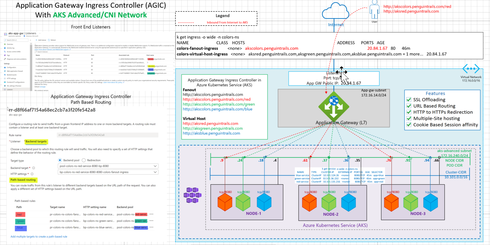
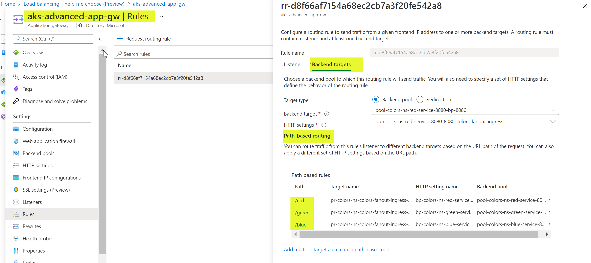

## Azure AKS Ingress Controllers

This architecture demonstrates the connectivity architecture and traffic flows for using L7 load balancer to expose AKS services to the Internet. The Application Gateway Ingress Controller (AGIC) is a kubernetes application which make it possible for AKS customers to leverage Azure's nativce Application Gateway L7 load balancer.

## Reference Architecture

### Application Gateway Ingress Contoller (AGIC) (Using Azure CNI Network)



Download Visio link here.

## Azure Documentation links

2. [Ingress For AKS](https://docs.microsoft.com/en-us/azure/application-gateway/ingress-controller-overview)
3. [Enable Ingress Controller add-on - Greenfield](https://docs.microsoft.com/en-us/azure/application-gateway/tutorial-ingress-controller-add-on-existing)
4. [Enable Ingress Controller add-on - Brownfield](https://docs.microsoft.com/en-us/azure/application-gateway/tutorial-ingress-controller-add-on-new)
5. [External Load Balancer](https://docs.microsoft.com/en-us/azure/aks/load-balancer-standard)
6. [Ingress Troubleshooting](https://azure.github.io/application-gateway-kubernetes-ingress/troubleshootings/troubleshooting-installing-a-simple-application/)

## Ingress Concepts

Some ingress concepts - detailed link [here](https://kubernetes.io/docs/concepts/services-networking/ingress/)

**Simple fanout**

A fanout configuration routes traffic from a single IP address to more than one Service, based on the HTTP URI being requested. An Ingress allows you to keep the number of load balancers down to a minimum. For example, a setup like:

foo.bar.com -> 178.91.123.132 ->
/ foo service1:4200
/ bar service2:8080

Fanout
http://akscolors.penguintrails.com
http://akscolors.penguintrails.com/red
http://akscolors.penguintrails.com/green
http://akscolors.penguintrails.com/blue

**Name based virtual hosting**

Name-based virtual hosts support routing HTTP traffic to multiple host names at the same IP address.

foo.bar.com --| |-> foo.bar.com service1:80
| 178.91.123.132 |
bar.foo.com --| |-> bar.foo.com service2:80

http://aksred.penguintrails.com
http://aksgreen.penguintrails.com
http://aksblue.penguintrails.com
default-white

## Design Components and Planning

1. [Benefits of Application Gateway](https://docs.microsoft.com/en-us/azure/application-gateway/ingress-controller-overview#benefits-of-application-gateway-ingress-controller)

- AGIC helps eliminate the need to have another load balancer/public IP in front of the AKS cluster and avoids multiple hops in your datapath before requests reach the AKS cluster. Application Gateway talks to pods using their private IP directly and does not require NodePort or KubeProxy services. This also brings better performance to your deployments.

- Ingress Controller is supported exclusively by Standard_v2 and WAF_v2 SKUs, which also brings you autoscaling benefits. Application Gateway can react in response to an increase or decrease in traffic load and scale accordingly, without consuming any resources from your AKS cluster.

- Using Application Gateway in addition to AGIC also helps protect your AKS cluster by providing TLS policy and Web Application Firewall (WAF) functionality.

2. [L7 Features](https://docs.microsoft.com/en-us/azure/application-gateway/ingress-controller-overview#benefits-of-application-gateway-ingress-controller)
   AGIC is configured via the Kubernetes Ingress resource, along with Service and Deployments/Pods. It provides a number of features, leveraging Azure’s native Application Gateway L7 load balancer. To name a few:

   - URL routing
   - Cookie-based affinity
   - TLS termination
   - End-to-end TLS
   - Support for public, private, and hybrid web sites
   - Integrated web application firewall

3. [Helm deployment vs AKS Add-on](https://docs.microsoft.com/en-us/azure/application-gateway/ingress-controller-overview#difference-between-helm-deployment-and-aks-add-on)

There are two ways to deploy AGIC for your AKS cluster. The first way is through Helm; the second is through AKS as an add-on. The primary benefit of deploying AGIC as an AKS add-on is that it's much simpler than deploying through Helm. For a new setup, you can deploy a new Application Gateway and a new AKS cluster with AGIC enabled as an add-on in one line in Azure CLI. The add-on is also a fully managed service, which provides added benefits such as automatic updates and increased support. Both ways of deploying AGIC (Helm and AKS add-on) are fully supported by Microsoft. Additionally, the add-on allows for better integration with AKS as a first class add-on

## Design Validations

#### Create a sample deployment

Create red,green and blue services and ingress using the Yaml files link [here](https://github.com/nehalineogi/aks-app-gw-ingress)

```
#
# Create Namespace
kubectl create namespace colors-ns
#
# Deployments
#
kubectl apply -f red-deployment.yaml
kubectl apply -f green-deployment.yaml
kubectl apply -f blue-deployment.yaml
kubectl apply -f white-deployment.yaml
#
# Ingress
#
kubectl apply -f colors-fanout.yaml
kubectl apply -f colors-virtual-host.yaml

```

#### IP Address Assignment

```
 k get nodes,pods,service -o wide -n colors-ns
NAME                                     STATUS   ROLES   AGE    VERSION    INTERNAL-IP     EXTERNAL-IP   OS-IMAGE             KERNEL-VERSION     CONTAINER-RUNTIME
node/aks-nodepool1-38290826-vmss000000   Ready    agent   2d1h   v1.19.11   172.16.240.4    <none>        Ubuntu 18.04.5 LTS   5.4.0-1049-azure   containerd://1.4.4+azure
node/aks-nodepool1-38290826-vmss000001   Ready    agent   2d1h   v1.19.11   172.16.240.35   <none>        Ubuntu 18.04.5 LTS   5.4.0-1049-azure   containerd://1.4.4+azure
node/aks-nodepool1-38290826-vmss000002   Ready    agent   2d1h   v1.19.11   172.16.240.66   <none>        Ubuntu 18.04.5 LTS   5.4.0-1049-azure   containerd://1.4.4+azure

NAME                                    READY   STATUS    RESTARTS   AGE   IP              NODE                                NOMINATED NODE   READINESS GATES
pod/blue-deployment-d5ccf9445-khv98     1/1     Running   0          25m   172.16.240.36   aks-nodepool1-38290826-vmss000001   <none>           <none>
pod/blue-deployment-d5ccf9445-mstjq     1/1     Running   0          25m   172.16.240.94   aks-nodepool1-38290826-vmss000002   <none>           <none>
pod/blue-deployment-d5ccf9445-pwthf     1/1     Running   0          25m   172.16.240.18   aks-nodepool1-38290826-vmss000000   <none>           <none>
pod/green-deployment-59cfdc54fb-87b6k   1/1     Running   0          25m   172.16.240.37   aks-nodepool1-38290826-vmss000001   <none>           <none>
pod/green-deployment-59cfdc54fb-gpx6c   1/1     Running   0          25m   172.16.240.24   aks-nodepool1-38290826-vmss000000   <none>           <none>
pod/green-deployment-59cfdc54fb-msmzn   1/1     Running   0          25m   172.16.240.91   aks-nodepool1-38290826-vmss000002   <none>           <none>
pod/red-deployment-5f589f64c6-6tcnz     1/1     Running   0          25m   172.16.240.61   aks-nodepool1-38290826-vmss000001   <none>           <none>
pod/red-deployment-5f589f64c6-ghxqt     1/1     Running   0          25m   172.16.240.9    aks-nodepool1-38290826-vmss000000   <none>           <none>
pod/red-deployment-5f589f64c6-nksj9     1/1     Running   0          25m   172.16.240.76   aks-nodepool1-38290826-vmss000002   <none>           <none>

NAME                    TYPE        CLUSTER-IP       EXTERNAL-IP   PORT(S)    AGE   SELECTOR
service/blue-service    ClusterIP   10.101.124.26    <none>        8080/TCP   25m   app=blue
service/green-service   ClusterIP   10.101.36.232    <none>        8080/TCP   25m   app=green
service/red-service     ClusterIP   10.101.135.216   <none>        8080/TCP   25m   app=red

```

#### Fanout Ingress

```
k get ingress colors-fanout-ingress -n colors-ns
Warning: extensions/v1beta1 Ingress is deprecated in v1.14+, unavailable in v1.22+; use networking.k8s.io/v1 Ingress
NAME                    CLASS    HOSTS                         ADDRESS      PORTS   AGE
colors-fanout-ingress   <none>   akscolors.penguintrails.com   20.84.1.67   80      26m

k  describe ingress colors-fanout-ingress -n colors-ns
Warning: extensions/v1beta1 Ingress is deprecated in v1.14+, unavailable in v1.22+; use networking.k8s.io/v1 Ingress
Name:             colors-fanout-ingress
Namespace:        colors-ns
Address:          20.84.1.67
Default backend:  default-http-backend:80 (<error: endpoints "default-http-backend" not found>)
Rules:
  Host                         Path  Backends
  ----                         ----  --------
  akscolors.penguintrails.com
                               /red     red-service:8080 (172.16.240.61:8080,172.16.240.76:8080,172.16.240.9:8080)
                               /green   green-service:8080 (172.16.240.24:8080,172.16.240.37:8080,172.16.240.91:8080)
                               /blue    blue-service:8080 (172.16.240.18:8080,172.16.240.36:8080,172.16.240.94:8080)
                                        red-service:8080 (172.16.240.61:8080,172.16.240.76:8080,172.16.240.9:8080)
Annotations:                   appgw.ingress.kubernetes.io/backend-path-prefix: /
                               kubernetes.io/ingress.class: azure/application-gateway
Events:                        <none>

```

#### On Prem Testing (Fanout)

```
Access via Application gateway (public IP)
nehali@nehali-laptop:~$ dig akscolors.penguintrails.com +short
nnaksappgw.eastus.cloudapp.azure.com.
20.84.1.67
nehali@nehali-laptop:~$ curl http://akscolors.penguintrails.com/red
red
nehali@nehali-laptop:~$ curl http://akscolors.penguintrails.com/green
green
nehali@nehali-laptop:~$ curl http://akscolors.penguintrails.com/blue
blue
nehali@nehali-laptop:~$ curl http://akscolors.penguintrails.com
red


Directly access the PODs:
nehali@nehali-laptop:~$ curl http://172.16.240.61:8080
red
nehali@nehali-laptop:~$ curl http://172.16.240.9:8080
red
nehali@nehali-laptop:~$ curl http://172.16.240.76:8080
red

```

#### Virtual Host Ingress

```
k get ingress colors-virtual-host-ingress -n colors-ns
Warning: extensions/v1beta1 Ingress is deprecated in v1.14+, unavailable in v1.22+; use networking.k8s.io/v1 Ingress
NAME                          CLASS    HOSTS                                                                                       ADDRESS      PORTS   AGE
colors-virtual-host-ingress   <none>   aksred.penguintrails.com,aksgreen.penguintrails.com,aksblue.penguintrails.com + 1 more...   20.84.1.67   80      4m12s


 k describe ingress colors-virtual-host-ingress -n colors-ns
Warning: extensions/v1beta1 Ingress is deprecated in v1.14+, unavailable in v1.22+; use networking.k8s.io/v1 Ingress
Name:             colors-virtual-host-ingress
Namespace:        colors-ns
Address:          20.84.1.67
Default backend:  default-http-backend:80 (<error: endpoints "default-http-backend" not found>)
Rules:
  Host                        Path  Backends
  ----                        ----  --------
  aksred.penguintrails.com
                                 red-service:8080 (172.16.240.61:8080,172.16.240.76:8080,172.16.240.9:8080)
  aksgreen.penguintrails.com
                                 green-service:8080 (172.16.240.24:8080,172.16.240.37:8080,172.16.240.91:8080)
  aksblue.penguintrails.com
                                 blue-service:8080 (172.16.240.18:8080,172.16.240.36:8080,172.16.240.94:8080)
  *
                                 red-service:8080 (172.16.240.61:8080,172.16.240.76:8080,172.16.240.9:8080)
Annotations:                  appgw.ingress.kubernetes.io/backend-path-prefix: /
                              kubernetes.io/ingress.class: azure/application-gateway
Events:                       <none>

```

#### On Prem Testing (Virtual Host)

```
dig aksred.penguintrails.com +short
nnaksappgw.eastus.cloudapp.azure.com.
20.84.1.67
nehali@nehali-laptop:~$ curl http://aksred.penguintrails.com
red
nehali@nehali-laptop:~$ curl http://aksgreen.penguintrails.com
green
nehali@nehali-laptop:~$ curl http://aksblue.penguintrails.com
blue
nehali@nehali-laptop:~$ curl -I -H "Host:aksred.penguintrails.com" 20.84.1.67
HTTP/1.1 200 OK
Date: Mon, 19 Jul 2021 16:46:56 GMT
Content-Type: text/plain; charset=utf-8
Content-Length: 4
Connection: keep-alive
X-App-Name: http-echo
X-App-Version: 0.2.3

nehali@nehali-laptop:~$ curl  -H "Host:aksred.penguintrails.com" 20.84.1.67
red
nehali@nehali-laptop:~$ curl  -H "Host:aksred.penguintrails.com" nnaksappgw.eastus.cloudapp.azure.com
red

```

#### Application Gateway Validations

Path Based Inbound Rule



## TODO

1. nginx ingress - update and consolidate content from the old artcile [here](https://github.com/nehalineogi/aks-nginx-ingress)
