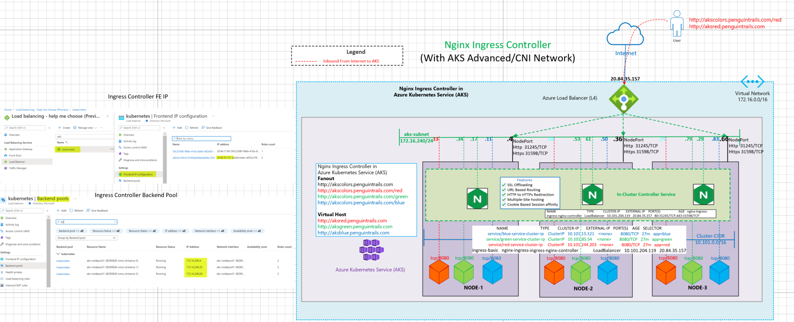
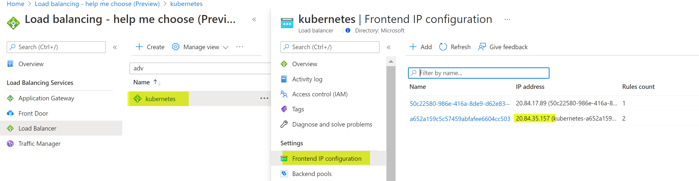
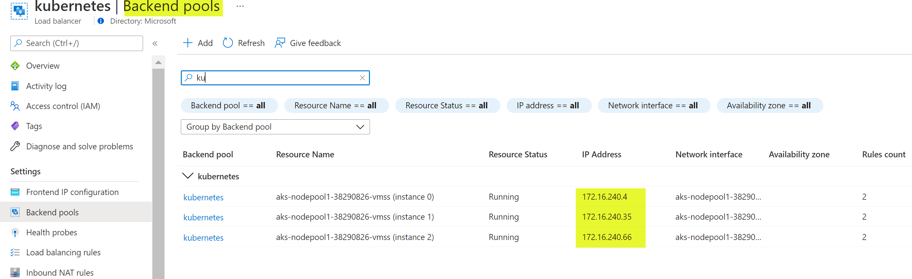
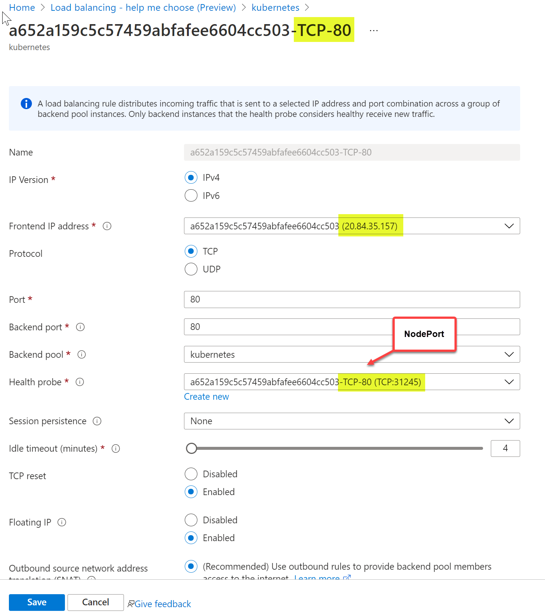
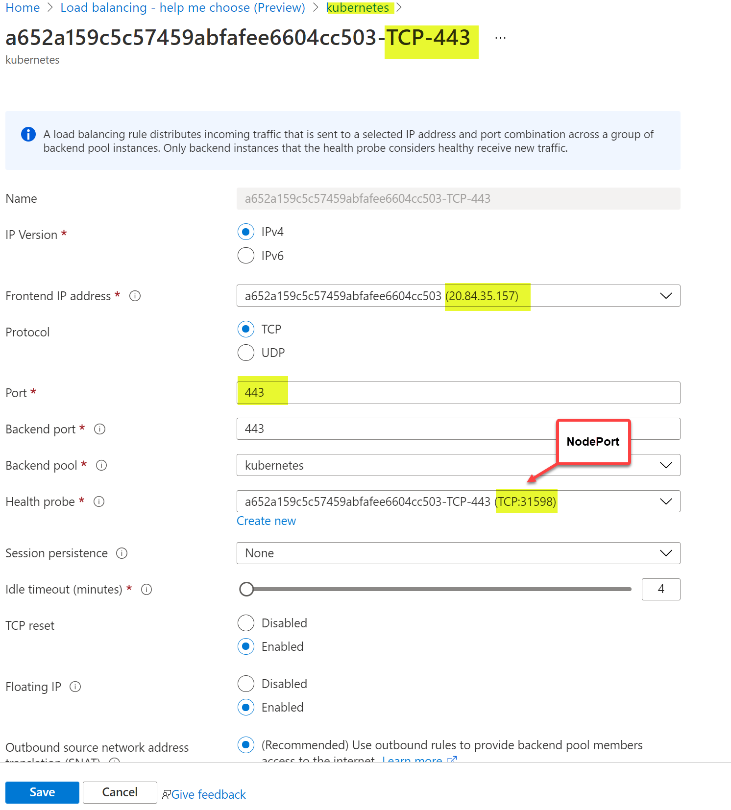
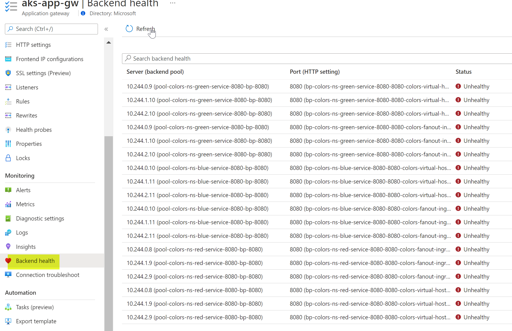
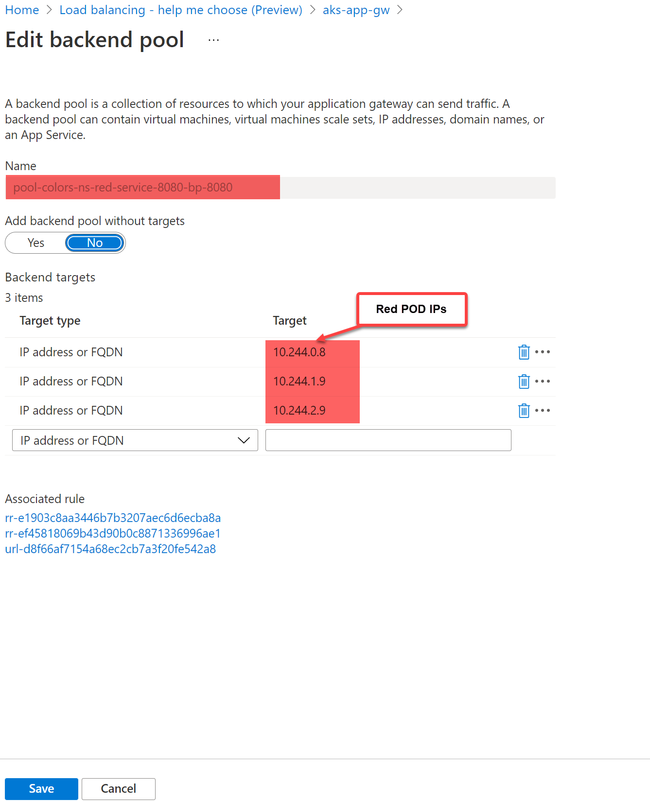

## Azure AKS Nginx Ingress Controller

While Application gateway Ingress Controller is an Azure native L7 load balancer, nginx ingress controller is an **in-cluster deployment** and runs in it's own pod inside the AKS cluster. Load balancer talks to the ingress PODs using NodePort.

## Reference Architecture

### Nginx Ingress Controller (Using Azure CNI Network)



Download Visio link here.

## Azure Documentation links

1. [Helm Installation](https://helm.sh/docs/intro/install/)
2. [Create Ingress Controller](https://docs.microsoft.com/en-us/azure/aks/ingress-basic)
3. [Comparison with AGIC](https://azure.microsoft.com/en-us/blog/application-gateway-ingress-controller-for-azure-kubernetes-service/)

## Ingress Concepts

Some ingress concepts - detailed link [here](https://kubernetes.io/docs/concepts/services-networking/ingress/)

**Simple fanout**

A fanout configuration routes traffic from a single IP address to more than one Service, based on the HTTP URI being requested. An Ingress allows you to keep the number of load balancers down to a minimum. For example, a setup like:

```
foo.bar.com -> 178.91.123.132 ->
/ foo service1:4200
/ bar service2:8080

```

Fanout

http://akscolors.penguintrails.com

http://akscolors.penguintrails.com/red

http://akscolors.penguintrails.com/green

http://akscolors.penguintrails.com/blue

**Name based virtual hosting**

Name-based virtual hosts support routing HTTP traffic to multiple host names at the same IP address.

```
foo.bar.com --| |-> foo.bar.com service1:80
| 178.91.123.132 |
bar.foo.com --| |-> bar.foo.com service2:80

```

Virtual Host

http://aksred.penguintrails.com

http://aksgreen.penguintrails.com

http://aksblue.penguintrails.com

## Design Components and Planning

## Enable nginx controller

```
REGISTRY_NAME=nnacr101
CONTROLLER_REGISTRY=k8s.gcr.io
CONTROLLER_IMAGE=ingress-nginx/controller
CONTROLLER_TAG=v0.48.1
PATCH_REGISTRY=docker.io
PATCH_IMAGE=jettech/kube-webhook-certgen
PATCH_TAG=v1.5.1
DEFAULTBACKEND_REGISTRY=k8s.gcr.io
DEFAULTBACKEND_IMAGE=defaultbackend-amd64
DEFAULTBACKEND_TAG=1.5

az acr import --name $REGISTRY_NAME --source $CONTROLLER_REGISTRY/$CONTROLLER_IMAGE:$CONTROLLER_TAG --image $CONTROLLER_IMAGE:$CONTROLLER_TAG
az acr import --name $REGISTRY_NAME --source $PATCH_REGISTRY/$PATCH_IMAGE:$PATCH_TAG --image $PATCH_IMAGE:$PATCH_TAG
az acr import --name $REGISTRY_NAME --source $DEFAULTBACKEND_REGISTRY/$DEFAULTBACKEND_IMAGE:$DEFAULTBACKEND_TAG --image $DEFAULTBACKEND_IMAGE:$DEFAULTBACKEND_TAG


kubectl create namespace ingress-basic

# Add the ingress-nginx repository
helm repo add ingress-nginx https://kubernetes.github.io/ingress-nginx

# Set variable for ACR location to use for pulling images
ACR_URL=nnacr101.azurecr.io

# Use Helm to deploy an NGINX ingress controller
helm install nginx-ingress ingress-nginx/ingress-nginx \
    --namespace ingress-basic \
    --set controller.replicaCount=2 \
    --set controller.nodeSelector."kubernetes\.io/os"=linux \
    --set controller.image.registry=$ACR_URL \
    --set controller.image.image=$CONTROLLER_IMAGE \
    --set controller.image.tag=$CONTROLLER_TAG \
     --set controller.image.digest="" \
    --set controller.admissionWebhooks.patch.nodeSelector."kubernetes\.io/os"=linux \
    --set controller.admissionWebhooks.patch.image.registry=$ACR_URL \
    --set controller.admissionWebhooks.patch.image.image=$PATCH_IMAGE \
    --set controller.admissionWebhooks.patch.image.tag=$PATCH_TAG \
    --set defaultBackend.nodeSelector."kubernetes\.io/os"=linux \
    --set defaultBackend.image.registry=$ACR_URL \
    --set defaultBackend.image.image=$DEFAULTBACKEND_IMAGE \
    --set defaultBackend.image.tag=$DEFAULTBACKEND_TAG

```

####Validate:

```
az acr login --name nnacr101

az acr repository list --name nnacr101 --output table
Result
----------------------------
defaultbackend-amd64
ingress-nginx/controller
jettech/kube-webhook-certgen

kubectl --namespace ingress-basic get services -o wide nginx-ingress-ingress-nginx-controller
NAME                                     TYPE           CLUSTER-IP       EXTERNAL-IP    PORT(S)                      AGE   SELECTOR
nginx-ingress-ingress-nginx-controller   LoadBalancer   10.101.204.119   20.84.35.157   80:31245/TCP,443:31598/TCP   31m   app.kubernetes.io/component=controller,app.kubernetes.io/instance=nginx-ingress,app.kubernetes.io/name=ingress-nginx

```

#### Deploy Sample Application

Create red,green and blue services and ingress using the YAML files link [here](https://github.com/nehalineogi/aks-app-gw-ingress)

```
# colors-ns

az aks get-credentials -g $RG -n $AKSCLUSTER

#

k delete ns colors-ns
k create ns colors-ns
k apply -f red-cluster-ip.yaml
k apply -f green-cluster-ip.yaml
k apply -f blue-cluster-ip.yaml
k get pods,services,nodes,ingress -o wide -n colors-ns

k apply -f fanout-nginx.yaml
k apply -f virtualhost-nginx.yaml

```

#### IP Address Assignment

```

k get pods,services,nodes,ingress -o wide -n colors-ns
Warning: extensions/v1beta1 Ingress is deprecated in v1.14+, unavailable in v1.22+; use networking.k8s.io/v1 Ingress
NAME READY STATUS RESTARTS AGE IP NODE NOMINATED NODE READINESS GATES
pod/blue-deployment-d5ccf9445-bgp65 1/1 Running 0 27m 172.16.240.50 aks-nodepool1-38290826-vmss000001 <none> <none>
pod/blue-deployment-d5ccf9445-ct5xw 1/1 Running 0 27m 172.16.240.11 aks-nodepool1-38290826-vmss000000 <none> <none>
pod/blue-deployment-d5ccf9445-qr8dm 1/1 Running 0 27m 172.16.240.83 aks-nodepool1-38290826-vmss000002 <none> <none>
pod/green-deployment-59cfdc54fb-f8gs4 1/1 Running 0 27m 172.16.240.34 aks-nodepool1-38290826-vmss000000 <none> <none>
pod/green-deployment-59cfdc54fb-mwnvj 1/1 Running 0 27m 172.16.240.79 aks-nodepool1-38290826-vmss000002 <none> <none>
pod/green-deployment-59cfdc54fb-zntjv 1/1 Running 0 27m 172.16.240.53 aks-nodepool1-38290826-vmss000001 <none> <none>
pod/red-deployment-5f589f64c6-568n9 1/1 Running 0 27m 172.16.240.8 aks-nodepool1-38290826-vmss000000 <none> <none>
pod/red-deployment-5f589f64c6-d4wfq 1/1 Running 0 27m 172.16.240.75 aks-nodepool1-38290826-vmss000002 <none> <none>
pod/red-deployment-5f589f64c6-g64sm 1/1 Running 0 27m 172.16.240.59 aks-nodepool1-38290826-vmss000001 <none> <none>

NAME TYPE CLUSTER-IP EXTERNAL-IP PORT(S) AGE SELECTOR
service/blue-service-cluster-ip ClusterIP 10.101.15.121 <none> 8080/TCP 27m app=blue
service/green-service-cluster-ip ClusterIP 10.101.85.54 <none> 8080/TCP 27m app=green
service/red-service-cluster-ip ClusterIP 10.101.244.203 <none> 8080/TCP 27m app=red

NAME STATUS ROLES AGE VERSION INTERNAL-IP EXTERNAL-IP OS-IMAGE KERNEL-VERSION CONTAINER-RUNTIME
node/aks-nodepool1-38290826-vmss000000 Ready agent 14d v1.19.11 172.16.240.4 <none> Ubuntu 18.04.5 LTS 5.4.0-1049-azure containerd://1.4.4+azure
node/aks-nodepool1-38290826-vmss000001 Ready agent 14d v1.19.11 172.16.240.35 <none> Ubuntu 18.04.5 LTS 5.4.0-1049-azure containerd://1.4.4+azure
node/aks-nodepool1-38290826-vmss000002 Ready agent 14d v1.19.11 172.16.240.66 <none> Ubuntu 18.04.5 LTS 5.4.0-1049-azure containerd://1.4.4+azure

NAME CLASS HOSTS ADDRESS PORTS AGE
ingress.extensions/colors-fanout-ingress-nginx <none> akscolors.penguintrails.com 20.84.35.157 80 23m
ingress.extensions/colors-virtual-host-ingress <none> aksred.penguintrails.com,aksgreen.penguintrails.com,aksblue.penguintrails.com + 1 more... 20.84.35.157 80 19m

```

#### Fanout Ingress

```

k describe ingress colors-fanout-ingress-nginx -n colors-ns
Warning: extensions/v1beta1 Ingress is deprecated in v1.14+, unavailable in v1.22+; use networking.k8s.io/v1 Ingress
Name: colors-fanout-ingress-nginx
Namespace: colors-ns
Address: 20.84.35.157
Default backend: default-http-backend:80 (<error: endpoints "default-http-backend" not found>)
Rules:
Host Path Backends

---

akscolors.penguintrails.com
/red red-service-cluster-ip:8080 (172.16.240.59:8080,172.16.240.75:8080,172.16.240.8:8080)
/green green-service-cluster-ip:8080 (172.16.240.34:8080,172.16.240.53:8080,172.16.240.79:8080)
/blue blue-service-cluster-ip:8080 (172.16.240.11:8080,172.16.240.50:8080,172.16.240.83:8080)
red-service-cluster-ip:8080 (172.16.240.59:8080,172.16.240.75:8080,172.16.240.8:8080)
Annotations: kubernetes.io/ingress.class: nginx
nginx.ingress.kubernetes.io/rewrite-target: /$1
nginx.ingress.kubernetes.io/ssl-redirect: false
nginx.ingress.kubernetes.io/use-regex: true
Events:
Type Reason Age From Message

---

Normal Sync 23m (x2 over 24m) nginx-ingress-controller Scheduled for sync
Normal Sync 23m (x2 over 24m) nginx-ingress-controller Scheduled for sync <none>

```

#### On Prem Testing (Fanout)

```

nehali@nehali-laptop:~$ curl 20.84.35.157 -H 'Host:akscolors.penguintrails.com'
red
nehali@nehali-laptop:~$ curl 20.84.35.157/green -H 'Host:akscolors.penguintrails.com'
green
nehali@nehali-laptop:~$ curl 20.84.35.157/blue -H 'Host:akscolors.penguintrails.com'
blue
nehali@nehali-laptop:~$ curl 20.84.35.157/red -H 'Host:akscolors.penguintrails.com'
red

```

#### Virtual Host Ingress

```

k describe ingress colors-virtual-host-ingress -n colors-ns
Warning: extensions/v1beta1 Ingress is deprecated in v1.14+, unavailable in v1.22+; use networking.k8s.io/v1 Ingress
Name: colors-virtual-host-ingress
Namespace: colors-ns
Address: 20.84.35.157
Default backend: default-http-backend:80 (<error: endpoints "default-http-backend" not found>)
Rules:
Host Path Backends

---

aksred.penguintrails.com
red-service-cluster-ip:8080 (172.16.240.59:8080,172.16.240.75:8080,172.16.240.8:8080)
aksgreen.penguintrails.com
green-service-cluster-ip:8080 (172.16.240.34:8080,172.16.240.53:8080,172.16.240.79:8080)
aksblue.penguintrails.com
blue-service-cluster-ip:8080 (172.16.240.11:8080,172.16.240.50:8080,172.16.240.83:8080)

-                                  red-service:8080 (<error: endpoints "red-service" not found>)
  Annotations: kubernetes.io/ingress.class: nginx
  nginx.ingress.kubernetes.io/rewrite-target: /$1
  nginx.ingress.kubernetes.io/ssl-redirect: false
  nginx.ingress.kubernetes.io/use-regex: true
  Events:
  Type Reason Age From Message
  ***
  Normal Sync 18m (x2 over 19m) nginx-ingress-controller Scheduled for sync
  Normal Sync 18m (x2 over 19m) nginx-ingress-controller Scheduled for sync

```

#### On Prem Testing (Virtual Host)

```

nehali@nehali-laptop:~$ curl 20.84.35.157 -H 'Host:aksred.penguintrails.com'
red
nehali@nehali-laptop:~$ curl 20.84.35.157 -H 'Host:aksgreen.penguintrails.com'
green
nehali@nehali-laptop:~$ curl 20.84.35.157 -H 'Host:aksblue.penguintrails.com'
blue

```

#### Application Gateway Validations

##### Front End Listners (Based on the host headers)



##### App GW Backend Pools (red, green and blue service)



##### Backed pods for red-pool



##### Path Based Routing Rule



## Load Balancer and App Gateway Co-existenace

Note LoadBalancer Service with External IP. Ingress services of the type Cluster-IP.

```

k get service,Ingress -n colors-ns
Warning: extensions/v1beta1 Ingress is deprecated in v1.14+, unavailable in v1.22+; use networking.k8s.io/v1 Ingress
NAME TYPE CLUSTER-IP EXTERNAL-IP PORT(S) AGE
service/blue-service ClusterIP 10.101.223.65 <none> 8080/TCP 3m46s
service/blue-service-external LoadBalancer 10.101.117.215 52.142.19.89 8080:30101/TCP 33s
service/green-service ClusterIP 10.101.93.184 <none> 8080/TCP 3m49s
service/green-service-external LoadBalancer 10.101.21.196 52.226.2.143 8080:31752/TCP 38s
service/red-service ClusterIP 10.101.182.196 <none> 8080/TCP 4m3s
service/red-service-external LoadBalancer 10.101.98.223 52.142.17.248 8080:32696/TCP 5m10s

NAME CLASS HOSTS ADDRESS PORTS AGE
ingress.extensions/colors-fanout-ingress <none> akscolors.penguintrails.com 104.211.0.182 80 3m40s
ingress.extensions/colors-virtual-host-ingress <none> aksred.penguintrails.com,aksgreen.penguintrails.com,aksblue.penguintrails.com + 1 more... 104.211.0.182 80

```

##### Validations

```

Load Balancer IPs (3 Different IPs)
nehali@nehali-laptop:~$ curl 52.142.19.89:8080
blue
nehali@nehali-laptop:~$ curl 52.142.17.248:8080
red
nehali@nehali-laptop:~$ curl 52.226.2.143:8080
green

Ingress Testing:

nehali@nehali-laptop:~$ dig +short akscolors.penguintrails.com
nnaksappgw.eastus.cloudapp.azure.com.
104.211.0.182
nehali@nehali-laptop:~$ dig +short aksred.penguintrails.com
nnaksappgw.eastus.cloudapp.azure.com.
104.211.0.182

nehali@nehali-laptop:~$ curl akscolors.penguintrails.com/red
red
nehali@nehali-laptop:~$ curl akscolors.penguintrails.com/green
green
nehali@nehali-laptop:~$ curl akscolors.penguintrails.com/blue
blue
nehali@nehali-laptop:~$ curl aksred.penguintrails.com
red
nehali@nehali-laptop:~$ curl aksgreen.penguintrails.com
green
nehali@nehali-laptop:~$ curl aksblue.penguintrails.com
blue

```

#### Application Gateway with Kubenet Network (Not Supported)

```

k get nodes,pods,service,ingress -A | grep -i ingress
Warning: extensions/v1beta1 Ingress is deprecated in v1.14+, unavailable in v1.22+; use networking.k8s.io/v1 Ingress
kube-system pod/ingress-appgw-deployment-5f49d4c468-ddcrc 1/1 Running 0 36m

k get nodes,pods,service,ingress -o wide -n colors-ns
Warning: extensions/v1beta1 Ingress is deprecated in v1.14+, unavailable in v1.22+; use networking.k8s.io/v1 Ingress
NAME STATUS ROLES AGE VERSION INTERNAL-IP EXTERNAL-IP OS-IMAGE KERNEL-VERSION CONTAINER-RUNTIME
node/aks-nodepool1-62766439-vmss000000 Ready agent 15d v1.19.11 172.16.239.4 <none> Ubuntu 18.04.5 LTS 5.4.0-1049-azure containerd://1.4.4+azure
node/aks-nodepool1-62766439-vmss000001 Ready agent 15d v1.19.11 172.16.239.5 <none> Ubuntu 18.04.5 LTS 5.4.0-1049-azure containerd://1.4.4+azure
node/aks-nodepool1-62766439-vmss000002 Ready agent 15d v1.19.11 172.16.239.6 <none> Ubuntu 18.04.5 LTS 5.4.0-1049-azure containerd://1.4.4+azure

NAME READY STATUS RESTARTS AGE IP NODE NOMINATED NODE READINESS GATES
pod/blue-deployment-d5ccf9445-4g7dw 1/1 Running 0 87s 10.244.0.10 aks-nodepool1-62766439-vmss000001 <none> <none>
pod/blue-deployment-d5ccf9445-6njwz 1/1 Running 0 87s 10.244.1.11 aks-nodepool1-62766439-vmss000002 <none> <none>
pod/blue-deployment-d5ccf9445-q7l64 1/1 Running 0 87s 10.244.2.11 aks-nodepool1-62766439-vmss000000 <none> <none>
pod/green-deployment-59cfdc54fb-6fkp2 1/1 Running 0 91s 10.244.0.9 aks-nodepool1-62766439-vmss000001 <none> <none>
pod/green-deployment-59cfdc54fb-hd88k 1/1 Running 0 91s 10.244.1.10 aks-nodepool1-62766439-vmss000002 <none> <none>
pod/green-deployment-59cfdc54fb-m8m9j 1/1 Running 0 91s 10.244.2.10 aks-nodepool1-62766439-vmss000000 <none> <none>
pod/red-deployment-5f589f64c6-djnz8 1/1 Running 0 2m33s 10.244.1.9 aks-nodepool1-62766439-vmss000002 <none> <none>
pod/red-deployment-5f589f64c6-nrjsk 1/1 Running 0 2m33s 10.244.2.9 aks-nodepool1-62766439-vmss000000 <none> <none>
pod/red-deployment-5f589f64c6-xv59t 1/1 Running 0 2m33s 10.244.0.8 aks-nodepool1-62766439-vmss000001 <none> <none>

NAME TYPE CLUSTER-IP EXTERNAL-IP PORT(S) AGE SELECTOR
service/blue-service ClusterIP 10.101.246.124 <none> 8080/TCP 87s app=blue
service/green-service ClusterIP 10.101.59.114 <none> 8080/TCP 91s app=green
service/red-service ClusterIP 10.101.141.74 <none> 8080/TCP 2m13s app=red
service/red-service-external LoadBalancer 10.101.47.205 40.88.55.42 8080:32282/TCP 2m33s app=red

NAME CLASS HOSTS ADDRESS PORTS AGE
ingress.extensions/colors-fanout-ingress <none> akscolors.penguintrails.com 104.211.0.182 80 60s
ingress.extensions/colors-virtual-host-ingress <none> aksred.penguintrails.com,aksgreen.penguintrails.com,aksblue.penguintrails.com + 1 more... 104.211.0.182 80

```

Application Gateway does not have routing to PODs inside the Cluster because PODs are not on the node network. All backend services showing unhealthy



Red POD IPs not reachable from Application Gateway


## TODO

1. nginx ingress - update and consolidate content from the old artcile [here](https://github.com/nehalineogi/aks-nginx-ingress)

```

```
