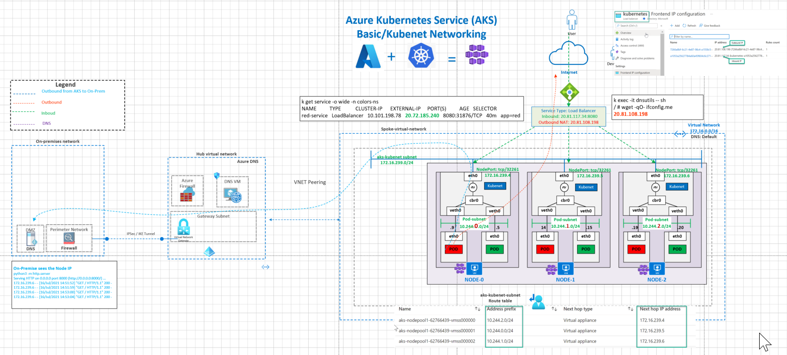
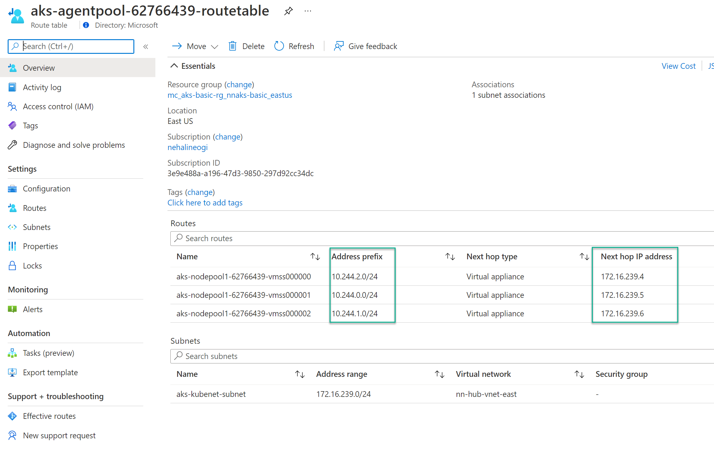

# Azure AKS Basic /Kubenet Networking

This architecture uses the AKS Basic (Kubenet) Network Model. 

Observe that the AKS nodes receive their IP address from the azure subnet (NODE CIDR) and the pods receive their IP address from a "POD CIDR" range that is different from the node network. Note the traffic flows for inbound connectivity to AKS via internal and public load balancers. This architecture also demonstrates connectivity and flows to and from on-premises. Outbound flows from AKS pods to internet traverse the Azure load balancer. There are other design options to egress via Azure firewall/NVA or Azure NAT Gateway.

# Reference Architecture

#### Basic/Kubenet Networking



Download [Multi-tab Visio](aks-all-reference-architectures-visio.vsdx) and [PDF](aks-all-reference-architectures-PDF.pdf)

[](https://portal.azure.com/#create/Microsoft.Template/uri/https%3A%2F%2Fraw.githubusercontent.com%2Fnehalineogi%2Fazure-cross-solution-network-architectures%2Fmain%2Faks%2Fjson%2Faks-kubenet.json)

# Quickstart deployment
### Task 1: Start Deployment

1. Click Deploy to Azure button above and supply the signed-in user ID from step 2.

2. Open Cloud Shell and retrieve your signed-in user ID below (this is used to apply access to Keyvault).

```
az ad signed-in-user show --query id -o tsv
```

3. Using Azure Bastion, log in to the VMs using the username `localadmin` and passwords from keyvault.

Note: SSH directly to the VMs is possible, however, it is best security practice to not expose VMs to the internet for SSH. 
It is not uncommon for tenants that are managed by corporations to restrict the use of SSH directly from the internet. More information can be found in the [FAQ](https://github.com/nehalineogi/azure-cross-solution-network-architectures/blob/main/aks/README-kubenet.md#faqtroubleshooting).

4. log in as root with command ```sudo su```

## Azure Documentation links

1. [Choosing a network model](https://docs.microsoft.com/en-us/azure/aks/configure-kubenet#choose-a-network-model-to-use)
2. [IP Address Planning](https://docs.microsoft.com/en-us/azure/aks/configure-kubenet#ip-address-availability-and-exhaustion)
3. [AKS Basic Networking](https://docs.microsoft.com/en-us/azure/aks/concepts-network#kubenet-basic-networking)
4. [AKS CNI Design Considerations](https://docs.microsoft.com/en-us/azure/aks/configure-kubenet#limitations--considerations-for-kubenet)
5. [AKS Services](https://docs.microsoft.com/en-us/azure/aks/concepts-network#services)
6. [Core DNS with AKS](https://docs.microsoft.com/en-us/azure/aks/coredns-custom)
7. [DNS with Private DNS Zone](https://docs.microsoft.com/en-us/azure/private-link/private-endpoint-dns)

# [Design Considerations](https://docs.microsoft.com/en-us/azure/aks/concepts-network#kubenet-basic-networking)

The kubenet networking option is the default configuration for AKS cluster creation. 
Components with blue dotted lines in the diagram above are automatically deployed and a three node AKS cluster is deployed in kubenet mode by default. 

The AKS nodes are deployed to the spoke-virtual-network on CIDR range 172.16.239.0/24 (aks-node-subnet). The pods are deployed to CIDR range 10.244.0.0/16.

Some general design considerations for Kubenet

- Nodes receive an IP address from the Azure subnet (aks-node-subnet). You can deploy these nodes in an existing or new Azure Virtual Network (VNet).
- Pods receive an IP address from a POD CIDR which is a logically different address space than the NODE CIDR. Direct pod addressing isn't supported for kubenet due to kubenet design.
- Route tables and user-defined routes are required for using kubenet, which adds complexity to operations.
- AKS Uses network address translation (NAT) so that the pods can reach resources on the Azure virtual and on-prem resources. The source IP address of the traffic is translated to the node's primary IP address
- Inbound connectivity using internal or public load Balancer
- Use Kubenet when you have limited IP address space on Azure VNet
- Most of the pod communication is within the cluster.
- Azure Network Policy is not supported but calico policies are supported

### [IP Address Calculations](https://docs.microsoft.com/en-us/azure/aks/)

kubenet - a simple /24 IP address range can support up to 251 nodes in the cluster (each Azure virtual network subnet reserves the first three IP addresses for management operations). Each Node can have a maximum of 110 pods/node. This node count could support up to 27,610 pods (251x110)

With kubenet, you can use a much smaller IP address range and be able to support large clusters and application demands. For example, even with a /27 IP address range on your subnet, you could run a 20-25 node cluster with enough room to scale or upgrade. This cluster size would support up to 2,200-2,750 pods (with a default maximum of 110 pods per node). The maximum number of pods per node that you can configure with kubenet in AKS is 110.

### Routing to and from on-premises

```
Outbound from AKS to on-premises
Note: on-premises sees the Node IP
python3 -m http.server
Serving HTTP on 0.0.0.0 port 8000 (http://0.0.0.0:8000/) ...
172.16.239.6 - - [16/Jul/2021 14:51:52] "GET / HTTP/1.1" 200 -
172.16.239.6 - - [16/Jul/2021 14:51:59] "GET / HTTP/1.1" 200 -
172.16.239.6 - - [16/Jul/2021 14:53:00] "GET / HTTP/1.1" 200 -
172.16.239.6 - - [16/Jul/2021 14:53:04] "GET / HTTP/1.1" 200 -

From On-Prem to AKS use the internal load balancer over VPN/ExpressRoute
nehali@nehali-laptop:~$ curl  172.16.239.7:8080
red

```
### DNS Design

Azure Subnet can use custom DNS or Azure Default DNS. Custom DNS can be used alongside Azure DNS.

### Inbound Services

AKS uses [services](https://docs.microsoft.com/en-us/azure/aks/concepts-network#services) to provide inbound connectivity to pods insides the AKS cluster. The three service types are Cluster IP, NodePort and LoadBalancer. In the archictecture above, the service type is LoadBalancer. AKS Creates an Azure load balancer resource, configures an external IP address, and connects the requested pods to the load balancer backend pool. To allow customers' traffic to reach the application, load balancing rules are created on the desired ports.

Diagram showing load balancer traffic flow in an AKS cluster


### Outbound to Internet

Outbound traffic from the pods to the Internet flows via the Azure public load balancer (Separate article showing the outbound via Azure firwall/NVA/NAT will follow)

# Deployment Validations

These steps will deploy a single test pod and delete it. You should run all these commands from a cloud shell for best results.

1. Obtain the cluster credentials to log in to kubectl (if you did not use the default, replace resource-group with your specified resource group name).

Note: If you get a warning "an object named MyAKSCluster already exists in your kubeconfig file, Overwrite? ", you should overwrite to obtain fresh credentials.

```shaun@Azure:~$ az aks get-credentials --resource-group aks-KUBENET --name myAKSCluster```

2. Open cloud shell and clone the reposity

```shaun@Azure:~$ git clone https://github.com/nehalineogi/azure-cross-solution-network-architectures```

3. Navigate to the dnsutils directory 

```shaun@Azure:~$ cd azure-cross-solution-network-architectures/aks/yaml/dns```

4. Deploy a simple pod

```shaun@Azure:~/azure-cross-solution-network-architectures$ kubectl apply -f dnsutils.yaml```

5. Check pod is running successfully 

```shaun@Azure:~/azure-cross-solution-network-architectures$ kubectl get pods -o wide```

6. Delete pod (cleanup)

```shaun@Azure:~/azure-cross-solution-network-architectures$ kubectl delete pod dnsutils```

**1. Verify nodes**

```console

shaun@Azure:~/azure-cross-solution-network-architectures$ kubectl get nodes -o wide
NAME STATUS ROLES AGE VERSION INTERNAL-IP EXTERNAL-IP OS-IMAGE KERNEL-VERSION CONTAINER-RUNTIME
node/aks-nodepool1-62766439-vmss000000 Ready agent 7h8m v1.19.11 172.16.239.4 <none> Ubuntu 18.04.5 LTS 5.4.0-1049-azure containerd://1.4.4+azure
node/aks-nodepool1-62766439-vmss000001 Ready agent 7h8m v1.19.11 172.16.239.5 <none> Ubuntu 18.04.5 LTS 5.4.0-1049-azure containerd://1.4.4+azure
node/aks-nodepool1-62766439-vmss000002 Ready agent 7h8m v1.19.11 172.16.239.6 <none> Ubuntu 18.04.5 LTS 5.4.0-1049-azure containerd://1.4.4+azure

shaun@Azure:~/azure-cross-solution-network-architectures$ kubectl get pods -o wide
```

# Challenge 1: Deploy Pods and Internal Service

In this challenge you will deploy pods and configure an internal service using an existing yaml definition in the repository. 

```
#
# Create a namespace for the service
#
shaun@Azure:~/azure-cross-solution-network-architectures$ kubectl create ns colors-ns

shaun@Azure:~/azure-cross-solution-network-architectures$ cd yaml/colors-ns

shaun@Azure:~/azure-cross-solution-network-architectures$ kubectl apply -f red-internal-service.yaml
shaun@Azure:~/azure-cross-solution-network-architectures$ kubectl get pods,services -o wide -n colors-ns
shaun@Azure:~/azure-cross-solution-network-architectures$ kubectl describe service red-service-internal -n colors-ns

shaun@Azure:~/azure-cross-solution-network-architectures$ kubectl get pods,services -o wide -n colors-ns

NAME                                  READY   STATUS    RESTARTS   AGE   IP            NODE                                NOMINATED NODE   READINESS GATES
pod/red-deployment-5f589f64c6-fslc8   1/1     Running   0          28s   10.244.2.21   aks-nodepool1-62766439-vmss000000   <none>           <none>
pod/red-deployment-5f589f64c6-jbrzp   1/1     Running   0          28s   10.244.1.19   aks-nodepool1-62766439-vmss000002   <none>           <none>
pod/red-deployment-5f589f64c6-pzwzs   1/1     Running   0          28s   10.244.0.19   aks-nodepool1-62766439-vmss000001   <none>           <none>

NAME                           TYPE           CLUSTER-IP       EXTERNAL-IP    PORT(S)          AGE     SELECTOR
service/red-service-internal   LoadBalancer   10.101.202.203   172.16.239.7   8080:32164/TCP   8m20s   app=red
 kubectl describe service red-service-internal -n colors-ns
Name:                     red-service-internal
Namespace:                colors-ns
Labels:                   <none>
Annotations:              service.beta.kubernetes.io/azure-load-balancer-internal: true
Selector:                 app=red
Type:                     LoadBalancer
IP Families:              <none>
IP:                       10.101.202.203
IPs:                      <none>
LoadBalancer Ingress:     172.16.239.7
Port:                     <unset>  8080/TCP
TargetPort:               8080/TCP
NodePort:                 <unset>  32164/TCP
Endpoints:                10.244.0.19:8080,10.244.1.19:8080,10.244.2.21:8080
Session Affinity:         None
External Traffic Policy:  Cluster
Events:
  Type    Reason                Age   From                Message
  ----    ------                ----  ----                -------
  Normal  EnsuringLoadBalancer  29m   service-controller  Ensuring load balancer
  Normal  EnsuredLoadBalancer   29m   service-controller  Ensured load balancer


**Verify from on-premises**
curl http://172.16.239.7:8080/
red

```

**2. Deploy Pods and External Service**

```
kubectl create ns colors-ns
kubectl apply -f red-external-lb.yaml
kubectl get pods,services -o wide -n colors-ns
kubectl describe service red-service-external -n colors-ns

kubectl get pods,services -o wide -n colors-ns
NAME                                  READY   STATUS    RESTARTS   AGE   IP            NODE                                NOMINATED NODE   READINESS GATES
pod/red-deployment-5f589f64c6-fslc8   1/1     Running   0          22m   10.244.2.21   aks-nodepool1-62766439-vmss000000   <none>           <none>
pod/red-deployment-5f589f64c6-jbrzp   1/1     Running   0          22m   10.244.1.19   aks-nodepool1-62766439-vmss000002   <none>           <none>
pod/red-deployment-5f589f64c6-pzwzs   1/1     Running   0          22m   10.244.0.19   aks-nodepool1-62766439-vmss000001   <none>           <none>

NAME                           TYPE           CLUSTER-IP       EXTERNAL-IP     PORT(S)          AGE   SELECTOR
service/red-service-external   LoadBalancer   10.101.219.137   20.120.58.166   8080:30947/TCP   12m   app=red
service/red-service-internal   LoadBalancer   10.101.202.203   172.16.239.7    8080:32164/TCP   29m   app=red

validate (review NSG and route table if needed)
curl 20.120.58.166:8080
red


```

**4. Route table Validations**

Note the POD CIDR is : --pod-cidr 10.244.0.0/16.


**5. Node view**

Node inherits the DNS from the Azure DNS.

```
../kubectl-node_shell aks-nodepool1-62766439-vmss000002
spawning "nsenter-xdz3o0" on "aks-nodepool1-62766439-vmss000002"
If you don't see a command prompt, try pressing enter.
root@aks-nodepool1-62766439-vmss000002:/# ip add
1: lo: <LOOPBACK,UP,LOWER_UP> mtu 65536 qdisc noqueue state UNKNOWN group default qlen 1000
    link/loopback 00:00:00:00:00:00 brd 00:00:00:00:00:00
    inet 127.0.0.1/8 scope host lo
       valid_lft forever preferred_lft forever
    inet6 ::1/128 scope host
       valid_lft forever preferred_lft forever
2: eth0: <BROADCAST,MULTICAST,UP,LOWER_UP> mtu 1500 qdisc mq state UP group default qlen 1000
    link/ether 00:0d:3a:9e:51:52 brd ff:ff:ff:ff:ff:ff
    inet 172.16.239.6/24 brd 172.16.239.255 scope global eth0
       valid_lft forever preferred_lft forever
    inet6 fe80::20d:3aff:fe9e:5152/64 scope link
       valid_lft forever preferred_lft forever
3: enP58592s1: <BROADCAST,MULTICAST,SLAVE,UP,LOWER_UP> mtu 1500 qdisc mq master eth0 state UP group default qlen 1000
    link/ether 00:0d:3a:9e:51:52 brd ff:ff:ff:ff:ff:ff
4: cbr0: <BROADCAST,MULTICAST,PROMISC,UP,LOWER_UP> mtu 1500 qdisc noqueue state UP group default qlen 1000
    link/ether ae:d6:45:3d:6f:ec brd ff:ff:ff:ff:ff:ff
    inet 10.244.1.1/24 scope global cbr0
       valid_lft forever preferred_lft forever
    inet6 fe80::acd6:45ff:fe3d:6fec/64 scope link
       valid_lft forever preferred_lft forever
5: veth482424ea@if3: <BROADCAST,MULTICAST,UP,LOWER_UP> mtu 1500 qdisc noqueue master cbr0 state UP group default
    link/ether 56:e5:eb:58:fb:44 brd ff:ff:ff:ff:ff:ff link-netnsid 0
    inet6 fe80::54e5:ebff:fe58:fb44/64 scope link
       valid_lft forever preferred_lft forever
6: veth93e12bb4@if3: <BROADCAST,MULTICAST,UP,LOWER_UP> mtu 1500 qdisc noqueue master cbr0 state UP group default
    link/ether 62:e2:4d:42:76:61 brd ff:ff:ff:ff:ff:ff link-netnsid 1
    inet6 fe80::60e2:4dff:fe42:7661/64 scope link
       valid_lft forever preferred_lft forever
7: vethd95f569f@if3: <BROADCAST,MULTICAST,UP,LOWER_UP> mtu 1500 qdisc noqueue master cbr0 state UP group default
    link/ether 3e:cb:84:b2:f7:f0 brd ff:ff:ff:ff:ff:ff link-netnsid 2
    inet6 fe80::3ccb:84ff:feb2:f7f0/64 scope link
       valid_lft forever preferred_lft forever
8: vethe75d7104@if3: <BROADCAST,MULTICAST,UP,LOWER_UP> mtu 1500 qdisc noqueue master cbr0 state UP group default
    link/ether 62:ee:97:dc:fd:75 brd ff:ff:ff:ff:ff:ff link-netnsid 3
    inet6 fe80::60ee:97ff:fedc:fd75/64 scope link
       valid_lft forever preferred_lft forever
9: vethdd2875f0@if3: <BROADCAST,MULTICAST,UP,LOWER_UP> mtu 1500 qdisc noqueue master cbr0 state UP group default
    link/ether 3a:cb:a7:80:87:2f brd ff:ff:ff:ff:ff:ff link-netnsid 4
    inet6 fe80::38cb:a7ff:fe80:872f/64 scope link
       valid_lft forever preferred_lft forever
root@aks-nodepool1-62766439-vmss000002:/# route -n
Kernel IP routing table
Destination     Gateway         Genmask         Flags Metric Ref    Use Iface
0.0.0.0         172.16.239.1    0.0.0.0         UG    100    0        0 eth0
10.244.1.0      0.0.0.0         255.255.255.0   U     0      0        0 cbr0
168.63.129.16   172.16.239.1    255.255.255.255 UGH   100    0        0 eth0
169.254.169.254 172.16.239.1    255.255.255.255 UGH   100    0        0 eth0
172.16.239.0    0.0.0.0         255.255.255.0   U     0      0        0 eth0
root@aks-nodepool1-62766439-vmss000002:/# more /etc/resolv.conf
# This file is managed by man:systemd-resolved(8). Do not edit.
#
# This is a dynamic resolv.conf file for connecting local clients directly to
# all known uplink DNS servers. This file lists all configured search domains.
#
# Third party programs must not access this file directly, but only through the
# symlink at /etc/resolv.conf. To manage man:resolv.conf(5) in a different way,
# replace this symlink by a static file or a different symlink.
#
# See man:systemd-resolved.service(8) for details about the supported modes of
# operation for /etc/resolv.conf.

nameserver 168.63.129.16
search 1grit5g0qs5exa0hhgg2i425ng.bx.internal.cloudapp.net

root@aks-nodepool1-62766439-vmss000002:/# brctl show cbr0
bridge name     bridge id               STP enabled     interfaces
cbr0            8000.aed6453d6fec       no              veth482424ea
                                                        veth93e12bb4
                                                        vethd95f569f
                                                        vethdd2875f0
                                                        vethe75d7104

```

**6. POD View**

The curl output showing the egress from POD to Internet via load balancer IP.

```
kubectl get pods -o wide
NAME       READY   STATUS    RESTARTS   AGE   IP           NODE                                NOMINATED NODE   READINESS GATES
dnsutils   1/1     Running   0          10m   10.244.1.5   aks-nodepool1-62766439-vmss000002   <none>           <none>

kubectl exec -it dnsutils sh
kubectl exec [POD] [COMMAND] is DEPRECATED and will be removed in a future version. Use kubectl exec [POD] -- [COMMAND] instead.

/ # ip add
1: lo: <LOOPBACK,UP,LOWER_UP> mtu 65536 qdisc noqueue state UNKNOWN qlen 1000
    link/loopback 00:00:00:00:00:00 brd 00:00:00:00:00:00
    inet 127.0.0.1/8 scope host lo
       valid_lft forever preferred_lft forever
    inet6 ::1/128 scope host
       valid_lft forever preferred_lft forever
3: eth0@if8: <BROADCAST,MULTICAST,UP,LOWER_UP,M-DOWN> mtu 1500 qdisc noqueue state UP
    link/ether 9a:40:c8:86:07:f7 brd ff:ff:ff:ff:ff:ff
    inet 10.244.1.5/24 scope global eth0
       valid_lft forever preferred_lft forever
    inet6 fe80::9840:c8ff:fe86:7f7/64 scope link
       valid_lft forever preferred_lft forever
/ # route -n
Kernel IP routing table
Destination     Gateway         Genmask         Flags Metric Ref    Use Iface
0.0.0.0         10.244.1.1      0.0.0.0         UG    0      0        0 eth0
10.244.1.0      0.0.0.0         255.255.255.0   U     0      0        0 eth0

/ # wget -qO- ifconfig.me
20.81.108.198

```

**7. On Premises view**

Initiate Outbound traffic from AKS to On-Premises. Note that On-Premise sees the Node IP where the pod is hosted

```

Source AKS:
Exec into AKS Pod
kubectl get pods -o wide
NAME       READY   STATUS    RESTARTS   AGE     IP           NODE                                NOMINATED NODE   READINESS GATES
dnsutils   1/1     Running   6          6h55m   10.244.1.5   aks-nodepool1-62766439-vmss000002   <none>           <none>
 kubectl get nodes -o wide
NAME                                STATUS   ROLES   AGE     VERSION    INTERNAL-IP    EXTERNAL-IP   OS-IMAGE             KERNEL-VERSION     CONTAINER-RUNTIME
aks-nodepool1-62766439-vmss000000   Ready    agent   7h21m   v1.19.11   172.16.239.4   <none>        Ubuntu 18.04.5 LTS   5.4.0-1049-azure   containerd://1.4.4+azure
aks-nodepool1-62766439-vmss000001   Ready    agent   7h22m   v1.19.11   172.16.239.5   <none>        Ubuntu 18.04.5 LTS   5.4.0-1049-azure   containerd://1.4.4+azure
aks-nodepool1-62766439-vmss000002   Ready    agent   7h22m   v1.19.11   172.16.239.6   <none>        Ubuntu 18.04.5 LTS   5.4.0-1049-azure   containerd://1.4.4+azure
 kubectl exec -it dnsutils -- sh
/ # wget 192.168.199.130:8000
Connecting to 192.168.199.130:8000 (192.168.199.130:8000)
index.html           100% |*********************************************************************************************************************|   854   0:00:00 ETA
/ # exit

Destination On-Premises:

python3 -m http.server
Serving HTTP on 0.0.0.0 port 8000 (http://0.0.0.0:8000/) ...
172.16.239.6 - - [16/Jul/2021 14:51:52] "GET / HTTP/1.1" 200 -
172.16.239.6 - - [16/Jul/2021 14:51:59] "GET / HTTP/1.1" 200 -
172.16.239.6 - - [16/Jul/2021 14:53:00] "GET / HTTP/1.1" 200 -
172.16.239.6 - - [16/Jul/2021 14:53:04] "GET / HTTP/1.1" 200 -

From On-Prem to AKS
nehali@nehali-laptop:~$ curl  172.16.239.7:8080
red

```

### DNS and Custom domain

Validate before configuration

```
kubectl get configmaps --namespace=kube-system coredns-custom -o yaml
```

DNS resolution for custom domain nnlab.local via 10.10.1.4. Ensure that you have routing to the 10.10.1.4 network. Create a file called coredns-custom-domain.yaml

```
apiVersion: v1
kind: ConfigMap
metadata:
  name: coredns-custom
  namespace: kube-system
data:
  nnlab.server: |
    nnlab.local:53 {
        errors
        cache 30
        forward . 10.10.1.4  # this is my test/dev DNS server
    }

```

Apply the configuration

```
kubectl apply -f coredns-custom-domain.yaml
restart core-dns pod
kubectl delete pod --namespace kube-system --selector k8s-app=kube-dns


validate nnlab.local resolution from dnsutils pod
kubectl exec -it dnsutils sh


/ # nslookup store1.nnlab.local
Server:         10.101.0.10
Address:        10.101.0.10#53

Name:   store1.nnlab.local
Address: 172.27.225.10

/ # nslookup www.google.com
Server:         10.101.0.10
Address:        10.101.0.10#53

```

### DNS with Private DNS Zone

Make sure there is a VNet link from the AKS-VNET to the private DNS Zone in question.

```
kubectl exec -it dnsutils sh
 # nslookup nnnetworklogs.blob.core.windows.net
Server:         10.101.0.10
Address:        10.101.0.10#53

Non-authoritative answer:
nnnetworklogs.blob.core.windows.net     canonical name = nnnetworklogs.privatelink.blob.core.windows.net.
Name:   nnnetworklogs.privatelink.blob.core.windows.net
Address: 172.16.1.7
```

## Cleanup

kubectl delete ns colors-ns

# FAQ/Troubleshooting

### Steps to enable SSH to the docker VMs.

1. Locate the Network Security Group (NSG) called "Allow-tunnel-traffic" and amend rule "allow-ssh-inbound" - change 127.0.0.1 to your current public IP address and change rule from Deny to Allow

2. Retrieve the public IP address (or DNS label) for each VM

3. Retrieve the VM passwords from the keyvault.

4. SSH to your VMs

```
ssh localadmin@[VM Public IP or DNS]
```

5. log in as root with command ```sudo su```

## I have followed the steps suggested above, but I still cannot log in over SSH? 

Ensure that you have correctly edited the Network Security Group (NSG) to allow access for port 22. The rule will need your current public IP address and the rule needs to be amended to <b>'allow' rather than 'deny' </b> traffic. 

If you are using a Virtual Private Network (VPN) for outbound internet access, the public IP address you are assigned may differ from the public IP address that is used to connect on the internet, VPN services sometimes use public to public IP address NAT for outbound internet access for efficient use of their public IP addresses. This can be tricky to determine, and will mean that entering your public IP addresss on the NSG will not work. You may wish to open the rule to a 'range' of public IP addresses provided by the VPN service (for instance a.a.a.a/24). You should consider that this does mean that your service will become network reachable to any other VPN customers who are currently assigned an IP address in that range. 

Alternatively, you can check on the destination side (host in Azure) exactly what public IP address is connecting by running this iptables command and then viewing /var/log/syslog. You can use bastion to connect to the host.

``` iptables -I INPUT -p tcp -m tcp --dport 22 -m state --state NEW  -j LOG --log-level 1 --log-prefix "SSH Log" ```

Finally, check that your company is not blocking or restricting port 22 access to the VMs.

## What are the logins for the VMs?

The credentials for the VMs are stored in an Azure keyvault.

## Are the passwords used cyptographically secure?

No. The passwords are generated deterministically and therefore should be changed on the VMs post deployment, to maximise security. They are auto generated in this way for convenience and are intended to support this environment as a 'Proof of Concept' or learning experience only and are not intended for production use.

## I cannot run the deployment - what is the ADuserID?

In order for the deployment to provision your signed-in user account access to the keyvault, you will need to provide your Azure Active Directory (AAD) signed-in user ObjectID. In order to retrieve this there are serveral methods. The Azure CLI and Azure Powershell methods are provided below. You can use the cloud shell to run the Azure CLI method, but for powershell you must run this from your own device using Azure Powershell module.

Note that older versions of az cli you may need to run the command with ```--query Objectid``` instead of ```--query id```

Azure CLI or Cloud Shell

```
az ad signed-in-user show --query id -o tsv
```

Azure Powershell

```
(Get-AzContext).Account.ExtendedProperties.HomeAccountId.Split('.')[0]
```

## How are OS level application automatically installed on the VMs?

OS level configuration is applied via a VM custom script extension, for reference the commands used are found in the following folder - [Scripts](/bicep/aks/scripts)

The scripts are called automatically by the [aks-kubenet.json](json/aks-kubenet.json) ARM template on deployment.
## Are there any commands I can use to get the host's DNS, passwords and to change the Network Security Group (NSG) rule, instead of using the portal? 

Yes, below are commands that can be used to more quickly retrieve this information. 

<b> Obtain password from keyvault (example for vpnvm host in default resource group) </b>

If you wish to retieve passwords for a different hostname, simply change the name property to match.

``` az keyvault secret show --name "vpnvm-admin-password" --vault-name $(az keyvault list -g aks-KUBENET --query "[].name" -o tsv) --query "value" -o tsv ```

If you receive an error on this command relating to a timeout and you are using Windows Subsystem for Linux and referencing the Windows based az, you should reference this github issue - https://github.com/Azure/azure-cli/issues/13573. Use powershell or cloud shell instead to mitigate this known bug.

<b> Obtain DNS label for public IP of host (example for vpnvm in default resource group) </b>

``` az network public-ip show -g aks-KUBENET -n vpnvmnic-vpnpip --query "dnsSettings.fqdn" -o tsv ```

<b> Change Network Security Rule (NSG) to allow SSH inbound from a specific public IP address </b>

You should change a.a.a.a to match your public IP address

``` az network nsg rule update -g aks-KUBENET --nsg-name Allow-tunnel-traffic -n allow-ssh-inbound  --access allow --source-address-prefix "a.a.a.a" ```


## TODO

1. Reference link to egress via firewall/NAT gateway
2. Section for Calico Policy
