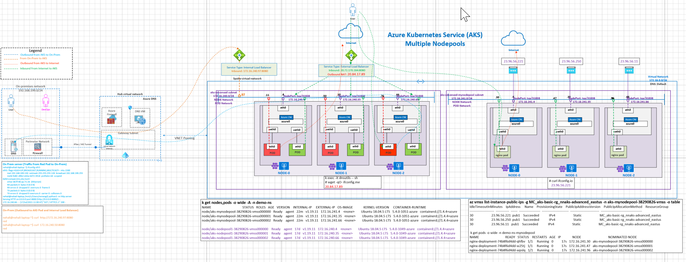
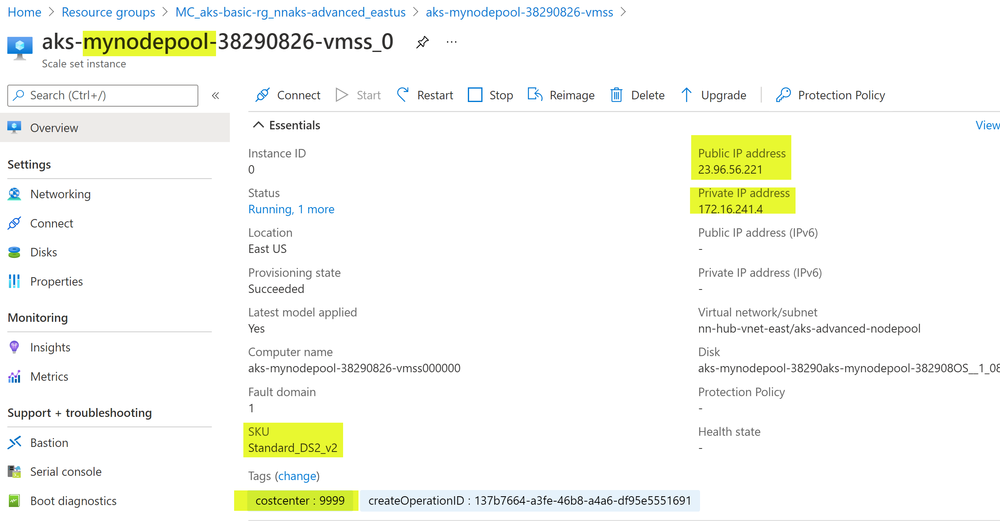
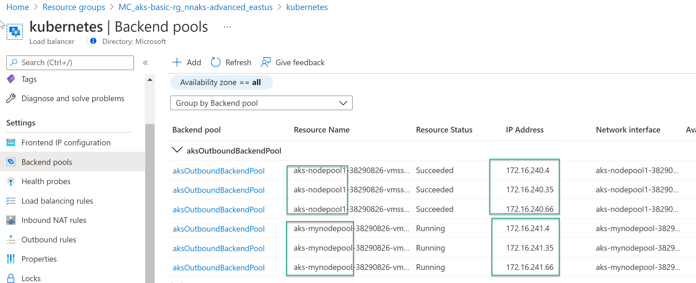
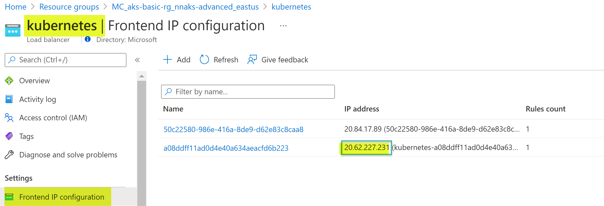

## AKS Multiple Nodepool

In AKS, **system nodes pool** is created when you create an AKS cluster. System node pools serve the primary prupose of hosting critical system pods such as CoreDNS and tunnel front. In Azure Kubernetes Service (AKS), nodes of the same configuration are grouped together into node pools. To support applications that have different compute or storage demands, you can create additonal **user node pools**.

## Reference Architecture

## AKS multiple nodepool design



Download [Multi-tab Visio](aks-all-reference-architectures-visio.vsdx) and [PDF](aks-all-reference-architectures-PDF.pdf)

## Azure Documentation links

[AKS Multiple Node pools](https://docs.microsoft.com/en-us/azure/aks/use-multiple-node-pools)
[Node Pool with unique subnet- Prevew](https://docs.microsoft.com/en-us/azure/aks/use-multiple-node-pools#add-a-node-pool-with-a-unique-subnet-preview)
[Node Pool tags](https://docs.microsoft.com/en-us/azure/aks/use-multiple-node-pools#setting-nodepool-azure-tags)

## Design Considerations

1. Note that you may have different IP addresses and interfaces on your environment than the screenshots throughout this series, this is expected. 


#### Add a Node pool, with node-public-ips and tag the nodes

Add a new nodepool to existing cluster in a new subnet(Prevew feature) link [here](https://docs.microsoft.com/en-us/azure/aks/use-multiple-node-pools#add-a-node-pool-with-a-unique-subnet-preview)

```
az aks nodepool add \
 --resource-group aks-basic-rg \
 --cluster-name nnaks-advanced \
 --name mynodepool \
 --node-count 3 \
 --vnet-subnet-id $SUBNET_ID \
 --enable-node-public-ip \
 --tags dept=IT costcenter=9999 \
 --verbose

```

#### Create a sample deployment

Note use the **nodeSelector** to select the new node pool

k create ns demo-ns-mynodepool
k apply -f deployment-mynodepool.yaml

```
apiVersion: apps/v1
kind: Deployment
metadata:
  name: nginx-deployment
  namespace: demo-ns-mynodepool
  labels:
    app: nginx
spec:
  replicas: 3
  selector:
    matchLabels:
      app: nginx
  template:
    metadata:
      labels:
        app: nginx
    spec:
      containers:
        - name: nginx
          image: nginxdemos/hello
          ports:
            - containerPort: 80
      nodeSelector:
        agentpool: mynodepool

```

## Design Validations

### View mynodepool node from the Azure Portal

Note the public IPs and tags



### List nodepool

```
az aks nodepool list --resource-group aks-basic-rg --cluster-name nnaks-advanced -o table
Name OsType KubernetesVersion VmSize Count MaxPods ProvisioningState Mode

---

mynodepool Linux 1.19.11 Standard_DS2_v2 3 30 Succeeded User
nodepool1 Linux 1.19.11 Standard_DS2_v2 3 30 Succeeded System


```

validate nodes

```
k get nodes,pods -o wide -A -n demo-ns
NAME                                      STATUS   ROLES   AGE   VERSION    INTERNAL-IP     EXTERNAL-IP   OS-IMAGE             KERNEL-VERSION     CONTAINER-RUNTIME
node/aks-mynodepool-38290826-vmss000000   Ready    agent   22m   v1.19.11   172.16.241.4    <none>        Ubuntu 18.04.5 LTS   5.4.0-1051-azure   containerd://1.4.4+azure
node/aks-mynodepool-38290826-vmss000001   Ready    agent   22m   v1.19.11   172.16.241.35   <none>        Ubuntu 18.04.5 LTS   5.4.0-1051-azure   containerd://1.4.4+azure
node/aks-mynodepool-38290826-vmss000002   Ready    agent   22m   v1.19.11   172.16.241.66   <none>        Ubuntu 18.04.5 LTS   5.4.0-1051-azure   containerd://1.4.4+azure
node/aks-nodepool1-38290826-vmss000000    Ready    agent   17d   v1.19.11   172.16.240.4    <none>        Ubuntu 18.04.5 LTS   5.4.0-1049-azure   containerd://1.4.4+azure
node/aks-nodepool1-38290826-vmss000001    Ready    agent   17d   v1.19.11   172.16.240.35   <none>        Ubuntu 18.04.5 LTS   5.4.0-1049-azure   containerd://1.4.4+azure
node/aks-nodepool1-38290826-vmss000002    Ready    agent   17d   v1.19.11   172.16.240.66   <none>        Ubuntu 18.04.5 LTS   5.4.0-1049-azure   containerd://1.4.4+azure

```

#### Egress via standard load balancer

Without node specific public IPs, pods will egress Via standard load balancer

```
k exec -it nginx-deployment-74b8f6d4dd-974vq -n demo-ns-mynodepool sh
kubectl exec [POD] [COMMAND] is DEPRECATED and will be removed in a future version. Use kubectl exec [POD] -- [COMMAND] instead.
/ # wget -qO- ifconfig.me
20.84.17.89/ #

```

Oubound Load Balancer Pool



#### Egress via node IPs

Note the IP address of the note **23.96.56.221** is the egress IP of the pod deployed on that node.

```
az vmss list-instance-public-ips -g MC_aks-basic-rg_nnaks-advanced_eastus -n aks-mynodepool-38290826-vmss -o table
IdleTimeoutInMinutes    IpAddress     Name    ProvisioningState    PublicIpAddressVersion    PublicIpAllocationMethod    ResourceGroup                          ResourceGuid
----------------------  ------------  ------  -------------------  ------------------------  --------------------------  -------------------------------------  ------------------------------------
30                      23.96.56.221  pub1    Succeeded            IPv4                      Static                      MC_aks-basic-rg_nnaks-advanced_eastus  de165421-4eef-4f6e-a123-d2edcb6c7a90
30                      23.96.56.250  pub1    Succeeded            IPv4                      Static                      MC_aks-basic-rg_nnaks-advanced_eastus  e5f31bd9-9a68-42f7-8e3f-dd70c7b64064
30                      23.96.56.11   pub1    Succeeded            IPv4                      Static                      MC_aks-basic-rg_nnaks-advanced_eastus  60437b3f-dea8-4773-b092-a477a99b1188
k create ns demo-ns-mynodepool
namespace/demo-ns-mynodepool created
 k apply -f deployment-mynodepool.yaml
deployment.apps/nginx-deployment created
 k get pods -o wide -n demo-ns-mynodepool
NAME                                READY   STATUS    RESTARTS   AGE   IP              NODE                                 NOMINATED NODE   READINESS GATES
nginx-deployment-74b8f6d4dd-qhfbv   1/1     Running   0          17s   172.16.241.30   aks-mynodepool-38290826-vmss000000   <none>           <none>
nginx-deployment-74b8f6d4dd-w25tj   1/1     Running   0          17s   172.16.241.47   aks-mynodepool-38290826-vmss000001   <none>           <none>
nginx-deployment-74b8f6d4dd-wpslq   1/1     Running   0          17s   172.16.241.96   aks-mynodepool-38290826-vmss000002   <none>           <none>
 k exec -it nginx-deployment-74b8f6d4dd-qhfbv -n demo-ns-mynodepool sh
kubectl exec [POD] [COMMAND] is DEPRECATED and will be removed in a future version. Use kubectl exec [POD] -- [COMMAND] instead.
/ # curl ifconfig.io
23.96.56.221
/ # exit

```

### AKS Ingress via Azure SLB

Inbound via service type: LoadBalancer



### Cleanup: Delete namespace, Delete nodepool

```
k delete ns demo-ns-mynodepool
az aks nodepool delete --resource-group aks-basic-rg  --cluster-name nnaks-advanced --name mynodepool --no-wait

```

## TODO

1. Refine diagram
2. List tags via command line
3. Add use cases
