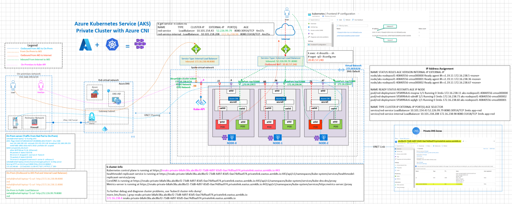
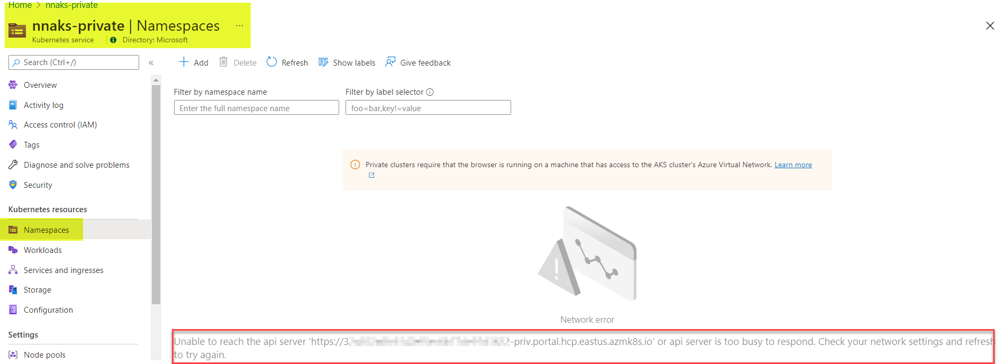
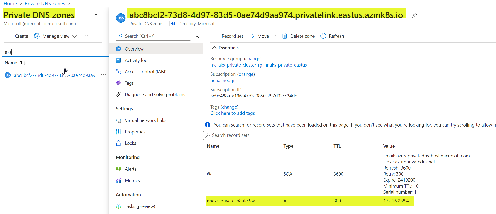

## Azure AKS Advanced/Azure CNI Networking

This architecture demonstrates the connectivity architecture and traffic flows for connecting Azure AKS Private Cluster environment with your on-premises environment. In the Private AKS cluster the control plane or the kube API server has an **internal IP address**. This IP is exposed via a private endpoint in the AKS subnet. The on-premises networks use the Private IP address of the Kube-API server hence **both DNS and routing** has to be in place between on-premises and AKS network..A private DNS zone is also created example - abcxyz.privatelink.<region>.azmk8s.io. AKS services exposed using internal load balancer. Egress paths from AKS cluster to Internet can be designed using External Load balancer (default) or using Azure Firewall/NVA/NAT gateway using userDefinedRouting setting in AKS

## Reference Architecture

#### This reference architecture uses Advanced/Azure CNI Networking



Download [Multi-tab Visio](aks-all-reference-architectures-visio.vsdx) and [PDF](aks-all-reference-architectures-PDF.pdf)

[](https://portal.azure.com/#create/Microsoft.Template/uri/https%3A%2F%2Fraw.githubusercontent.com%2Fnehalineogi%2Fazure-cross-solution-network-architectures%2Fmain%2Faks%2Fjson%2Faks-private.json)

# Quickstart deployment
### Task 1: Start Deployment

1. Click Deploy to Azure button above and supply the signed-in user ID from step 2. Leave all defaults and deploy.

2. Open Cloud Shell and retrieve your signed-in user ID below (this is used to apply access to Keyvault).

```
az ad signed-in-user show --query id -o tsv
```

3. You can log in to the supporting VMs (DC, hub DNS, VPN VM) using the username `localadmin` and passwords from the deployed keyvault.

4. You can log into the AKS cluster by using kubectl from cloud shell. Follow the challenges below. 

### Task 2 (optional): SSH to the supporting VMs.

1. Locate the Network Security Group (NSG) called "Allow-tunnel-traffic" and amend rule "allow-ssh-inbound" - change 127.0.0.1 to your current public IP address and change rule from Deny to Allow

2. Retrieve the public IP address (or DNS label) for each VM

3. Retrieve the VM passwords from the keyvault.

4. SSH to your VMs

```
ssh localadmin@[VM Public IP or DNS]
```

## Azure Documentation links

1. [AKS Baseline architecture](https://docs.microsoft.com/en-us/azure/architecture/reference-architectures/containers/aks/secure-baseline-aks)
2. [Create Private Cluster](https://docs.microsoft.com/en-us/azure/aks/private-clusters)
3. [AKS Private Cluster limitations](https://docs.microsoft.com/en-us/azure/aks/private-clusters#limitations)
4. [External Load Balancer](https://docs.microsoft.com/en-us/azure/aks/load-balancer-standard)
5. [Internal Load Balancer](https://docs.microsoft.com/en-us/azure/aks/internal-lb)
6. [Configure Private DNS Zone](https://docs.microsoft.com/en-us/azure/aks/private-clusters#configure-private-dns-zone)
7. [Egress Path](https://docs.microsoft.com/en-us/azure/aks/egress-outboundtype#outbound-type-of-userdefinedrouting)

## Design Components and Planning

1. Private Cluster is supported in Basic/Kubenet and AzureCNI mode. The above diagram show Azure CNI.
2. Private Cluster can be deployed in existing or new VNET.
3. Planning is required routing Kube API private endpoint from on-premises or from other Azure VNETs.
4. Hybrid DNS setup with private DNS zones for DNS resolution from on-premises in Enterprise environments. However, local hosts files can be used in lab/POCs.
5. **Ingress Considerations:** While, both Internal and External load balancers can be used to expose Ingress services however, in a truely private cluster only Internal load balancer is used for Ingress. External Load balancer is used for egress.
6. **Egress Considerations**: Egress Path options via Azure External Load balancer or using Azure Firewall/NVA
7. Options for connecting to Private cluster. Azure documentation link [here](https://docs.microsoft.com/en-us/azure/aks/private-clusters#options-for-connecting-to-the-private-cluster). This this architecture we have On-Premises connectivity and also example of AKS run command

- Create a VM in the same Azure Virtual Network (VNet) as the AKS cluster.
- Use a VM in a separate network and set up Virtual network peering. See the section below for more information on this option.
- Use an Express Route or VPN connection.
- Use the AKS Run Command feature.

8. Common errors without DNS and Routing in place.

```
kubectl get pods -o wide
Unable to connect to the server: dial tcp: i/o timeout

```

From Azure Portal. You need to be connected to Azure VNET or have VPN/Private connectivity in place.


## Kube API Access

With the above command AKS Private DNS Zone and Private endpoint gets created.



## On-Premises to Kube API server connectivity

Note the kubeAPI / cluster IP will resolve differently in your deployment based on the clustername and the location you deploy to. The references below are specifically for the deployment used for this demo series, you will need to replace the environment specific references to match your own deployment. 

The form will be [clustername].privatelink.[location].azmk8s.io (private endpoint IP)

```
kubectlcluster-info
Kubernetes control plane is running at https://nnaks-private-b8afe38a.abc8bcf2-73d8-4d97-83d5-0ae74d9aa974.privatelink.eastus.azmk8s.io:443
healthmodel-replicaset-service is running at https://nnaks-private-b8afe38a.abc8bcf2-73d8-4d97-83d5-0ae74d9aa974.privatelink.eastus.azmk8s.io:443/api/v1/namespaces/kube-system/services/healthmodel-replicaset-service/proxy
CoreDNS is running at https://nnaks-private-b8afe38a.abc8bcf2-73d8-4d97-83d5-0ae74d9aa974.privatelink.eastus.azmk8s.io:443/api/v1/namespaces/kube-system/services/kube-dns:dns/proxy
Metrics-server is running at https://nnaks-private-b8afe38a.abc8bcf2-73d8-4d97-83d5-0ae74d9aa974.privatelink.eastus.azmk8s.io:443/api/v1/namespaces/kube-system/services/https:metrics-server:/proxy
To further debug and diagnose cluster problems, use 'kubectl cluster-info dump'

```

Note that the KubeAPI DNS resolves to private IP and hence routing to the private IP needs to be configured. Best practice to use the hybrid On-premises DNS best practices for DNS resolution of private endpoint from on-premises. However, a local hosts file can be leverage for lab/POC.

```
To further debug and diagnose cluster problems, use 'kubectl cluster-info dump'.
nehali@nehali-laptop:/mnt/c/Users/neneogi/Documents/repos/k8s/aks-azcli$ more /etc/hosts | grep nnaks-private-b8afe38a.abc8bcf2-73d8-4d97-83d5-0ae74d9aa974.privatelink.eastus.azmk8s.io
172.16.238.4 nnaks-private-b8afe38a.abc8bcf2-73d8-4d97-83d5-0ae74d9aa974.privatelink.eastus.azmk8s.io

```
## Deployment Validations

These steps will deploy a single test pod and delete it. This deployment type is 'Private' so you can run these commands from a VM connected to any VNet, but not from outside of the deployed environment. The VM called dc1 can be used for this purpose. 

1. Install the following tools on dc1 or other VM:

- az cli tools
- git client
- Microsoft Edge (optional, easy authentication for az cli and git). 

A powershell script has been made available for convenience that will auto download and install the tools on Windows - [Tool deployment script](../bicep/aks/scripts/install_edge_and_azcli.ps1). 

Note: Alternatively you may be able use Cloud Shell from dc1 (dependant on Conditional Access etc) in which case you can skip this step and steps 2 and use a Cloud Shell session instead. 

2. Authenticate to your tenant 

``` az login ```

3. Install az cli aks (kubetcl) and follow on screen instructions to add the executables to your environment variables path.

``` az aks install-cli ```

4. Obtain the cluster credentials to log in to kubectl (if you did not use the default, replace resource-group with your specified resource group name). 

```az aks get-credentials --resource-group aks --name myAKSCluster```

5. Clone the reposity

```git clone https://github.com/nehalineogi/azure-cross-solution-network-architectures```

6. Navigate to the dnsutils directory 

```cd azure-cross-solution-network-architectures/aks/yaml/dns```

7. Deploy a simple pod

```kubectl apply -f dnsutils.yaml```

8. Check pod is running successfully 

```kubectl get pods -o wide```

9. Delete pod (cleanup)

```kubectl delete pod dnsutils```

## IP Address Assignment

This deployment is using Azure CNI so the node and pod IPs are in the same subnet

```
kubectl get nodes,pods,service -o wide -n colors-ns
NAME                                     STATUS   ROLES   AGE   VERSION    INTERNAL-IP     EXTERNAL-IP   OS-IMAGE             KERNEL-VERSION     CONTAINER-RUNTIME
node/aks-nodepool1-40840556-vmss000000   Ready    agent   9h    v1.19.11   172.16.238.5    <none>        Ubuntu 18.04.5 LTS   5.4.0-1049-azure   containerd://1.4.4+azure
node/aks-nodepool1-40840556-vmss000001   Ready    agent   9h    v1.19.11   172.16.238.36   <none>        Ubuntu 18.04.5 LTS   5.4.0-1049-azure   containerd://1.4.4+azure
node/aks-nodepool1-40840556-vmss000002   Ready    agent   9h    v1.19.11   172.16.238.67   <none>        Ubuntu 18.04.5 LTS   5.4.0-1049-azure   containerd://1.4.4+azure

NAME                                  READY   STATUS    RESTARTS   AGE   IP              NODE                                NOMINATED NODE   READINESS GATES
pod/red-deployment-5f589f64c6-msqnw   1/1     Running   0          25m   172.16.238.11   aks-nodepool1-40840556-vmss000000   <none>           <none>
pod/red-deployment-5f589f64c6-sdm8f   1/1     Running   0          25m   172.16.238.73   aks-nodepool1-40840556-vmss000002   <none>           <none>
pod/red-deployment-5f589f64c6-xq4gh   1/1     Running   0          25m   172.16.238.60   aks-nodepool1-40840556-vmss000001   <none>           <none>

NAME                           TYPE           CLUSTER-IP       EXTERNAL-IP     PORT(S)          AGE   SELECTOR
service/red-service            LoadBalancer   10.101.154.43    52.226.99.79    8080:30914/TCP   25m   app=red
service/red-service-internal   LoadBalancer   10.101.218.208   172.16.238.98   8080:31418/TCP   25m   app=red

```

## Portal Validation

## Node view

Note the Node inherits the DNS from VNET DNS setting and egress for the node via Azure External load balancer (NVA/Firewall options available)

```
 kubectl get pods -o wide
NAME       READY   STATUS    RESTARTS   AGE   IP              NODE                                NOMINATED NODE   READINESS GATES
dnsutils   1/1     Running   0          21m   172.16.238.27   aks-nodepool1-40840556-vmss000000   <none>           <none>
../kubectl-node_shell aks-nodepool1-40840556-vmss000000
spawning "nsenter-xecmko" on "aks-nodepool1-40840556-vmss000000"
If you don't see a command prompt, try pressing enter.
root@aks-nodepool1-40840556-vmss000000:/# ip add
1: lo: <LOOPBACK,UP,LOWER_UP> mtu 65536 qdisc noqueue state UNKNOWN group default qlen 1000
    link/loopback 00:00:00:00:00:00 brd 00:00:00:00:00:00
    inet 127.0.0.1/8 scope host lo
       valid_lft forever preferred_lft forever
    inet6 ::1/128 scope host
       valid_lft forever preferred_lft forever
2: eth0: <BROADCAST,MULTICAST,UP,LOWER_UP> mtu 1500 qdisc mq state UP group default qlen 1000
    link/ether 00:0d:3a:10:f2:71 brd ff:ff:ff:ff:ff:ff
    inet 172.16.238.5/24 brd 172.16.238.255 scope global eth0
       valid_lft forever preferred_lft forever
    inet6 fe80::20d:3aff:fe10:f271/64 scope link
       valid_lft forever preferred_lft forever
3: enP929s1: <BROADCAST,MULTICAST,SLAVE,UP,LOWER_UP> mtu 1500 qdisc mq master eth0 state UP group default qlen 1000
    link/ether 00:0d:3a:10:f2:71 brd ff:ff:ff:ff:ff:ff
5: azvca752574e53@if4: <BROADCAST,MULTICAST,UP,LOWER_UP> mtu 1500 qdisc noqueue state UP group default qlen 1000
    link/ether a6:25:90:3b:48:96 brd ff:ff:ff:ff:ff:ff link-netnsid 0
    inet6 fe80::a425:90ff:fe3b:4896/64 scope link
       valid_lft forever preferred_lft forever
7: azv7d81daa1243@if6: <BROADCAST,MULTICAST,UP,LOWER_UP> mtu 1500 qdisc noqueue state UP group default qlen 1000
    link/ether c6:cb:c1:a6:81:b9 brd ff:ff:ff:ff:ff:ff link-netnsid 1
    inet6 fe80::c4cb:c1ff:fea6:81b9/64 scope link
       valid_lft forever preferred_lft forever
13: azv82e43ff514a@if12: <BROADCAST,MULTICAST,UP,LOWER_UP> mtu 1500 qdisc noqueue state UP group default qlen 1000
    link/ether 66:6a:e6:78:c9:47 brd ff:ff:ff:ff:ff:ff link-netnsid 2
    inet6 fe80::646a:e6ff:fe78:c947/64 scope link
       valid_lft forever preferred_lft forever
15: azvb3c61c3cba9@if14: <BROADCAST,MULTICAST,UP,LOWER_UP> mtu 1500 qdisc noqueue state UP group default qlen 1000
    link/ether ca:2a:5b:e1:ff:3a brd ff:ff:ff:ff:ff:ff link-netnsid 3
    inet6 fe80::c82a:5bff:fee1:ff3a/64 scope link
       valid_lft forever preferred_lft forever
root@aks-nodepool1-40840556-vmss000000:/# route -n
Kernel IP routing table
Destination     Gateway         Genmask         Flags Metric Ref    Use Iface
0.0.0.0         172.16.238.1    0.0.0.0         UG    100    0        0 eth0
168.63.129.16   172.16.238.1    255.255.255.255 UGH   100    0        0 eth0
169.254.169.254 172.16.238.1    255.255.255.255 UGH   100    0        0 eth0
172.16.238.0    0.0.0.0         255.255.255.0   U     0      0        0 eth0
172.16.238.7    0.0.0.0         255.255.255.255 UH    0      0        0 azvca752574e53
172.16.238.11   0.0.0.0         255.255.255.255 UH    0      0        0 azv82e43ff514a
172.16.238.20   0.0.0.0         255.255.255.255 UH    0      0        0 azv7d81daa1243
172.16.238.27   0.0.0.0         255.255.255.255 UH    0      0        0 azvb3c61c3cba9
root@aks-nodepool1-40840556-vmss000000:/# cat /etc/resolv.conf
# This file is managed by man:systemd-resolved(8). Do not edit.
#
# This is a dynamic resolv.conf file for connecting local clients directly to
# all known uplink DNS servers. This file lists all configured search domains.
#
# Third party programs must not access this file directly, but only through the
# symlink at /etc/resolv.conf. To manage man:resolv.conf(5) in a different way,
# replace this symlink by a static file or a different symlink.
#
# See man:systemd-resolved.service(8) for details about the supported modes of
# operation for /etc/resolv.conf.

nameserver 168.63.129.16
search 1grit5g0qs5exa0hhgg2i425ng.bx.internal.cloudapp.net
root@aks-nodepool1-40840556-vmss000000:/# curl ifconfig.me
20.81.57.240

```

## POD View

Pod Inherits DNS from the Node and egress via external LB.

```
 kubectl exec -it dnsutils -- sh
/ # ip add
1: lo: <LOOPBACK,UP,LOWER_UP> mtu 65536 qdisc noqueue state UNKNOWN qlen 1000
    link/loopback 00:00:00:00:00:00 brd 00:00:00:00:00:00
    inet 127.0.0.1/8 scope host lo
       valid_lft forever preferred_lft forever
    inet6 ::1/128 scope host
       valid_lft forever preferred_lft forever
14: eth0@if15: <BROADCAST,UP,LOWER_UP,M-DOWN> mtu 1500 qdisc noqueue state UP qlen 1000
    link/ether e6:88:11:21:35:69 brd ff:ff:ff:ff:ff:ff
    inet 172.16.238.27/24 scope global eth0
       valid_lft forever preferred_lft forever
    inet6 fe80::e488:11ff:fe21:3569/64 scope link
       valid_lft forever preferred_lft forever
/ # route -n
Kernel IP routing table
Destination     Gateway         Genmask         Flags Metric Ref    Use Iface
0.0.0.0         169.254.1.1     0.0.0.0         UG    0      0        0 eth0
169.254.1.1     0.0.0.0         255.255.255.255 UH    0      0        0 eth0
/ # cat /etc/resolv.conf
search default.svc.cluster.local svc.cluster.local cluster.local 1grit5g0qs5exa0hhgg2i425ng.bx.internal.cloudapp.net
nameserver 10.101.0.10
options ndots:5
/ # wget -qO- ifconfig.me
20.81.57.240

```

## Traffic validations from On-Premises to Azure

```

On Prem server:
nehali@nehali-laptop:~$ ifconfig eth5
eth5: flags=4163<UP,BROADCAST,RUNNING,MULTICAST>  mtu 1500
        inet 192.168.199.130  netmask 255.255.255.128  broadcast 192.168.199.255
        inet6 fe80::d9b2:eb5a:4d72:3918  prefixlen 64  scopeid 0xfd<compat,link,site,host>
        ether 00:ff:96:aa:71:26  (Ethernet)
        RX packets 0  bytes 0 (0.0 B)
        RX errors 0  dropped 0  overruns 0  frame 0
        TX packets 0  bytes 0 (0.0 B)
        TX errors 0  dropped 0 overruns 0  carrier 0  collisions 0

Internal Load Balancer Service IP
nehali@nehali-laptop:~$ curl  http://172.16.238.98:8080
red

Directly Hitting the POD IP:
nehali@nehali-laptop:~$ curl  http://172.16.238.11:8080
red

Public IP Via External Load Balancer
nehali@nehali-laptop:~$ curl  http://52.226.99.79:8080
red


```

## Application Gateway Ingress with Private Cluster in Azure CNI Mode

This is supported in Azure CNI mode only. For details see the application gateway ingress controller document [here](README-ingress-controllers.md)

```
kubectl get nodes,pods,service,ingress  -n colors-ns -o wide
Warning: extensions/v1beta1 Ingress is deprecated in v1.14+, unavailable in v1.22+; use networking.k8s.io/v1 Ingress
NAME                                     STATUS   ROLES   AGE   VERSION    INTERNAL-IP     EXTERNAL-IP   OS-IMAGE             KERNEL-VERSION     CONTAINER-RUNTIME
node/aks-nodepool1-40840556-vmss000000   Ready    agent   13d   v1.19.11   172.16.238.5    <none>        Ubuntu 18.04.5 LTS   5.4.0-1049-azure   containerd://1.4.4+azure
node/aks-nodepool1-40840556-vmss000001   Ready    agent   13d   v1.19.11   172.16.238.36   <none>        Ubuntu 18.04.5 LTS   5.4.0-1049-azure   containerd://1.4.4+azure
node/aks-nodepool1-40840556-vmss000002   Ready    agent   13d   v1.19.11   172.16.238.67   <none>        Ubuntu 18.04.5 LTS   5.4.0-1049-azure   containerd://1.4.4+azure

NAME                                    READY   STATUS    RESTARTS   AGE    IP              NODE                                NOMINATED NODE   READINESS GATES
pod/blue-deployment-d5ccf9445-t2j7z     1/1     Running   0          3m2s   172.16.238.30   aks-nodepool1-40840556-vmss000000   <none>           <none>
pod/blue-deployment-d5ccf9445-wh5cr     1/1     Running   0          3m2s   172.16.238.88   aks-nodepool1-40840556-vmss000002   <none>           <none>
pod/blue-deployment-d5ccf9445-xz25k     1/1     Running   0          3m2s   172.16.238.54   aks-nodepool1-40840556-vmss000001   <none>           <none>
pod/green-deployment-59cfdc54fb-l6nxv   1/1     Running   0          3m4s   172.16.238.16   aks-nodepool1-40840556-vmss000000   <none>           <none>
pod/green-deployment-59cfdc54fb-lfhv7   1/1     Running   0          3m4s   172.16.238.72   aks-nodepool1-40840556-vmss000002   <none>           <none>
pod/green-deployment-59cfdc54fb-tb6ls   1/1     Running   0          3m4s   172.16.238.41   aks-nodepool1-40840556-vmss000001   <none>           <none>
pod/red-deployment-5f589f64c6-msqnw     1/1     Running   0          12d    172.16.238.11   aks-nodepool1-40840556-vmss000000   <none>           <none>
pod/red-deployment-5f589f64c6-sdm8f     1/1     Running   0          12d    172.16.238.73   aks-nodepool1-40840556-vmss000002   <none>           <none>
pod/red-deployment-5f589f64c6-xq4gh     1/1     Running   0          12d    172.16.238.60   aks-nodepool1-40840556-vmss000001   <none>           <none>

NAME                               TYPE           CLUSTER-IP       EXTERNAL-IP     PORT(S)          AGE    SELECTOR
service/blue-service-cluster-ip    ClusterIP      10.101.242.201   <none>          8080/TCP         3m1s   app=blue
service/green-service-cluster-ip   ClusterIP      10.101.213.227   <none>          8080/TCP         3m4s   app=green
service/red-service                LoadBalancer   10.101.154.43    52.226.99.79    8080:30914/TCP   12d    app=red
service/red-service-cluster-ip     ClusterIP      10.101.42.247    <none>          8080/TCP         3m7s   app=red
service/red-service-internal       LoadBalancer   10.101.218.208   172.16.238.98   8080:31418/TCP   12d    app=red

NAME                                             CLASS    HOSTS                                                                                       ADDRESS         PORTS   AGE
ingress.extensions/colors-fanout-ingress         <none>   akscolors.penguintrails.com                                                                 104.211.0.182   80      2m27s
ingress.extensions/colors-virtual-host-ingress   <none>   aksred.penguintrails.com,aksgreen.penguintrails.com,aksblue.penguintrails.com + 1 more...   104.211.0.182   80      52s
```

# AKS Run command

Azure documentation
https://docs.microsoft.com/en-us/azure/aks/private-clusters#use-aks-run-command

Quick way to run kubectl commands using AKS run:

```
 kubectl get pods -o wide
 Unable to connect to the server: dial tcp: i/o timeout


 az aks command invoke -g aks-private-cluster-rg -n nnaks-private -c "kubectl get nodes -o wide"
command started at 2021-09-21 13:08:40+00:00, finished at 2021-09-21 13:08:41+00:00 with exitcode=0
NAME                                STATUS   ROLES   AGE   VERSION    INTERNAL-IP     EXTERNAL-IP   OS-IMAGE             KERNEL-VERSION     CONTAINER-RUNTIME
aks-nodepool1-40840556-vmss000000   Ready    agent   64d   v1.19.11   172.16.238.5    <none>        Ubuntu 18.04.5 LTS   5.4.0-1049-azure   containerd://1.4.4+azure
aks-nodepool1-40840556-vmss000001   Ready    agent   64d   v1.19.11   172.16.238.36   <none>        Ubuntu 18.04.5 LTS   5.4.0-1049-azure   containerd://1.4.4+azure
aks-nodepool1-40840556-vmss000002   Ready    agent   64d   v1.19.11   172.16.238.67   <none>        Ubuntu 18.04.5 LTS   5.4.0-1049-azure   containerd://1.4.4+azure

```

Sample deployment using AKS Run:

```
az aks command invoke -g aks-private-cluster-rg -n nnaks-private -c "kubectl create ns demo-ns"
command started at 2021-09-21 13:18:27+00:00, finished at 2021-09-21 13:18:28+00:00 with exitcode=0
namespace/demo-ns created

az aks command invoke -g aks-private-cluster-rg -n nnaks-private -c "kubectl apply -f deployment.yaml" -f deployment.yaml
command started at 2021-09-21 13:19:06+00:00, finished at 2021-09-21 13:19:07+00:00 with exitcode=0
deployment.apps/nginx-deployment created

az aks command invoke -g aks-private-cluster-rg -n nnaks-private -c "kubectl get pods -o wide -n demo-ns"
command started at 2021-09-21 13:19:32+00:00, finished at 2021-09-21 13:19:33+00:00 with exitcode=0
NAME                                READY   STATUS    RESTARTS   AGE   IP              NODE                                NOMINATED NODE   READINESS GATES
nginx-deployment-6c46465cc6-2nhqq   1/1     Running   0          26s   172.16.238.33   aks-nodepool1-40840556-vmss000000   <none>           <none>
nginx-deployment-6c46465cc6-kk284   1/1     Running   0          26s   172.16.238.97   aks-nodepool1-40840556-vmss000002   <none>           <none>
nginx-deployment-6c46465cc6-txs5j   1/1     Running   0          26s   172.16.238.45   aks-nodepool1-40840556-vmss000001   <none>           <none>
```
