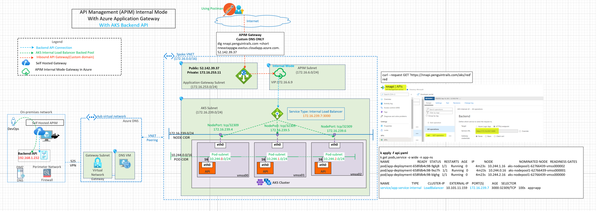
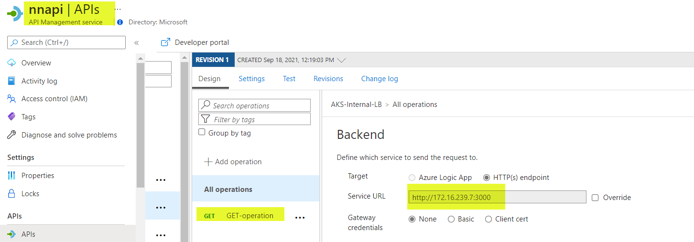

# Overview
This architecture provides details of APIM connectivity to AKS backend. This architecture shows AKS cluster deployed in Basic/Kubnet mode, however the internal load balancer placement and APIM backend connection stays the same for both Kubenet and Azure CNI deployments. More details on the AKS Reference architectures [here](../aks/README.md).


# Architecture Diagram


# Desgin Components
1. APIM Deployed in Internal Mode with Application Gateway
2. Custom domain is configured for APIM endpoints.
3. AKS Cluster deployed with Kubenet networking in the above diagram. Note: The load balancer placement stays the same with Azure CNI. With Azure CNI, APIM can directly access the POD as well since the NODE and PODS are on the same subnet. Review AKS architectures[here](../aks/README.md). for more details on kubenet vs CNI..
4. AKS Subnet (172.16.239.0/24) routable from APIM Subnet (172.16.6.0/24). Note: Backend APIs can be in peered subnet.
5. AKS hosted API exposed on the Internal Load balancer (172.16.239.7)
   
# Create Backend API in APIM



# Create an API

Review the AKS Networking series for the demo AKS applications. In this example we are using the api.yaml manifest to deploy a sample API in AKS.


```
k apply -f api.yaml
k get pods,service -o wide -n app-ns
NAME                                  READY   STATUS    RESTARTS   AGE     IP            NODE                                NOMINATED NODE   READINESS GATES
pod/app-deployment-658fdb4c98-9gkj8   1/1     Running   0          4m23s   10.244.1.16   aks-nodepool1-62766439-vmss000002   <none>           <none>
pod/app-deployment-658fdb4c98-9xz7h   1/1     Running   0          4m23s   10.244.0.16   aks-nodepool1-62766439-vmss000001   <none>           <none>
pod/app-deployment-658fdb4c98-blghg   1/1     Running   0          4m23s   10.244.2.16   aks-nodepool1-62766439-vmss000000   <none>           <none>

NAME                           TYPE           CLUSTER-IP      EXTERNAL-IP    PORT(S)          AGE    SELECTOR
service/app-service-internal   LoadBalancer   10.101.11.159   172.16.239.7   3000:32309/TCP   100s   app=app


k describe service app-service-internal -n app-ns
Name:                     app-service-internal
Namespace:                app-ns
Labels:                   <none>
Annotations:              service.beta.kubernetes.io/azure-load-balancer-internal: true
Selector:                 app=app
Type:                     LoadBalancer
IP Families:              <none>
IP:                       10.101.11.159
IPs:                      <none>
LoadBalancer Ingress:     172.16.239.7
Port:                     <unset>  3000/TCP
TargetPort:               3000/TCP
NodePort:                 <unset>  32309/TCP
Endpoints:                10.244.0.16:3000,10.244.1.16:3000,10.244.2.16:3000
Session Affinity:         None
External Traffic Policy:  Cluster
Events:
  Type    Reason                Age   From                Message
  ----    ------                ----  ----                -------
  Normal  EnsuringLoadBalancer  15m   service-controller  Ensuring load balancer
  Normal  EnsuredLoadBalancer   13m   service-controller  Ensured load balancer

```
## Validations
curl http://172.16.239.7:3000/red
red

curl --request GET 'https://nnapi.penguintrails.com/aks/red' --header 'Ocp-Apim-Subscription-Key: XXXX135'
red


## Cleanup
k delete ns app-ns

# TODO
1. Add function app example