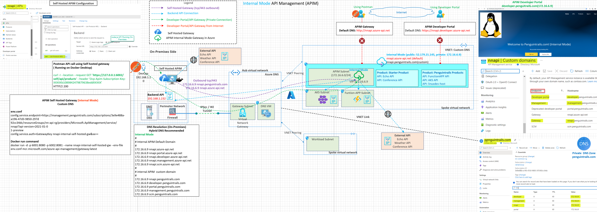
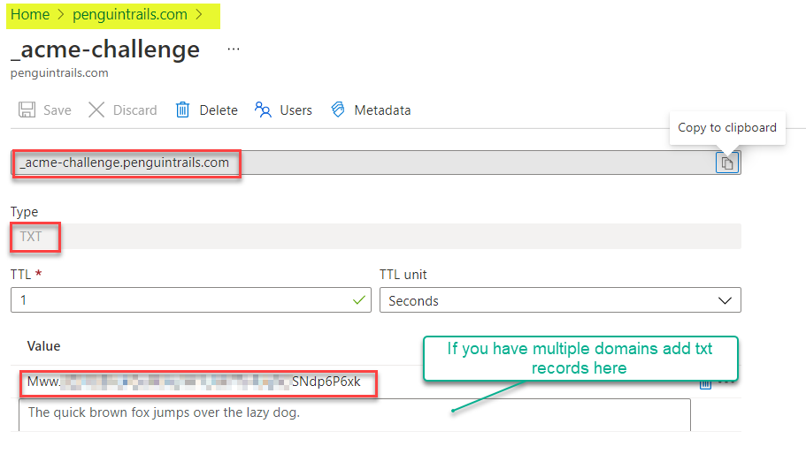
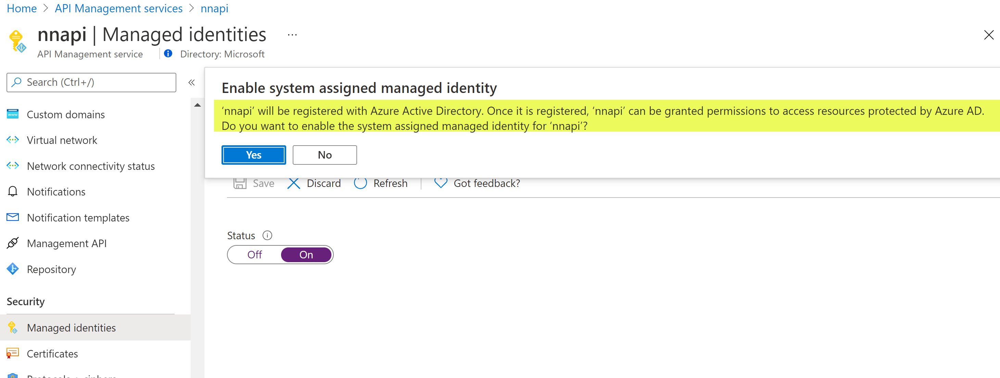
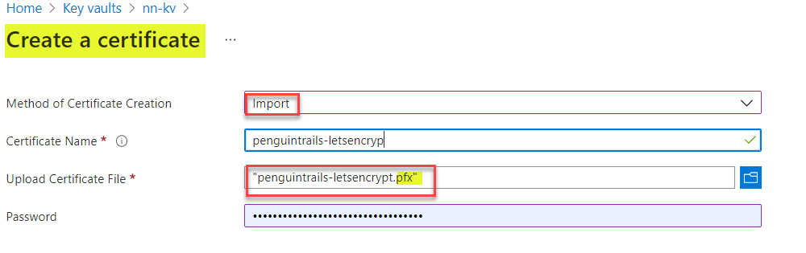
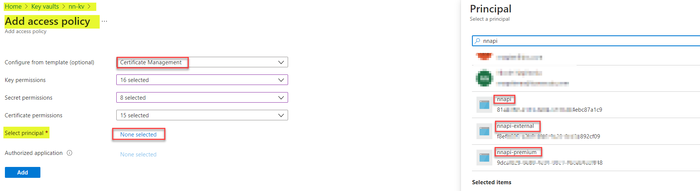
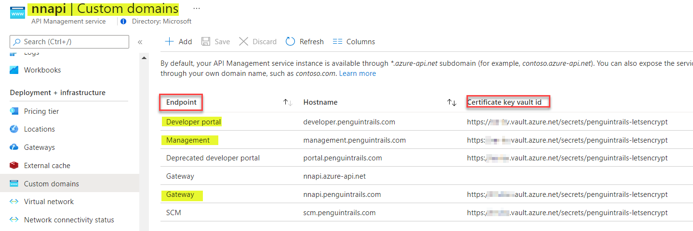
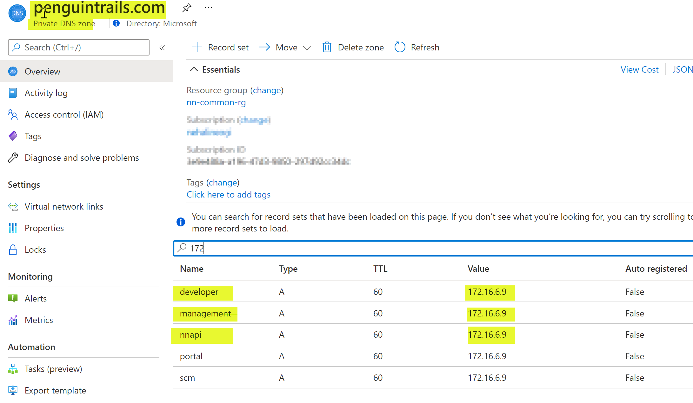
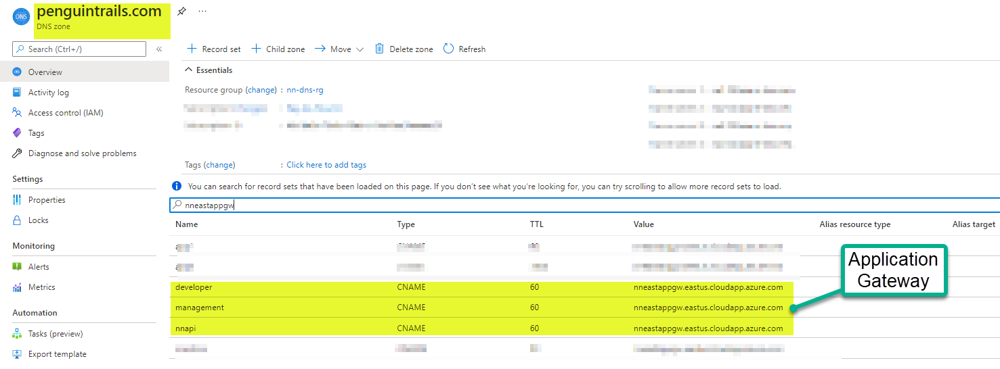
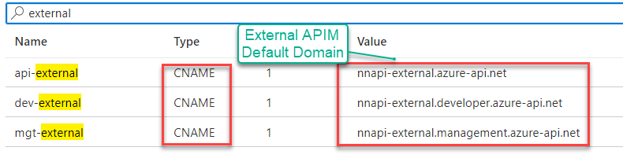

# Overview
This article shows an example of generating a valid Let's Encrypt certificate and leveraging Azure Private and Public DNS zone with APIM depoloyment. This process to common to Internal,External and Default APIM Modes. APIM endpoints by default have Azure managed DNS using azure-api.net subdomain. In this example we expose the APIM endpoints using a custom domain - penguintrails.com. The example below shows how to create a valid letencrypt certificate and use Azure Key Vault to store the certificates. 

Note: Lets Encrypt certificates are **valid for 90 days**. FAQ link [here](https://letsencrypt.org/docs/faq/#what-is-the-lifetime-for-let-s-encrypt-certificates-for-how-long-are-they-valid)

# Reference Architecture

Download [Multi-tab Visio](APIM-all-reference-architectures-visio.vsdx) and [PDF](APIM-all-reference-architectures-PDF.pdf)

# Design Components
1. This diagram shows the Internal IPIM. The sample process applies to External and Default Modes.
2. Let's Encrypt Certificates are used
3. Public DNS Zone are used for External resulution are mapped to API default domains. Note: When used with application gateway the CNAME record points to the application gateway.
4. Private DNS are used for internal resolution and mapped to internal IP.
# Documentation links

[Lets Encrypt](https://letsencrypt.org/)

[Certbot](https://certbot.eff.org/)

[APIM Custom Doman](https://docs.microsoft.com/en-us/azure/api-management/configure-custom-domain)

[Using Managed Identity with APIM](https://docs.microsoft.com/en-us/azure/api-management/api-management-howto-use-managed-service-identity)


# LetsEncrypt Certificates and Custom Domain

APIM endpoints by default have Azure managed DNS using azure-api.net subdomain. 

```
API Gateway :           nnapi.azure-api.net

API Legacy Portal:      nnapi.portal.azure-api.net

API Developer Portal:   nnapi.developer.azure-api.net

API Management Endpoint nnapi.management.azure-api.net

API Git                 nnapi.scm.azure-api.net


```


In this example we expose these endpoints using a custom domain - penguintrails.com. The example below shows how to create a valid letencrypt certificate and use Azure Key Vault to store the certificates. 

1. Install Certbot utility link [here](https://github.com/certbot/certbot/releases/tag/v1.19.0)
2. Create a wildcard certificate. (Note: For individual certificates add more domains after -d)
In Powershell:

certbot certonly --manual --preferred-challenges dns -d *.penguintrails.com

Navigate to c:\certbot and validate.


3. Create DNS Record
   
   

4. Convert the certificate to .pfx format
   
Example in WSL environment:
From :  /mnt/c/Certbot/live/penguintrails.com/

```
     openssl pkcs12 -export -inkey privkey.pem -in cert.pem -certfile chain.pem -out penguintrails-letsencrypt.pfx

```     
    ** Note: These certificates are valid for 90 days**

```
     penguintrails-letsencrypt.pfx -nokeys | openssl x509 -noout -startdate -enddate
     
     Enter Import Password:
     
     notBefore=Jul 23 20:23:54 2021 GMT
     notAfter=Oct 21 20:23:52 2021 GMT


```

5. Enable Managed Identity
    

6. Import the Certificate to Azure keyvault
   
    
     

7. Add a custom domain for each of the APIM endpoints (developer portal, management, gateway, scm and legacy portal(if needed))
       

# Custom Domain and DNS Considerations
APIM in Internal Mode DNS is managed by the user. APIM in External Mode Default DNS resolution is provided by Azure DNS. For Custom Domain, the user needs to do the manage DNS configuration.
Azure Private and public DNS zone can be leveraged.

```
#APIM default domain
#
172.16.6.9 nnapi.azure-api.net
172.16.6.9 nnapi.portal.azure-api.net
172.16.6.9 nnapi.developer.azure-api.net
172.16.6.9 nnapi.management.azure-api.net
172.16.6.9 nnapi.scm.azure-api.net
##
#APIM custom domain
#
172.16.6.9 nnapi.penguintrails.com
172.16.6.9 developer.penguintrails.com
172.16.6.9 portal.penguintrails.com
172.16.6.9 management.penguintrails.com
172.16.6.9 scm.penguintrails.com

```

# Azure Private DNS Zone

Azure Private DNS Zone with hybrid can be leveraged for Custom Domain resolution for internal users within Azure VNET and on-premises





# Azure Public DNS Zone

Azure Public DNS Zone can be leveraged for external resolution of custom domain


Internal APIM with Application Gateway.  CNAME record pointing to application gateway DNS name.



External APIM with Azure Firewall

