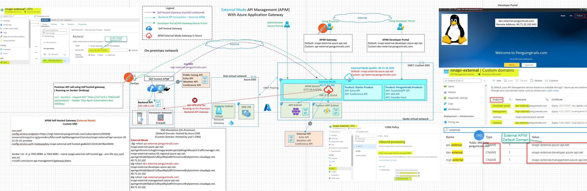
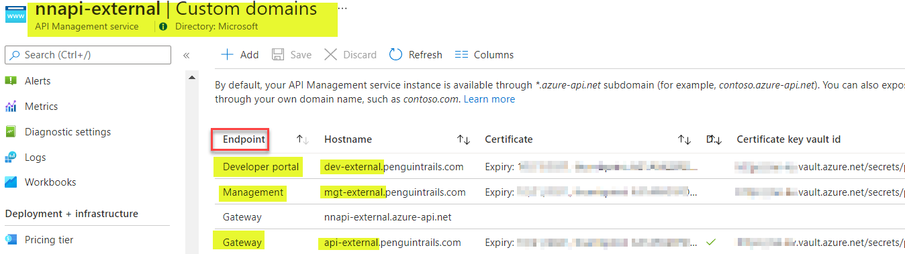
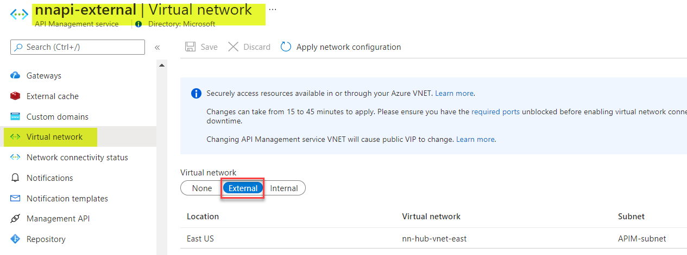
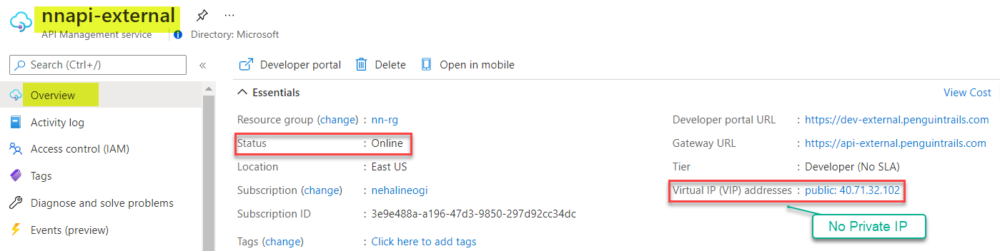
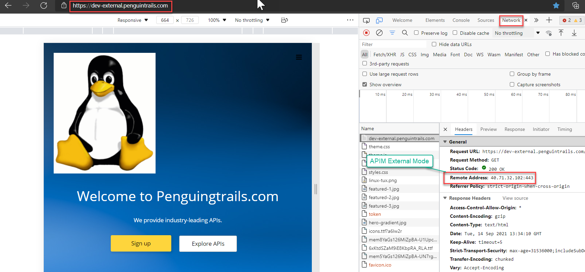
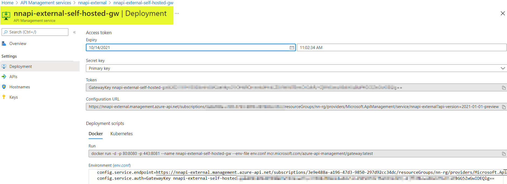
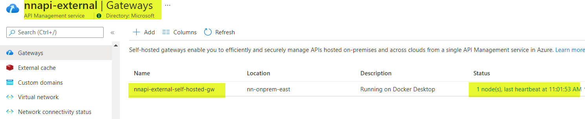
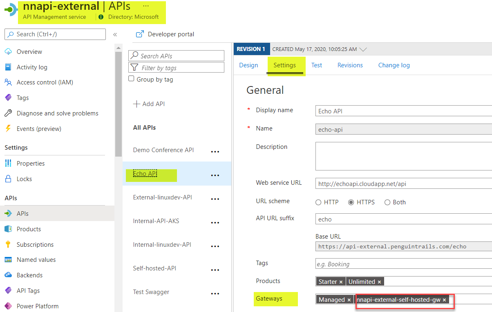

# Azure API Management (APIM) External Mode

This architecture demonstrates the connectivity architecture and traffic flows to and from API Management (APIM). APIM can be deployed in various modes. The diagram shows APIM in external mode with Custom DNS, APIM Self hosted gateway. Main consideration for APIM is external modes is that it's reachable from the public internnet for external consumers with minimal DNS configuration

# Azure Documentation links

1. [APIM External Mode](https://docs.microsoft.com/en-us/azure/api-management/api-management-using-with-vnet)
2. [Internal APIM Self Hosted Gateway](https://docs.microsoft.com/en-us/azure/api-management/self-hosted-gateway-overviewt)

# Reference Architecture




## Design Components

0. **Traffic Flows**
   
   1. Blue/Cyan : Backend API Connections
   2. Green: Developer Portal and API Gateway Access from On-Prem
   3. Red: No VPN to On-premises
   4. Purple: Self-hosted APIM Gateway(On-Premises) outbound connection to APIM Management plane in Azure


1. APIM in External mode is accessible from the internet. Note : VPN connectivity to on-premises is not needed (it's optional). External DNS Resolution works for the default domain

**APIM External Mode default hostnames**
Note: All resolve to public IP: 40.71.32.102

API Gateway nnapi-external.azure-api.net

API Legacy Portal nnapi-external.portal.azure-api.net

API Developer Portal nnapi-external.developer.azure-api.net

API Management Endpoint nnapi-external.management.azure-api.net

API Git nnapi-external.scm.azure-api.net


2. **DNS Custom domain considerations:** APIM External mode is accessible from the internet.APIM Public DNS is setup and Custom domain is deployoed with Letsencrypt Certificates in the keyvault


   
   

```
    dig +short api-external.penguintrails.com
nnapi-external.azure-api.net.
apimgmttmclcv1shygitnmegqrwzwkcqw2cjbklugm8iuvje1l.trafficmanager.net.
nnapi-external-eastus-01.regional.azure-api.net.
apimgmthsbkt9pesb7u9kyu94q3o8fn5nnanvvv8rykjsxmmxr.cloudapp.net.
40.71.32.102
dig +short dev-external.penguintrails.com
nnapi-external.developer.azure-api.net.
apimgmthsbkt9pesb7u9kyu94q3o8fn5nnanvvv8rykjsxmmxr.cloudapp.net.
40.71.32.102
dig +short mgt-external.penguintrails.com
nnapi-external.management.azure-api.net.
apimgmthsbkt9pesb7u9kyu94q3o8fn5nnanvvv8rykjsxmmxr.cloudapp.net.
40.71.32.102

```
3. Backend APIs needs to be routable from APIM in internal mode.
4. Use Docker host or On-Premises Kubernetes cluster to run API Management self hosted gateway
5. The diagram shows Backend APIs running in Azure (AKS Cluster, Function App), externally hosted APIs (example weather API or conference API) and Backend API hosted on-premises

5. Internal APIs hosted On-premises and in Azure (AKS or Azure Functions)
6. External API (Echo and Conference APIs)
7. Self hosted Gateway Consideration: Backend APIs (192.168.1.232) needs to be routable from Self hosted APIM Gateway within the on-premises environment. Management.penguintrails.com resolves to public IP.
  


# Pre-requisites
Using Azure documentation link [here](https://docs.microsoft.com/en-us/azure/api-management/import-and-publish) ensure that you've external APIM in the external mode.

Refer to common documentation link [here](README-common.md) for more details on pre-requisites
1. APIM in deployed in External mode.
2. Products,APIs and subscriptions created
3. VPN or Private Connectivity is optional in this design
4. Internal and External APIs routable from APIM subnet
5. Azure Provided default DNS resolution for API endpoints.
6. Developer Portal Published
7. Troubleshooting Notes - [here](README-troubleshooting.md).

# Validations:
Note: Private Connectivity and DNS configuration is required

0. Base validations from Azure Portal
   
   
   

1. From On-Premises validate connection to an backend API running in Azure. Using host headers validate that both default domain and custom domain should work.

      Default Domain:

      curl --location --request GET 'http://nnapi-external.azure-api.net/internal/listUsers' --header 'Ocp-Apim-Subscription-Key: XXXXea'

      Custom Domain

      curl --location --request GET 'http://api-external.penguintrails.com/internal/listUsers' --header 'Ocp-Apim-Subscription-Key: XXXXea'

2. From On-premises validate connection to an External API  (Demo Conference API)

   Default Domain

   curl --location --request GET 'https://nnapi-external.azure-api.net/conference/sessions' --header 'Ocp-Apim-Subscription-Key: XXXXea'

   Custom Domain

    curl --location --request GET 'https://api-external.penguintrails.com/conference/sessions' --header 'Ocp-Apim-Subscription-Key: XXXXea'
  

3. Verify Developer Portal Access
    
    Access developer Portal via Private Window using "dev-external.penguintrails.com". Developer portal resolves to a public IP. Navigate to API and products.  API call will fail because of the subscription key requirement. You'll need to register to see subscriptions.


    
   
4. Packet Capture on backend API server to validate the source IP of the APIM.  More info on [VIP and DIP Address](https://docs.microsoft.com/en-us/azure/api-management/api-management-using-with-internal-vnet?tabs=stv2#vip-and-dip-addresses)

NOTE: 172.16.6.6 is the DIP IP address. Public IP address of the APIM in External Mode:  40.71.32.102

```
Sample API listening on private and public IP address on Azure linux VM for demo (this can be AKS or Functon APP)
nehali@nn-linux-dev:~/api$ node app.js
Example app listening at http://:::3001


Note: APIM Source: 172.16.6.6  (for internal backend api)
tcpdump: verbose output suppressed, use -v or -vv for full protocol decode
listening on eth0, link-type EN10MB (Ethernet), capture size 262144 bytes
13:59:13.952801 IP 172.16.1.5.3001 > 172.16.6.6.50370: Flags [F.], seq 3185730895, ack 768215584, win 501, length 0
13:59:13.953991 IP 172.16.6.6.50370 > 172.16.1.5.3001: Flags [.], ack 1, win 16394, length 0
13:59:15.135720 IP 172.16.6.6.50370 > 172.16.1.5.3001: Flags [F.], seq 1, ack 1, win 16394, length 0
13:59:15.135761 IP 172.16.1.5.3001 > 172.16.6.6.50370: Flags [.], ack 2, win 501, length 0
13:59:15.136077 IP 172.16.6.6.50380 > 172.16.1.5.3001: Flags [SEW], seq 1376038664, win 64240, options [mss 1418,nop,wscale 8,nop,nop,sackOK], length 0
13:59:15.136165 IP 172.16.1.5.3001 > 172.16.6.6.50380: Flags [S.], seq 901298113, ack 1376038665, win 64240, options [mss 1460,nop,nop,sackOK,nop,wscale 7], length 0
13:59:15.137351 IP 172.16.6.6.50380 > 172.16.1.5.3001: Flags [.], ack 1, win 16395, length 0
13:59:15.137417 IP 172.16.6.6.50380 > 172.16.1.5.3001: Flags [P.], seq 1:278, ack 1, win 16395, length 277
13:59:15.137437 IP 172.16.1.5.3001 > 172.16.6.6.50380: Flags [.], ack 278, win 501, length 0
13:59:15.138639 IP 172.16.1.5.3001 > 172.16.6.6.50380: Flags [P.], seq 1:409, ack 278, win 501, length 408


Note: APIM Source: 40.71.32.102 (for external backend api)
root@nn-linux-dev:~# tcpdump -ni eth0 port 3001
tcpdump: verbose output suppressed, use -v or -vv for full protocol decode
listening on eth0, link-type EN10MB (Ethernet), capture size 262144 bytes
14:00:25.129133 IP 40.71.32.102.1985 > 172.16.1.5.3001: Flags [SEW], seq 2765777871, win 64240, options [mss 1440,nop,wscale 8,nop,nop,sackOK], length 0
14:00:25.129136 IP 40.71.32.102.1984 > 172.16.1.5.3001: Flags [F.], seq 3626643882, ack 853881095, win 2051, length 0
14:00:25.129194 IP 172.16.1.5.3001 > 40.71.32.102.1985: Flags [S.], seq 3977587758, ack 2765777872, win 64240, options [mss 1460,nop,nop,sackOK,nop,wscale 7], length 0
14:00:25.129194 IP 172.16.1.5.3001 > 40.71.32.102.1984: Flags [.], ack 1, win 501, length 0
14:00:25.130508 IP 40.71.32.102.1985 > 172.16.1.5.3001: Flags [.], ack 1, win 16425, length 0
14:00:25.130761 IP 40.71.32.102.1985 > 172.16.1.5.3001: Flags [P.], seq 1:304, ack 1, win 16425, length 303
14:00:25.130780 IP 172.16.1.5.3001 > 40.71.32.102.1985: Flags [.], ack 304, win 501, length 0
14:00:25.132485 IP 172.16.1.5.3001 > 40.71.32.102.1985: Flags [P.], seq 1:409, ack 304, win 501, length 408
14:00:25.173433 IP 40.71.32.102.1985 > 172.16.1.5.3001: Flags [.], ack 409, win 16423, length 0


```


# API Self Hosted Gateway

1. Deploy Gateway in Portal 




2. Add APIs



3. Deploy Gateway on Prem using the env.conf and the docker run command

 
```

env.conf

config.service.endpoint=https://mgt-external.penguintrails.com/subscriptions/XXXXX/resourceGroups/nn-rg/providers/Microsoft.ApiManagement/service/nnapi-external?api-version=20
21-01-01-preview
config.service.auth=GatewayKey nnapi-external-self-hosted-gw&202110141447&xVXXXX


docker run -d -p 7001:8080 -p 7002:8081 --name nnapi-external-self-hosted-gw --env-file env.conf mcr.mi
crosoft.com/azure-api-management/gateway:latest

```

Adjust the listening port per your environment. Default is 80 and 443. In this example it's change to 6001 and 6002.

```

nehali@nehali-laptop:~$ docker ps
CONTAINER ID   IMAGE                                                   COMMAND                  CREATED                  STATUS        PORTS
                                                              NAMES
04f2a0a861fc   mcr.microsoft.com/azure-api-management/gateway:latest   "/bin/sh -c 'dotnet …"   Less than a second ago   Up 1 second   0.0.0.0:7001->8080/tcp, :::7001->8080/tcp, 0.0.0.0:7002->8081/tcp, :::7002->8081/tcp   nnapi-external-self-hosted-gw

nehali@nehali-laptop:~$ docker exec -it 04 sh

/app $  hping -S -p 443 mgt-external.penguintrails.com
HPING mgt-external.penguintrails.com (eth0 40.71.32.102): S set, 40 headers + 0 data bytes
len=44 ip=40.71.32.102 ttl=37 id=28031 sport=443 flags=SA seq=0 win=65535 rtt=39.8 ms

^C
--- mgt-external.penguintrails.com hping statistic ---
2 packets tramitted, 3 packets received, -50% packet loss
round-trip min/avg/max = 39.5/259.7/699.8 ms


/app $ netstat -ant | grep 40.71.32
tcp       62      0 172.17.0.2:41406        40.71.32.102:443        ESTABLISHED
tcp        0      0 172.17.0.2:41404        40.71.32.102:443        ESTABLISHED
/app $


```
4. Validate self hosted gateway container is running and online. For any troubleshooting the container use the following command:
   
```
docker logs 04 --follow

```

4. Validate local api running on 192.168.1.232

   1. On 192.168.1.232
    node app.js
Server started on port 3001...
Mysql Connected...

   2. Test local api connection using curl or postman
        
        curl --location --request GET 'https://127.0.0.1:7002/self/api/products' --header 'Ocp-Apim-Subscription-Key: XXXXea'

   3. Self hosted container logs:

Successful Connection:
   
```
 [Info] 2021-09-14T02:58:55.494, isRequestSuccess: True, totalTime: 32, category: GatewayLogs, callerIpAddress: 172.17.0.1, timeGenerated: 09/14/2021 14:58:55, region: nn-onprem-east, correlationId: 022d5382-61ee-4658-bdb1-73271f3414cd, method: GET, url: https://127.0.0.1:7002/self/api/products, backendResponseCode: 200, responseCode: 200, responseSize: 627, cache: none, backendTime: 17, apiId: self-hosted-api, operationId: wsl-linux-get-products, apimSubscriptionId: nehali-all-product-subscription, clientProtocol: HTTP/1.1, backendProtocol: HTTP/1.1, apiRevision: 1, clientTlsVersion: 1.2, backendMethod: GET, backendUrl: http://192.168.1.232:3001/api/products

```   

Container logs for a failed Connection (In case the backend API is not running)


```
[Info] 2021-09-14T02:59:23.892, isRequestSuccess: False, totalTime: 2104, category: GatewayLogs, callerIpAddress: 172.17.0.1, timeGenerated: 09/14/2021 14:59:23, region: nn-onprem-east, correlationId: 2bbf232e-0757-472c-8f69-5ae6466aa2c2, method: GET, url: https://127.0.0.1:7002/self/api/products, responseCode: 500, responseSize: 191, cache: none, apiId: self-hosted-api, operationId: wsl-linux-get-products, apimSubscriptionId: nehali-all-product-subscription, clientProtocol: HTTP/1.1, apiRevision: 1, clientTlsVersion: 1.2, lastError: {
  "elapsed": 2094,
  "source": "request-forwarder",
  "path": "forward-request\\forward-request",
  "reason": "BackendConnectionFailure",
  "message": "LogError connecting to 192.168.1.232:3001",
  "section": "backend",
  "transportErrorCode": 111
}, errors: [
  {
    "elapsed": 2079,
    "source": "request-forwarder",
    "path": "forward-request\\forward-request",
    "message": "LogError connecting to 192.168.1.232:3001",
    "section": "backend"
  }
]

```
5. Validate External API.

   curl --location --request GET 'https://127.0.0.1:7002/echo/resource?param1=sample' --header 'Ocp-Apim-Subscription-Key: XXXXXa2ea'


