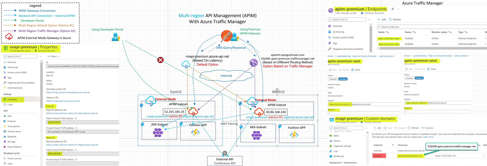
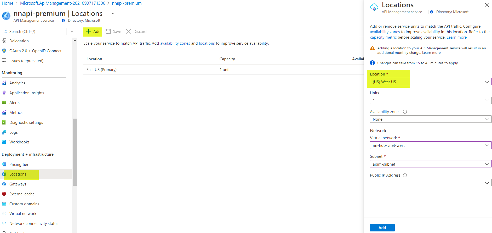
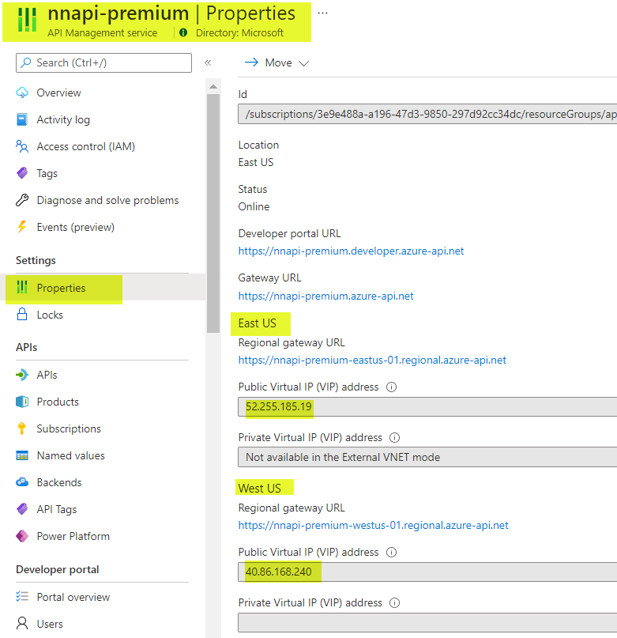
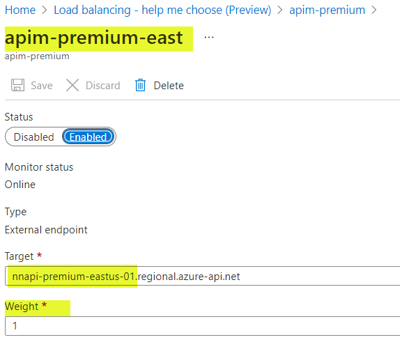
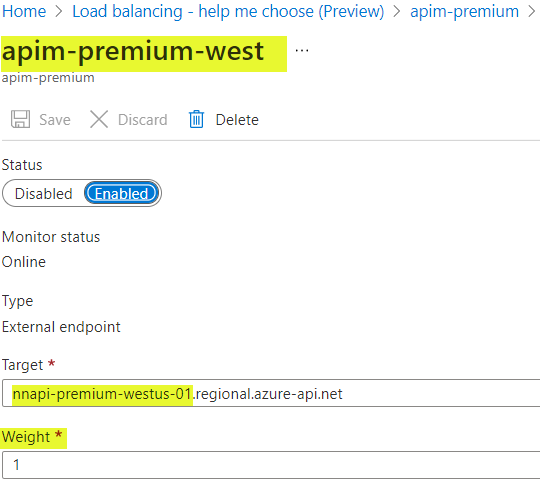
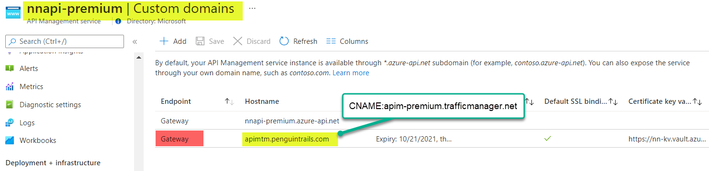
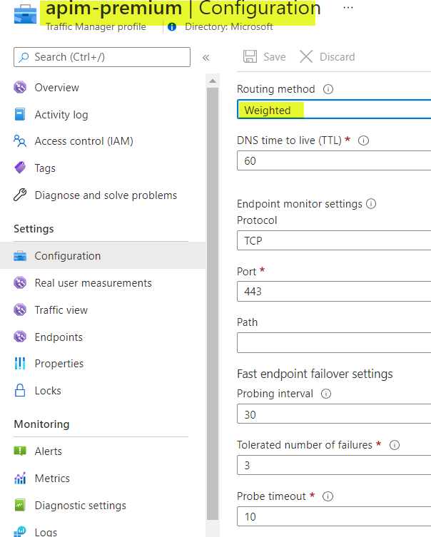
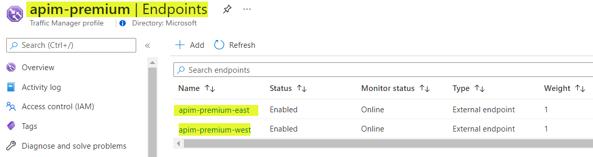

# Azure API Management (APIM) Multi-region Architecture

This architecture shows APIM with multi-region deployment.  Multi-region deployment helps reduce front end latency perceived by geographically distributed API consumers and improves service availability if one region goes offline. Connection latency to backend APIs needs to be taken into consideration in the multi-region design. APIM in multi-region mode requires premium tier. Note that only the APIM gateway component of API Management is deployed to all regions. The developer portal is hosted in the Primary region only.  Two DNS load balancing options are discussed here - one with the default multi-region deployment and one with Azure Traffic manager for more granular control over the routing.


# Reference Architecture


Download [Multi-tab Visio](APIM-all-reference-architectures-visio.vsdx) and [PDF](APIM-all-reference-architectures-PDF.pdf)

# Azure Documentation links

1. [APIM Multi-region](https://docs.microsoft.com/en-us/azure/api-management/api-management-howto-deploy-multi-region)
2. [APIM Multi-region with Traffic Manager](https://docs.microsoft.com/en-us/azure/api-management/api-management-howto-deploy-multi-region#-use-custom-routing-to-api-management-regional-gateways)


# Desgin Components and Considerations
0. **Traffic Flows**
   
   1. Cyan : Backend API Connections
   2. Green: Developer Portal and API Gateway Access for External Consumers
   3. Blue: API Gateway endpoint Access
   4. Orange: Default DNS load balancing option
   5. Purple: DNS Load balancing with Azure Traffic Manager (TM)
 

1. This architecture represents APIM in External Mode however, traffic manager can be deployed in front of the Application Gateway in internal mode.
2. Default option (Option#1) routes requests to the correspoding regional gateway based on the lowest latency.
3. Azure TM Option (Option#2) gives more granular control over routing and load balancing options
4. Failover Design considerations: Developer Portal is hosted in Primary region only. In case of Primary region outage access to the developer portal will be impacted until primary region comes back online. Secondary region will service the API traffic.


# Pre-requisites
Using Azure documentation link [here](https://docs.microsoft.com/en-us/azure/api-management/import-and-publish) ensure that APIM is in External Mode.

Refer to common documentation link [here](README-common.md) for more details on prerequisites
1. APIM is deployed in External Mode (**Premium tier required**)
2. Products, APIs and subscriptions created
3. VPN or Private Connectivity is optional in this design
4. Internal and External APIs routable from APIM subnet
5. Azure Provided default DNS resolution for API endpoints.
6. Developer Portal Published
7. Troubleshooting Notes - [here](README-troubleshooting.md).


# Configuration

## APIM Side Configuration






# Traffic Manager Configuration





# Multi-region (Option#1) DNS Resolution with default Multi-region

In the default mode and routes request to a regional gateway based on lowest latency

East VM Resolves to East IP (Primary Region)
```
nehali@nn-linux-dev:~$ dig +short nnapi-premium.azure-api.net
apimgmttm1xwomm3ais1n8uk6p1nuaa6wso55smgryhomsg7qr.trafficmanager.net.
nnapi-premium-eastus-01.regional.azure-api.net.
apimgmthsajvdzotyzpmfmhrqfh7xjnq7k0gzo6cmn9u2d5s5l.cloudapp.net.
52.255.185.19

```
West VM resolves to west IP(Secondary Region)
```
nehali@nn-cyan-vm:~$ dig +short nnapi-premium.azure-api.net
apimgmttm1xwomm3ais1n8uk6p1nuaa6wso55smgryhomsg7qr.trafficmanager.net.
nnapi-premium-westus-01.regional.azure-api.net.
apimgmthsehik1fs6runeq18v2h5rptaznywntzbjw0kmleq8a.cloudapp.net.
40.86.168.240

```
Developer portal always resolves to primary region

```
nehali@nehali-laptop:~$ dig nnapi-premium.developer.azure-api.net +short
apimgmthsajvdzotyzpmfmhrqfh7xjnq7k0gzo6cmn9u2d5s5l.cloudapp.net.
52.255.185.19

```

# Multi-region (Option#2) DNS Resolution with Custom domain and Traffic Manager

Note the equal weight traffic manager routing method is resolving the EastUS and West US IPs

```
nehali@nehali-laptop:~$ dig +short apimtm.penguintrails.com
apim-premium.trafficmanager.net.
nnapi-premium-westus-01.regional.azure-api.net.
apimgmthsehik1fs6runeq18v2h5rptaznywntzbjw0kmleq8a.cloudapp.net.
40.86.168.240


nehali@nehali-laptop:~$ dig +short apimtm.penguintrails.com
apim-premium.trafficmanager.net.
nnapi-premium-eastus-01.regional.azure-api.net.
apimgmthsajvdzotyzpmfmhrqfh7xjnq7k0gzo6cmn9u2d5s5l.cloudapp.net.
52.255.185.19

```
Primary Region IP: API Call resulting in EastUS connection:

```
 curl -v -I --location --request GET 'https://apimtm.penguintrails.com/echo/resource?param1=sample' --insecure
*   Trying 52.255.185.19:443...
* TCP_NODELAY set
* Connected to apimtm.penguintrails.com (52.255.185.19) port 443 (#0)
* ALPN, offering h2
* <snip>

```
Secondary Region IP: API Call resulting in EastUS connection:
```

curl -v -I --location --request GET 'https://apimtm.penguintrails.com/echo/resource?param1=sample' --insecure
*   Trying 40.86.168.240:443...
* TCP_NODELAY set
* Connected to apimtm.penguintrails.com (40.86.168.240) port 443 (#0)
* <snip>
```

# TODO
1. Add Diagram for Internal mode with App GW and Traffic Manager