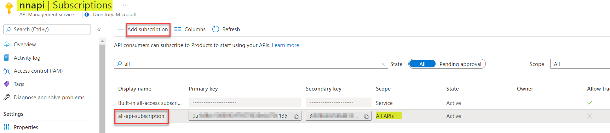
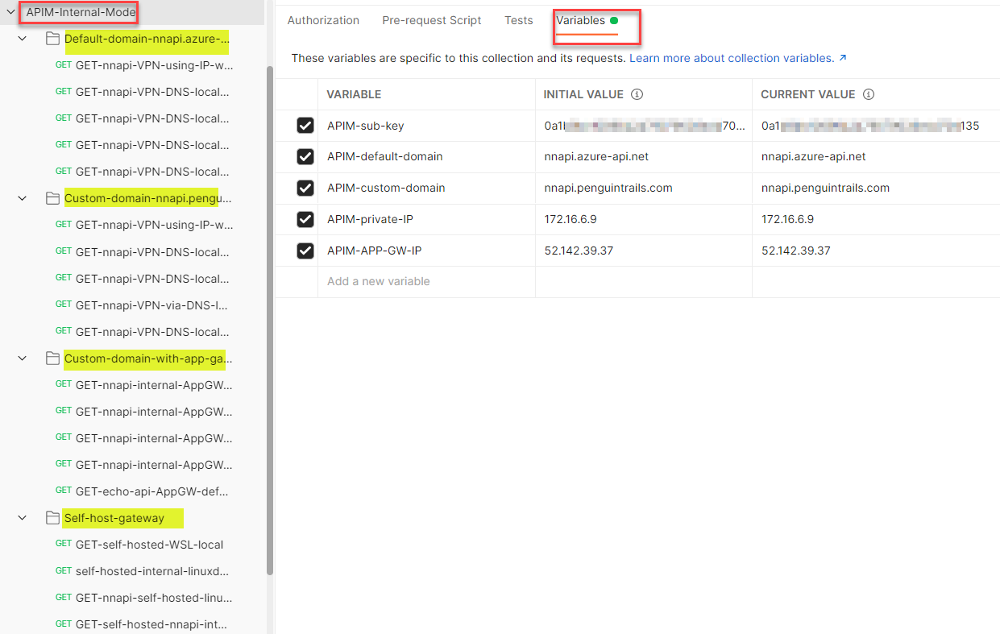
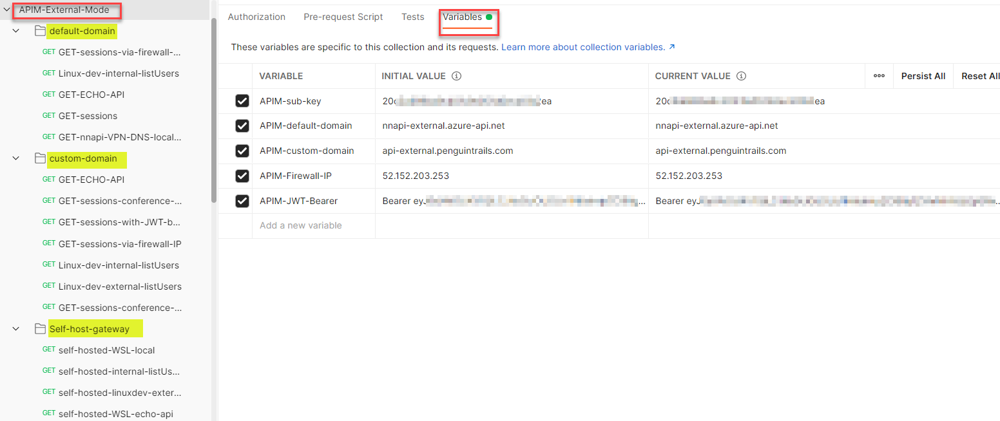

# Postman Collection
This document contains intructions to download sample postman collection and set it up in your environment. This is still work in progress but sharing what i have so far.

# Download Postman collection

[Internal Mode](APIM-Internal-Mode-Shared.postman_collection.json)

[External Mode](APIM-External-Mode-Shared.postman_collection.json)

# Configuration

1. Create a subscritpion key in the APIM Portal

2. Import the collection in Postman.

3. Configure the variable to match your environment.

Example from my environment:

Note: 
1. In addition to variables - the API path adjustments will be needed for this to work in your environment.
2. For self hosted Gateway's your ports may vary. The example uses 600[12] for Internal APIM and 700[12] for External APIM

Internal Mode

External Mode

# TODO
1. Consistent naming convention in the postman collection.
2. Fix API paths to linuxdev examples to make it more generic