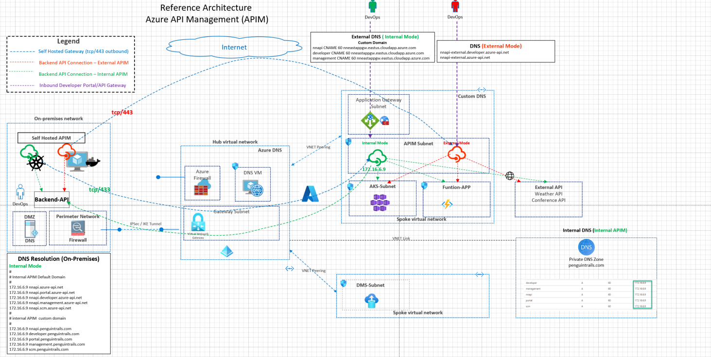
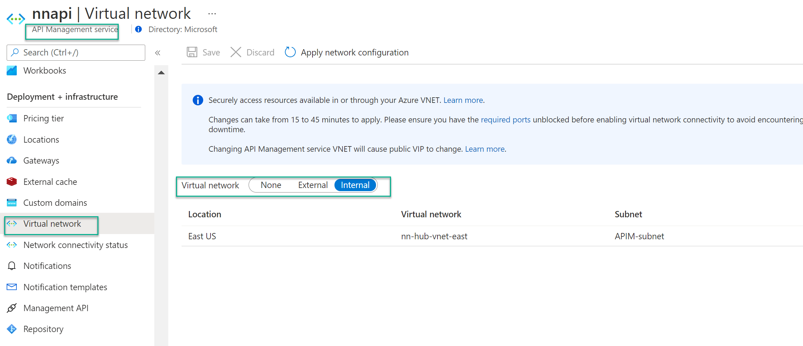
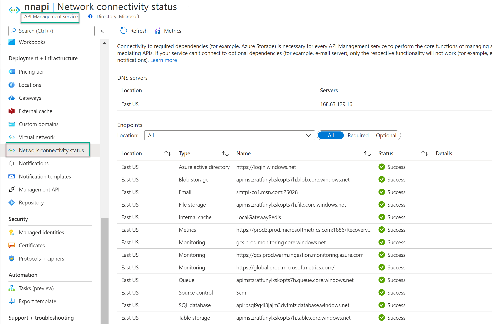

## Azure API Management (APIM) Architecture

This architecture demonstrates the connectivity architecture and traffic flows for API Management (APIM). APIM can be deployed in various modes. APIM in internal mode with Application gateway and Custom DNS. APIM can also be deployed in External with direct access from the internet.

## Azure Documentation links

1. [APIM External Mode](https://docs.microsoft.com/en-us/azure/api-management/api-management-using-with-vnet)
2. [APIM Internal Mode](https://docs.microsoft.com/en-us/azure/api-management/api-management-using-with-internal-vnet)
3. [Internal APIM with Application Gateway](https://docs.microsoft.com/en-us/azure/api-management/api-management-using-with-internal-vnet)
4. [Internal APIM Self Hosted Gateway](https://docs.microsoft.com/en-us/azure/api-management/self-hosted-gateway-overviewt)

## Reference Architecture



Download Visio link here

Download postman APIM collection here

## Design Components

1. APIM in Internal mode
2. APIM in External mode
3. Custom DNS using Azure Private DNS Zone
4. Docker Desktop or On-Premises Kubernetes cluster to run API Management self hosted gateway
5. Backend APIs running in Azure (AKS Cluster, Function App)
6. Externally hosted APIs (example weather API or conference API)
7. Backend API hosted on-premises

## Design Considerations and Planning

1. Azure Subnet planning for DMS subnet and SQL MI subnet

If using API version 2021-01-01-preview or later to deploy an Azure API Management, you don't have to use a subnet dedicated to API Management instances.

2. DNS Resolution in Azure
   In external VNET mode, Azure manages the DNS. For internal VNET mode, you have to manage your own DNS. Note that none of the service endpoints in Internal Mode are registered on the public DNS. The service endpoints will remain inaccessible until you configure DNS for the VNET. If using custom DNS on-premises should also resolve APIM endpoints below

#

```
#APIM default domain
#
172.16.6.9 nnapi.azure-api.net
172.16.6.9 nnapi.portal.azure-api.net
172.16.6.9 nnapi.developer.azure-api.net
172.16.6.9 nnapi.management.azure-api.net
172.16.6.9 nnapi.scm.azure-api.net
##
#APIM custom domain
#
172.16.6.9 nnapi.penguintrails.com
172.16.6.9 developer.penguintrails.com
172.16.6.9 portal.penguintrails.com
172.16.6.9 management.penguintrails.com
172.16.6.9 scm.penguintrails.com

```

3. DNS Resolution with Application Gateway (Internal Mode)

Use Custom Domain and CNAME records point to the application gateway for the APIM endpoints.

```
nnapi CNAME 60 nneastappgw.eastus.cloudapp.azure.com
developer CNAME 60 nneastappgw.eastus.cloudapp.azure.com
management CNAME 60 nneastappgw.eastus.cloudapp.azure.com

```

4. APIM Modes (External vs Internal)
   

5. Azure firewall/NVA Design
   Check network connectivity status for any potential DNS or assymetric routing issue with NVA or Azure firewall



## Tools and Traffic Flows

1. Postman
2. Node.js application in AKS
3. Function API application
4. Docker Desktop to run self hosted gateway
