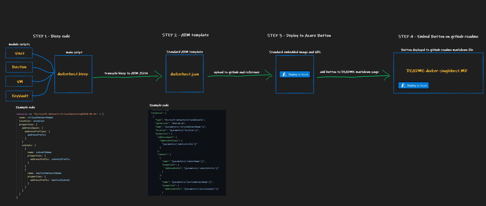

# Automation Process

This series includes architectures which can be deployed automatically via "Deploy to Azure" buttons found within each design below the architectural diagrams. 

This section discusses the method used to build the environments using Bicep, exporting to ARM template and then referencing the ARM template to start a custom deployment in Azure. 

## Reference Architecture

1. Azure resources are built in Bicep to define the entire environment.
2. The bicep code is used to export to a standard ARM template. Each design will have it's own ARM template hosted in this github repository.
3. A "Deploy to Azure" button is configured to allow a custom deployment using the hosted ARM template. Instructions for using this facility can be found [here](https://docs.microsoft.com/en-us/azure/azure-resource-manager/templates/deploy-to-azure-button).

4. The "Deploy to Azure" button is embedded into the markdown pages throughout this series where there is a deployable architecture.