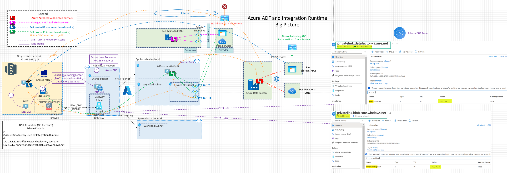

## Azure Data Factory Architecture

This architecture demonstrates the connectivity architecture and traffic flows for migrating data using Azure Data Factory, Self Hosted IR and Managed Virtual Network

## Azure Documentation links

1. [Azure Data Factory terminology](hhttps://docs.microsoft.com/en-us/azure/data-factory/introduction)
2. [Support Data Stores and Formats](https://docs.microsoft.com/en-us/azure/data-factory/copy-activity-overview#supported-data-stores-and-formats)
3. [Integration Runtime Concepts](https://docs.microsoft.com/en-us/azure/data-factory/concepts-integration-runtime)
4. [Self Hosted Integration Runtime](https://docs.microsoft.com/en-us/azure/data-factory/create-self-hosted-integration-runtimes)
5. [Managed Virtual Network](https://docs.microsoft.com/en-us/azure/data-factory/managed-virtual-network-private-endpoint)
6. [Linked Services](https://docs.microsoft.com/en-us/azure/data-factory/concepts-linked-services)

## Reference Architecture

Download Visio link here.

## Design Components

Going from left to right, source(on-premises) to a sink(Azure PaaS), the service that runs the Copy activity performs these steps:

- Reads data from a source data store.
- Performs operations based on the configuration of the input dataset, output dataset, and Copy activity.
- Writes data to the sink/destination data store
- IP Routing in place between ADF and source/sink
- ADF Self hosted Integration Runtime can be place in Azure VNET or On-Premises

1. Simple architecuture from Azure Documentation: [Data Copy Overview](https://docs.microsoft.com/en-us/azure/data-factory/copy-activity-overview)

   

2. [Support Data Stores and Formats](https://docs.microsoft.com/en-us/azure/data-factory/copy-activity-overview#supported-data-stores-and-formats)
3. Integration Runtime
4. Private DNS Zones and Hybrid DNS setup for ADF private endpoint DNS resolution.
5. Private Endpoints for ADF and Private Endpoint for Sink(Azure PaaS services)
6. Managed Virtual Network
7. Azure IR vs AzureAutoResolve

## Design Considerations and Planning

1. [Managed Virtual Network](https://docs.microsoft.com/en-us/azure/data-factory/managed-virtual-network-private-endpoint)

   Benefits of using Managed Virtual Network:

- No need to manually create a subnet for for Private Endpoints and upfront infrastructure planning
- Suited for Brownfield deployments
- Protects against data exfiltration.

2. [Self Hosted Integration Runtime](https://docs.microsoft.com/en-us/azure/data-factory/create-self-hosted-integration-runtimes)

   Use Cases:

- Use Self hosted IR to support data integration with On-premises data sources over VPN/Express route
- Use Self hosted IR to support data integration within Azure VNET
- Use Self hosted IR to support data integration with sources in another Cloud with IR running on IaaS VM.
- Self-hosted IR can service two data factories and same data source

## Tools and Traffic Flows

1. Integration Runtime
2. Azure Data factory
