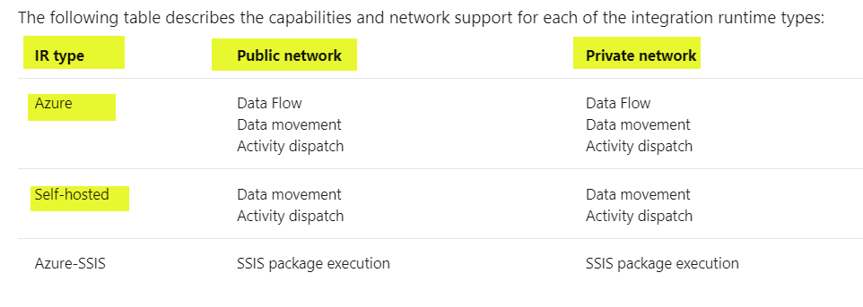

## Azure Data Factory (ADF) - The Big Picture

This architecture demonstrates the connectivity architecture and traffic flows for migrating data using Azure Data Factory. ADF offters different types of Integration Runtime (IR). This architecture shows the placement and big picture view of all different types of IR and design considerations for different types of IR.

## Reference Architecture

Download all database-services architectures [Multi-tab Visio](db-services-all-reference-architectures-visio.vsdx) and [PDF](db-services-all-reference-architectures-PDF.pdf)

## Design Components

1. Azure Hosted IR (Autoresolve). Red links showing linked services to public endpoints
2. Azure Hosted Managed VNET. This is a fully managed VNET and not connected to the hub and spoke architecture. Pink lines showing linked services to private endpoints
3. Self hosted IR in Azure. Green lines showing linked services to private endpoints. The linked services could have public endpoints as well.
4. Self hosted IT on-premises. Blue lines showing linked services to private endpoints. The linked services could have public endpoints as well.
5. Private endpoints and Private DNS Zones for ADF, blob storage and Azure SQL server.
6. Private Connectivity is provided using ExpressRoute or VPN.
7. DNS Architecture. Purple lines showing DNS traffic flow.

## Azure Documentation links

1. [Azure Integration Runtime](https://docs.microsoft.com/en-us/azure/data-factory/concepts-integration-runtime#azure-integration-runtime)
2. [Azure Data Factory terminology](hhttps://docs.microsoft.com/en-us/azure/data-factory/introduction)
3. [Support Data Stores and Formats](https://docs.microsoft.com/en-us/azure/data-factory/copy-activity-overview#supported-data-stores-and-formats)
4. [Integration Runtime Concepts](https://docs.microsoft.com/en-us/azure/data-factory/concepts-integration-runtime)
5. [Linked Services](https://docs.microsoft.com/en-us/azure/data-factory/concepts-linked-services)
6. [Private Endpoint for ADF](https://docs.microsoft.com/en-us/azure/data-factory/data-factory-private-link)
7. [On Premises DNS Configuration with Private Endpoints](https://docs.microsoft.com/en-us/azure/private-link/private-endpoint-dns#on-premises-workloads-using-a-dns-forwarder)

## Integration Runtime

Simple architecuture from Azure Documentation: [Data Copy Overview](https://docs.microsoft.com/en-us/azure/data-factory/copy-activity-overview)

Going from left to right, source to a sink, the service that runs the Copy activity is Integration Runtime which is Compute Infrastructure used by Azure Data factory. IR is used for data movement across data sotre in public or private network. It performs the following steps

- Reads data from a source data store.
- Performs operations based on the configuration of the input dataset, output dataset, and Copy activity.
- Writes data to the sink/destination data store
- IP Routing in place between ADF IR and source/sink
- ADF Self hosted Integration Runtime can be place in Azure VNET or On-Premises

There are different types of Integration Runtime

1. Autoresolve IR(default)
2. Azure Managed VNET
3. Self Hosted IR in Azure
4. Self Hosted IR On-Premises
5. Azure SSIS (outside the scope of this architecture)

The following table defines the the capabilities from network connectivity perspective. From Azure documentation link [here](https://docs.microsoft.com/en-us/azure/data-factory/concepts-integration-runtime#integration-runtime-types).

## Design Considerations and Use Cases

### Default Autoresolve Integration Runtime

- Fully Managed Compute to natively perform data movement
- Supports connecting to targets or resources with publicly accessible endpoints.
  Note: Enabling Managed Virtual Network, Azure Integration Runtime supports connecting to data stores using private link service in private network environment.
- Security Considerations:
  Source and sink protected using first line of defence by IP address (firewall IP address for Azure SQL or allow Azure services). These IPs could change. Allow Azure services should be used with caution.
- Requires operational overhead of whitelisting IPs for publicly accessible endpoints.

### Managed Virtual Network - **Preview Feature**

- Fully Managed compute to natively perform data movement
- Supports connecting to targets or resources with private endpoints so no need for allowing IPs in the firewall or allowing Azure services.
- More suited for brownfield environments where You don't need to create a subnet for Azure Integration Runtime that could eventually use many private IPs from your Virtual Network and would require prior network infrastructure planning.
- It does not require deep Azure networking knowledge to do data integrations securely.
- Security Consideration: Managed Virtual Network along with Managed private endpoints protects against data exfiltration.
- Uses Microsoft Backbone.

### Self Hosted Integration Runtime (Azure VNET or On-Premises)

- Compute for self hosted IR is in Azure VNET.
- Supports connecting to targets or resources with private endpoints so no need for allowing IPs in the firewall or allowing Azure services.
- More suited for greenfield environments and would require prior network infrastructure planning for private endpoint subnet and routing.
  Note: If you want to perform data integration securely in a private network environment, which doesn't have a direct line-of-sight from the public cloud environment, you can install a self-hosted IR on premises environment behind your corporate firewall, or inside a virtual private network. The self-hosted integration runtime only makes outbound HTTP-based connections to open internet.
- Running copy activity between a cloud data stores (public endpoints) and a data store in private network (private endpoints)
- Security Consideration: Using Private endpoints with self hosted IR protects against data exfiltration
- DNS Considerations:
  When using private endpoints, DNS infrastructure needs to be setup correctly. Spokes VNET is setup for Custom DNS pointing to 10.10.1.4 (DNS Server in the Hub VNET). The DNS server 10.10.1.4 has a server level DNS forwarder to Azure Provided DNS (168.63.129.16)

## TODO

1. Add image for SQL server private DNS zone.
