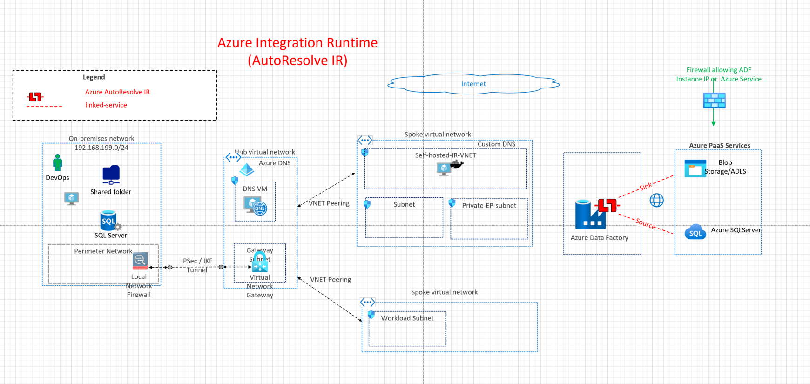
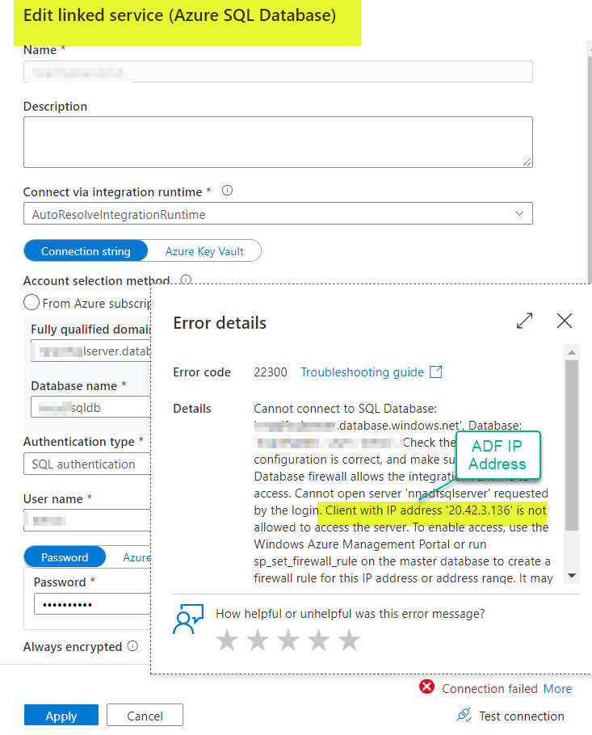
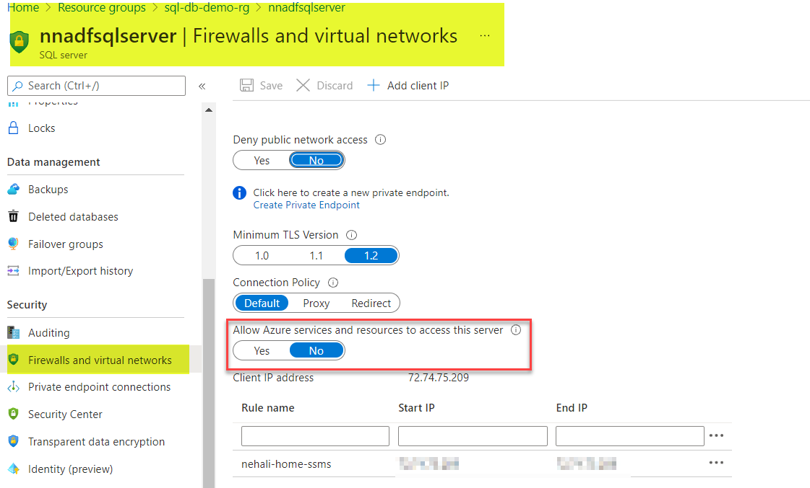

## Azure Default Integration Runtime(IR)

This architecture demonstrates the connectivity architecture and traffic flows for migrating data using Azure Data Factory (ADF) default Azure Integration Runtime (IR). Location of this IR is autoresolve. Azure IR is the compute infrastructed used by ADF to provide data integration capabilities across network environments.

## Reference Architecture

Download [Multi-tab Visio](db-services-all-reference-architectures-visio.vsdx) and [PDF](db-services-all-reference-architectures-PDF.pdf)

## Design Components

1. Public Endpoints (Source: Azure sqlserver and sink: Azure Blob storage)
2. Integration Runtime: Default fully managed Azure IR.
3. IP Routing between source and sink using public network.
4. Source and sink protected using firewall rules.

## Azure Documentation links

1. [Azure Integration Runtime](https://docs.microsoft.com/en-us/azure/data-factory/concepts-integration-runtime#azure-integration-runtime)
2. [Azure Data Factory terminology](hhttps://docs.microsoft.com/en-us/azure/data-factory/introduction)
3. [Support Data Stores and Formats](https://docs.microsoft.com/en-us/azure/data-factory/copy-activity-overview#supported-data-stores-and-formats)
4. [Integration Runtime Concepts](https://docs.microsoft.com/en-us/azure/data-factory/concepts-integration-runtime)
5. [Linked Services](https://docs.microsoft.com/en-us/azure/data-factory/concepts-linked-services)

## Design Considerations and Use cases

1. Fullly Managed Compute to natively perform data movement
2. Supports connecting to targets or resources with publicly accessible endpoints.
3. Note: Enabling Managed Virtual Network, Azure Integration Runtime supports connecting to data stores using private link service in private network environment.
4. Security Considerations:
   Source and sink protected using first line of defence by IP address (firewall IP address for Azure SQL or allow Azure services). These IPs could change. Allow Azure services should be used with caution.
   

5. Requires operational overhead of whitelisting IPs for publicly accessible endpoints.

## TODO
