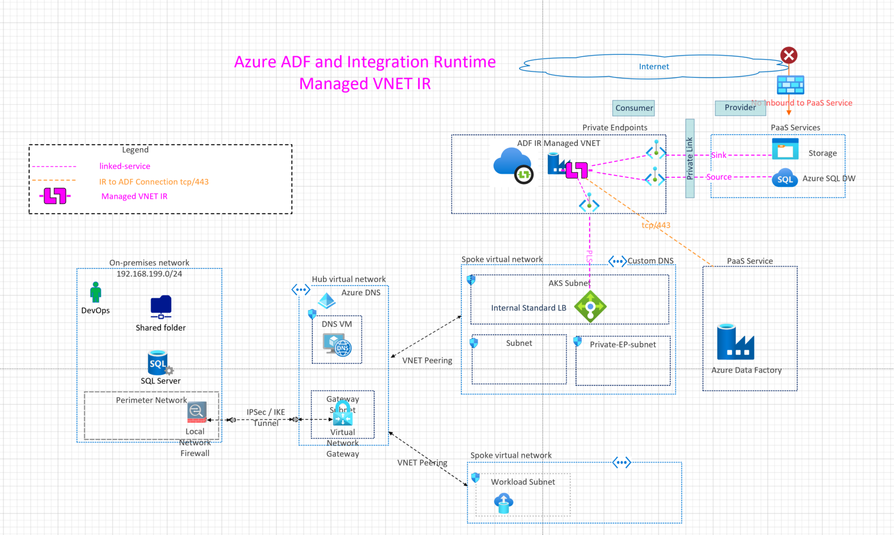

## Managed VNET Integration Runtime

This architecture demonstrates the connectivity architecture and traffic flows for migrating data using Azure Data Factory (ADF) using Managed VNET Integration Runtime (IR) and Private Endpoints. Managed VNET IR is the compute infrastructed provisioned in managed VNET and will leverage private endpoints to securely connect to the target resources or data stores.

## Reference Architecture

Download [Multi-tab Visio](db-services-all-reference-architectures-visio.vsdx) and [PDF](db-services-all-reference-architectures-PDF.pdf)

## Design Components

1. Private Endpoints (Source: Azure sqlserver and sink: Azure Blob storage)
2. Integration Runtime: Default fully managed Azure IR.
3. IP Routing between source and sink using managed VNET network.
4. Source and sink protected using private endpoints.

## Azure Documentation links

1. [Azure Managed VNET Integration Runtime](https://docs.microsoft.com/en-us/azure/data-factory/managed-virtual-network-private-endpoint)
2. [Managed VNET with on-premises SQL Server](https://docs.microsoft.com/en-us/azure/data-factory/tutorial-managed-virtual-network-on-premise-sql-server)
3. [Azure Data Factory terminology](hhttps://docs.microsoft.com/en-us/azure/data-factory/introduction)
4. [Support Data Stores and Formats](https://docs.microsoft.com/en-us/azure/data-factory/copy-activity-overview#supported-data-stores-and-formats)
5. [Integration Runtime Concepts](https://docs.microsoft.com/en-us/azure/data-factory/concepts-integration-runtime)
6. [Linked Services](https://docs.microsoft.com/en-us/azure/data-factory/concepts-linked-services)

## Design Considerations and Use cases

1. Fully Managed compute to natively perform data movement
2. Supports connecting to targets or resources with private endpoints so no need for allowing IPs in the firewall or allowing Azure services.
3. More suited for brownfield environments where You don't need to create a subnet for Azure Integration Runtime that could eventually use many private IPs from your Virtual Network and would require prior network infrastructure planning.
4. It does not require deep Azure networking knowledge to do data integrations securely.
5. Security Consideration: Managed Virtual Network along with Managed private endpoints protects against data exfiltration.
6. Uses Microsoft Backbone.

## TODO
