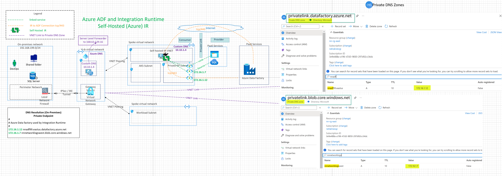

## Self Hosted Integration Runtime in Azure

This architecture demonstrates the connectivity architecture and traffic flows for migrating data using Azure Data Factory (ADF) using Self Hosted Integration Runtime (IR) and Private Endpoints. Using Self hosted IR the compute infrastructed provisioned in Azure VNET and can leverage public and private endpoints to securely connect to the target resources or data stores.

## Reference Architecture

Download [Multi-tab Visio](db-services-all-reference-architectures-visio.vsdx) and [PDF](db-services-all-reference-architectures-PDF.pdf)

## Design Components

1. Private Endpoints for Source (Azure sqlserver) and sink (Azure Blob storage)
2. Private Endpoint created for Azure Data Factory PaaS service for the command and control (tcp/443) connection between self hosted IR and ADF. The traffic between the self-hosted integration runtime and the Azure Data Factory service goes through Private Link.
3. Integration Runtime: Self Hosted IR in Azure VNET
4. IP Routing between source and sink using Azure VNET.
5. When using private endpoints, DNS infrastructure needs to be setup correctly. Spokes VNET is setup for Custom DNS pointing to 10.10.1.4 (DNS Server in the Hub VNET). The DNS server 10.10.1.4 has a server level DNS forwarder to Azure Provided DNS (168.63.129.16)

## Azure Documentation links

1. [Self Hosted Integration Runtime](https://docs.microsoft.com/en-us/azure/data-factory/concepts-integration-runtime#self-hosted-integration-runtime)
2. [Private Endpoint for ADF](https://docs.microsoft.com/en-us/azure/data-factory/data-factory-private-link)
3. [DNS Configuration with Private Endpoints](https://docs.microsoft.com/en-us/azure/private-link/private-endpoint-dns#virtual-network-workloads-without-custom-dns-server)
4. [Secure Communitcation between Self Hosted IR and ADF] (https://docs.microsoft.com/en-us/azure/data-factory/data-factory-private-link#secure-communication-between-customer-networks-and-azure-data-factory)
5. [Azure Data Factory terminology](hhttps://docs.microsoft.com/en-us/azure/data-factory/introduction)
6. [Support Data Stores and Formats](https://docs.microsoft.com/en-us/azure/data-factory/copy-activity-overview#supported-data-stores-and-formats)
7. [Integration Runtime Concepts](https://docs.microsoft.com/en-us/azure/data-factory/concepts-integration-runtime)
8. [Linked Services](https://docs.microsoft.com/en-us/azure/data-factory/concepts-linked-services)

## Design Considerations and Use cases

1. Compute for self hosted IR is in Azure VNET.
2. Supports connecting to targets or resources with private endpoints so no need for allowing IPs in the firewall or allowing Azure services.
3. More suited for greenfield environments and would require prior network infrastructure planning for private endpoint subnet and routing.
4. Note: If you want to perform data integration securely in a private network environment, which doesn't have a direct line-of-sight from the public cloud environment, you can install a self-hosted IR on premises environment behind your corporate firewall, or inside a virtual private network. The self-hosted integration runtime only makes outbound HTTP-based connections to open internet.
5. Running copy activity between a cloud data stores (public endpoints) and a data store in private network (private endpoints)
6. Security Consideration: Using Private endpoints with self hosted IR protects against data exfiltration
7. DNS Considerations:
   When using private endpoints, DNS infrastructure needs to be setup correctly. Spokes VNET is setup for Custom DNS pointing to 10.10.1.4 (DNS Server in the Hub VNET). The DNS server 10.10.1.4 has a server level DNS forwarder to Azure Provided DNS (168.63.129.16)

From Azure Documentation link [here](https://docs.microsoft.com/en-us/azure/private-link/private-endpoint-dns#virtual-network-workloads-without-custom-dns-server)

