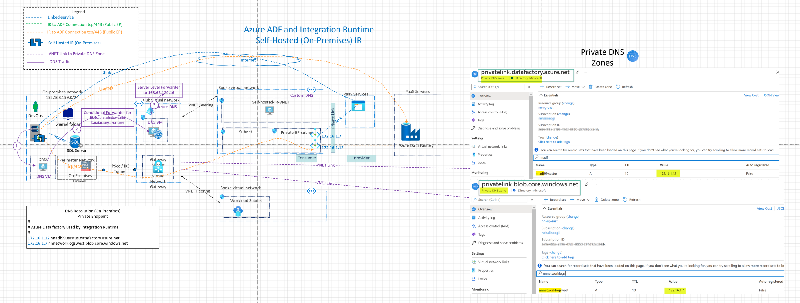

## Self Hosted Integration Runtime Hosted On-Premises

This architecture demonstrates the connectivity architecture and traffic flows for migrating data using Azure Data Factory (ADF) using Self Hosted Integration Runtime (IR) hosted on-premises and Private Endpoints. Using Self hosted IR the compute infrastructed provisioned in Azure VNET and can leverage public and private endpoints to securely connect to the target resources or data stores.

## Reference Architecture

Download [Multi-tab Visio](db-services-all-reference-architectures-visio.vsdx) and [PDF](db-services-all-reference-architectures-PDF.pdf)

## Design Components

0. There is private connectivity between Azure and On-Premises using ExpressRoute or VPN.
1. Source is a local on-premises SQL server and sink (Azure Blob storage). In this diagram, Sink can be a public endpoint or a private endpoint.
2. Private Endpoint created for Azure Data Factory PaaS service for the command and control (tcp/443) connection between self hosted IR and ADF. The traffic between the self-hosted integration runtime and the Azure Data Factory service goes through Private Link over the private connection.
3. Integration Runtime: Self Hosted IR hosted on-premises
4. IP Routing from IR to target linked Service provide using private connectivity or public endpoints..
5. When using private endpoints, DNS infrastructure needs to be setup correctly. On-Premises DNS server has a conditional forwarder ( for blob.core.windows.net, datafactory.azure.net) pointing to 10.10.1.4 (DNS Server in the Hub VNET). The DNS server 10.10.1.4 has a server level DNS forwarder to Azure Provided DNS (168.63.129.16)
6. Note: In this architecture with self hosted IR, source and sink can be public or Private endpoints.

## Azure Documentation links

1. [Self Hosted Integration Runtime](https://docs.microsoft.com/en-us/azure/data-factory/concepts-integration-runtime#self-hosted-integration-runtime)
2. [Private Endpoint for ADF](https://docs.microsoft.com/en-us/azure/data-factory/data-factory-private-link)
3. [On Premises DNS Configuration with Private Endpoints](https://docs.microsoft.com/en-us/azure/private-link/private-endpoint-dns#on-premises-workloads-using-a-dns-forwarder)
4. [Secure Communitcation between Self Hosted IR and ADF](https://docs.microsoft.com/en-us/azure/data-factory/data-factory-private-link#secure-communication-between-customer-networks-and-azure-data-factory)
5. [Azure Data Factory terminology](hhttps://docs.microsoft.com/en-us/azure/data-factory/introduction)
6. [Support Data Stores and Formats](https://docs.microsoft.com/en-us/azure/data-factory/copy-activity-overview#supported-data-stores-and-formats)
7. [Integration Runtime Concepts](https://docs.microsoft.com/en-us/azure/data-factory/concepts-integration-runtime)
8. [Linked Services](https://docs.microsoft.com/en-us/azure/data-factory/concepts-linked-services)

## Design Considerations and Use cases

1. Compute for self hosted IR is hosted on-premises. Self-hosted IR on premises environment behind your corporate firewall. The self-hosted integration runtime only makes outbound HTTP-based connections to internet or using Private Endpoint for ADF.
2. Supports connecting to targets or resources with private endpoints so no need for allowing IPs in the firewall or allowing Azure services.
3. More suited for greenfield environments and would require prior network infrastructure planning for private endpoint subnet and routing.
4. Running copy activity between a On-premises SQL server (local network) and a data store in Azure private network (private endpoints). Note: Both source and sink can be public endpoints as well.
5. Security Consideration: Using Private endpoints with self hosted IR protects against data exfiltration
6. DNS Considerations:
   When using private endpoints, DNS infrastructure needs to be setup correctly. On-Premises DNS server has a conditional forwarder ( for blob.core.windows.net, datafactory.azure.net) pointing to 10.10.1.4 (DNS Server in the Hub VNET). The DNS server 10.10.1.4 has a server level DNS forwarder to Azure Provided DNS (168.63.129.16)

From Azure Documentation link [here](https://docs.microsoft.com/en-us/azure/private-link/private-endpoint-dns#on-premises-workloads-using-a-dns-forwarder)

